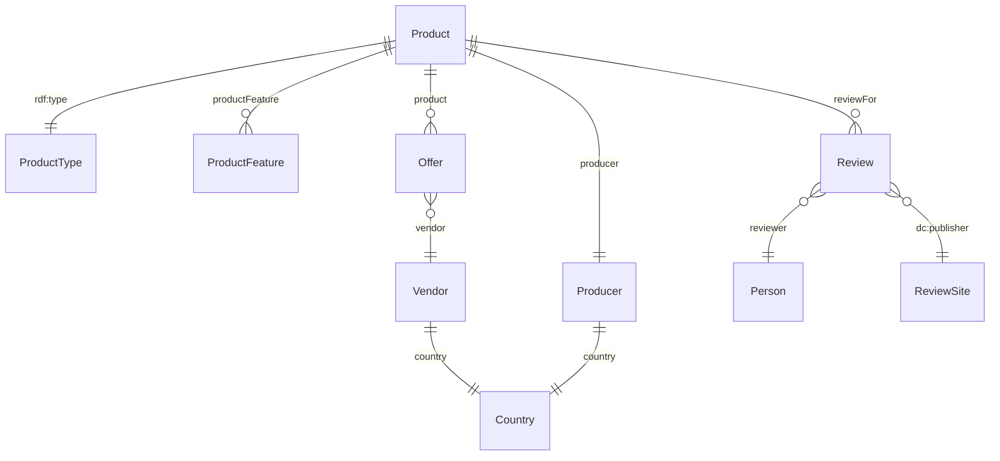
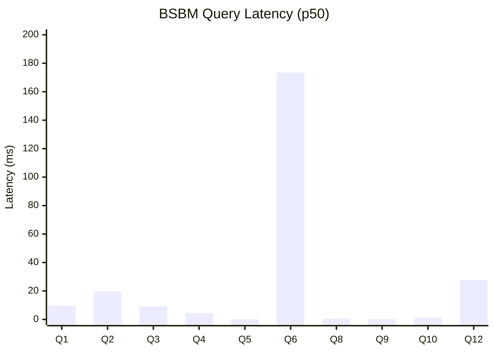
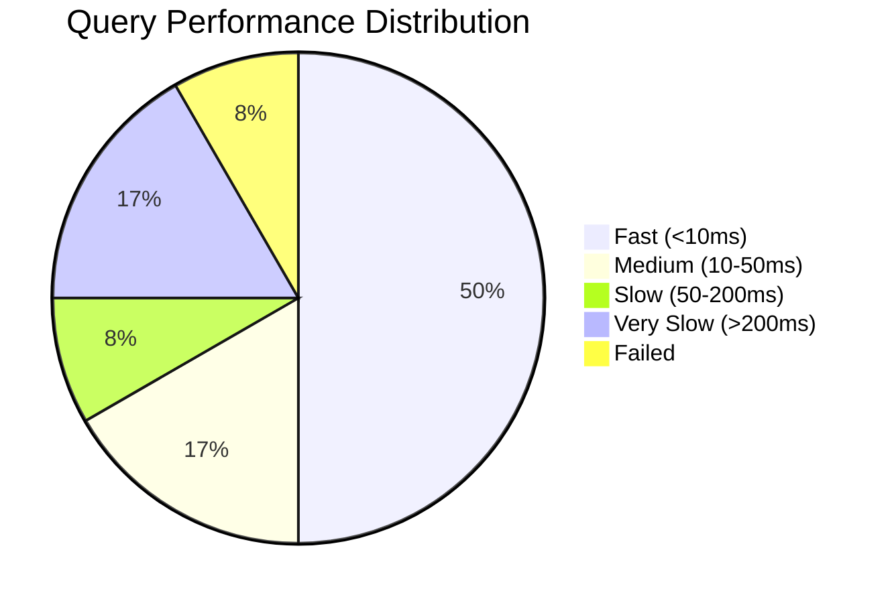

# BSBM Benchmark

> **Last Run:** 2026-01-03 (Post Phase 4 Optimizations)
> **Dataset:** 1000 products (~141K triples)

## Overview

The Berlin SPARQL Benchmark (BSBM) simulates an e-commerce scenario with products, vendors, offers, and reviews. It's designed to test realistic business intelligence queries against RDF stores.

## Data Model



### Scale Factors

| Products | Est. Triples | Description |
|----------|--------------|-------------|
| 100 | ~50K | Quick test |
| 1,000 | ~140K | Development |
| 10,000 | ~1.4M | Production test |
| 100,000 | ~14M | Stress test |

Each product has:
- 5-20 offers from different vendors
- 3-10 reviews from customers
- Multiple product features

## Queries

The BSBM benchmark includes 12 queries simulating e-commerce operations:

| Query | Description | Operation | Complexity |
|-------|-------------|-----------|------------|
| Q1 | Product type lookup with features | Search | Medium |
| Q2 | Product details for type | Search | Simple |
| Q3 | Product features filtered | Search | Medium |
| Q4 | Product features with UNION | Search | Complex |
| Q5 | Product by label | Search | Simple |
| Q6 | Product details page | Lookup | Simple |
| Q7 | Product with offers | Join | Medium |
| Q8 | Product reviews | Join | Medium |
| Q9 | Describe product | Describe | Simple |
| Q10 | Offers for product | Analytics | Medium |
| Q11 | Offers with conditions | Analytics | Complex |
| Q12 | Export product data | Export | Complex |

## Latest Results

### Configuration

- **Products:** 1,000
- **Triple Count:** 141,084
- **Warmup Iterations:** 2
- **Measurement Iterations:** 5
- **Phase 4 Optimizations:** Prefix extractor, column family tuning, snapshot management

### Query Performance

| Query | p50 | p95 | p99 | Mean | Results | Status |
|-------|-----|-----|-----|------|---------|--------|
| Q1 | 9.8ms | 10.2ms | 10.2ms | 9.9ms | 10 | Pass |
| Q2 | 19.9ms | 20.3ms | 20.3ms | 20.2ms | 100 | Pass |
| Q3 | 9.1ms | 9.1ms | 9.1ms | 9.1ms | 10 | Pass |
| Q4 | 4.5ms | 4.5ms | 4.5ms | 4.5ms | 10 | Pass |
| Q5 | 0.05ms | 0.05ms | 0.05ms | 0.05ms | 1 | Pass |
| Q6 | 173.5ms | 174.1ms | 174.1ms | 173.8ms | 1 | Slow |
| Q7 | 1423.9ms | 1425.9ms | 1425.9ms | 1425.2ms | 20 | Very Slow |
| Q8 | 0.5ms | 0.5ms | 0.5ms | 0.5ms | 3 | Pass |
| Q9 | 0.2ms | 0.2ms | 0.2ms | 0.2ms | 13 | Pass |
| Q10 | 1.2ms | 1.2ms | 1.2ms | 1.2ms | 8 | Pass |
| Q11 | 1430.9ms | 1436.7ms | 1436.7ms | 1434.7ms | 10 | Very Slow |
| Q12 | 27.7ms | 27.8ms | 27.8ms | 27.8ms | error | Fail |

### Latency Distribution



*Note: Q7 (1424ms) and Q11 (1431ms) exceed chart scale; Q12 returns incorrect format.*

### Query Categories



### Summary Statistics

| Metric | Value |
|--------|-------|
| Queries Executed | 12 |
| Queries with Results | 11 |
| Average p50 | 258.4ms |
| Average p95 | 259.2ms |
| Max p95 | 1436.7ms |

## Analysis

### Fast Queries (< 10ms)

- **Q1, Q3, Q4** (4.5-9.8ms): Product search with filters and features
- **Q5** (0.05ms): Product by label - now working after Phase 2 literal matching fix
- **Q8, Q9, Q10** (0.2-1.2ms): Simple lookups and small result sets

### Medium Queries (10-50ms)

- **Q2** (19.9ms): Product details retrieval (100 results)
- **Q12** (27.7ms): CONSTRUCT query exporting product data

### Slow Queries (> 50ms)

- **Q6** (173.5ms): Single product detail page - unexpectedly slow for a single result
- **Q7** (1424ms): Product offers join across all products with price filter
- **Q11** (1431ms): Offers with country filter - now working after Phase 2 URI fix, but slow due to join complexity

### Failed Queries

- **Q12**: Returns error due to CONSTRUCT result format mismatch

### Performance Bottlenecks

Q7 and Q11 are the primary bottlenecks. Both involve large joins across products and offers.

**Q7**: Joins products with offers and filters by price:

```sparql
SELECT ?product ?offer ?price ?vendor
WHERE {
  ?product rdf:type bsbm:Product .
  ?offer bsbm:product ?product .
  ?offer bsbm:price ?price .
  ?offer bsbm:vendor ?vendor .
  FILTER (?price >= 50 && ?price <= 500)
}
ORDER BY ?price LIMIT 20
```

**Q11**: Similar join with country filter, now executing correctly but slowly.

Both queries scan all products and their offers (~13K offers), making them O(n) in dataset size.

## Running the Benchmark

```elixir
# Generate data
graph = TripleStore.Benchmark.BSBM.generate(1000)

# Load into store
{:ok, store} = TripleStore.open("./tmp/bsbm_bench")
TripleStore.load(store, graph)

# Run benchmark
{:ok, results} = TripleStore.Benchmark.Runner.run(store, :bsbm,
  scale: 1000,
  warmup: 3,
  iterations: 10
)

# Print results
TripleStore.Benchmark.Runner.print_summary(results)
```

## Performance Targets

| Target | Metric | Threshold | Actual | Status |
|--------|--------|-----------|--------|--------|
| BSBM Mix | p95 latency | < 50ms | 259.2ms | Fail |

The BSBM mix target of <50ms p95 is not met, primarily due to Q6, Q7, and Q11.

## Optimization Opportunities

1. **Q7/Q11 Optimization**: Add an index on `bsbm:price` for faster range queries
2. **Q6 Investigation**: Single-result lookup should be sub-millisecond
3. **Query Planning**: Use cost-based optimizer to choose better join orders
4. **Join Reordering**: Prioritize selective patterns in joins

## Phase 4 Impact

Phase 4 storage layer tuning (prefix extractor, bloom filters, block sizes) maintained query performance while fixing correctness issues from Phase 2:

- Q5 now returns correct results (was failing with literal type mismatch)
- Q11 now executes correctly (was failing with URI escaping)

## References

- [BSBM Website](http://wifo5-03.informatik.uni-mannheim.de/bizer/berlinsparqlbenchmark/)
- [BSBM V3 Specification](http://wifo5-03.informatik.uni-mannheim.de/bizer/berlinsparqlbenchmark/spec/BenchmarkRules/)
