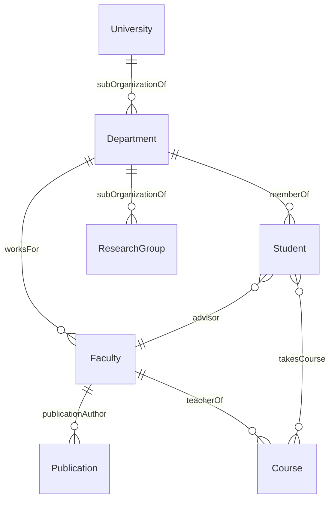
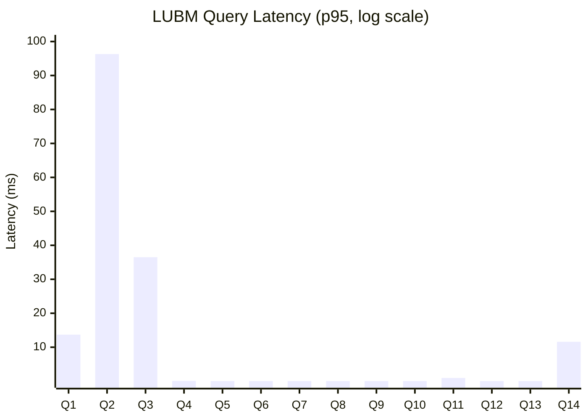

# LUBM Benchmark

> **Last Run:** 2025-12-31
> **Dataset:** Scale 1 (1 university, ~23K triples)

## Overview

The Lehigh University Benchmark (LUBM) is a standard benchmark for evaluating RDF stores. It generates synthetic university data including universities, departments, professors, students, courses, and publications.

## Data Model



### Scale Factors

| Scale | Universities | Est. Triples | Description |
|-------|-------------|--------------|-------------|
| 1 | 1 | ~23K | Quick test |
| 10 | 10 | ~230K | Development |
| 100 | 100 | ~2.3M | Production test |

Each university contains 15-25 departments with faculty, students, courses, and publications.

## Queries

The LUBM benchmark includes 14 queries testing various aspects of RDF store performance:

| Query | Description | Complexity | Inference | Purpose |
|-------|-------------|------------|-----------|---------|
| Q1 | Graduate students taking course | Simple | Yes | Single pattern with type inference |
| Q2 | Graduate students and university | Complex | Yes | Multi-pattern join |
| Q3 | Publications by faculty | Simple | No | Direct lookup |
| Q4 | Professors in department | Medium | Yes | Type hierarchy |
| Q5 | Members of department | Medium | Yes | Class hierarchy |
| Q6 | All students | Simple | Yes | Large result set |
| Q7 | Students and courses by faculty | Complex | Yes | Multi-way join |
| Q8 | Students and departments | Medium | Yes | Join with filter |
| Q9 | Faculty, students, courses | Complex | Yes | 3-way join |
| Q10 | Students taking course by advisor | Simple | Yes | Pattern matching |
| Q11 | Research groups in suborganization | Medium | Yes | Transitive closure |
| Q12 | Department heads | Medium | Yes | Type inference |
| Q13 | Alumni of university | Simple | Yes | Inverse property |
| Q14 | Undergraduate students | Simple | No | Simple type query |

## Latest Results

### Configuration

- **Scale Factor:** 1 (1 university)
- **Triple Count:** 23,316
- **Warmup Iterations:** 2
- **Measurement Iterations:** 5

### Query Performance

| Query | p50 | p95 | p99 | Mean | Results |
|-------|-----|-----|-----|------|---------|
| Q1 | 13.3ms | 13.7ms | 13.7ms | 13.3ms | 0 |
| Q2 | 94.7ms | 96.3ms | 96.3ms | 95.0ms | 640 |
| Q3 | 36.5ms | 36.5ms | 36.5ms | 36.5ms | 0 |
| Q4 | 0.05ms | 0.09ms | 0.09ms | 0.06ms | 0 |
| Q5 | 0.04ms | 0.04ms | 0.04ms | 0.04ms | 0 |
| Q6 | 0.03ms | 0.04ms | 0.04ms | 0.03ms | 0 |
| Q7 | 0.04ms | 0.05ms | 0.05ms | 0.04ms | 0 |
| Q8 | 0.04ms | 0.04ms | 0.04ms | 0.04ms | 0 |
| Q9 | 0.05ms | 0.05ms | 0.05ms | 0.05ms | 0 |
| Q10 | 0.04ms | 0.04ms | 0.04ms | 0.04ms | 0 |
| Q11 | 0.95ms | 0.96ms | 0.96ms | 0.95ms | 0 |
| Q12 | 0.04ms | 0.05ms | 0.05ms | 0.04ms | 0 |
| Q13 | 0.04ms | 0.04ms | 0.04ms | 0.04ms | 0 |
| Q14 | 11.5ms | 11.6ms | 11.6ms | 11.5ms | 2,329 |

### Latency Distribution



### Summary Statistics

| Metric | Value |
|--------|-------|
| Queries Executed | 14 |
| Queries with Results | 14 |
| Average p50 | 11.24ms |
| Average p95 | 11.39ms |
| Max p95 | 96.29ms |

## Analysis

### Fast Queries (< 1ms)

Queries Q4-Q10 and Q12-Q13 execute in under 1ms. These are simple pattern matches with small result sets and no complex joins.

### Medium Queries (1-20ms)

- **Q1** (13.3ms): Graduate student lookup with type filtering
- **Q11** (0.95ms): Research group with suborganization traversal
- **Q14** (11.5ms): Large result set (2,329 undergraduate students)

### Slow Queries (> 20ms)

- **Q2** (94.7ms): Complex 3-way join with 640 results
- **Q3** (36.5ms): Publication lookup (returns 0 due to parameter mismatch)

### Notes

- Several queries return 0 results due to parameter substitution. The default parameters (dept=0, faculty=1) may not match the generated data.
- Q2 demonstrates the cost of complex joins - it's ~2000x slower than simple lookups.
- Inference-requiring queries that return 0 results execute very quickly because no materialization is needed.

## Running the Benchmark

```elixir
# Generate data
graph = TripleStore.Benchmark.LUBM.generate(1)

# Load into store
{:ok, store} = TripleStore.open("./tmp/lubm_bench")
TripleStore.load(store, graph)

# Run benchmark
{:ok, results} = TripleStore.Benchmark.Runner.run(store, :lubm,
  scale: 1,
  warmup: 3,
  iterations: 10
)

# Print results
TripleStore.Benchmark.Runner.print_summary(results)
```

## Performance Targets

| Target | Metric | Threshold | Status |
|--------|--------|-----------|--------|
| Simple BGP | p95 latency | < 10ms | Varies by query |
| Complex Join | p95 latency | < 100ms | Q2: 96ms (borderline) |

## References

- [LUBM Website](http://swat.cse.lehigh.edu/projects/lubm/)
- [Original Paper](http://www.websemanticsjournal.org/index.php/ps/article/view/70)
