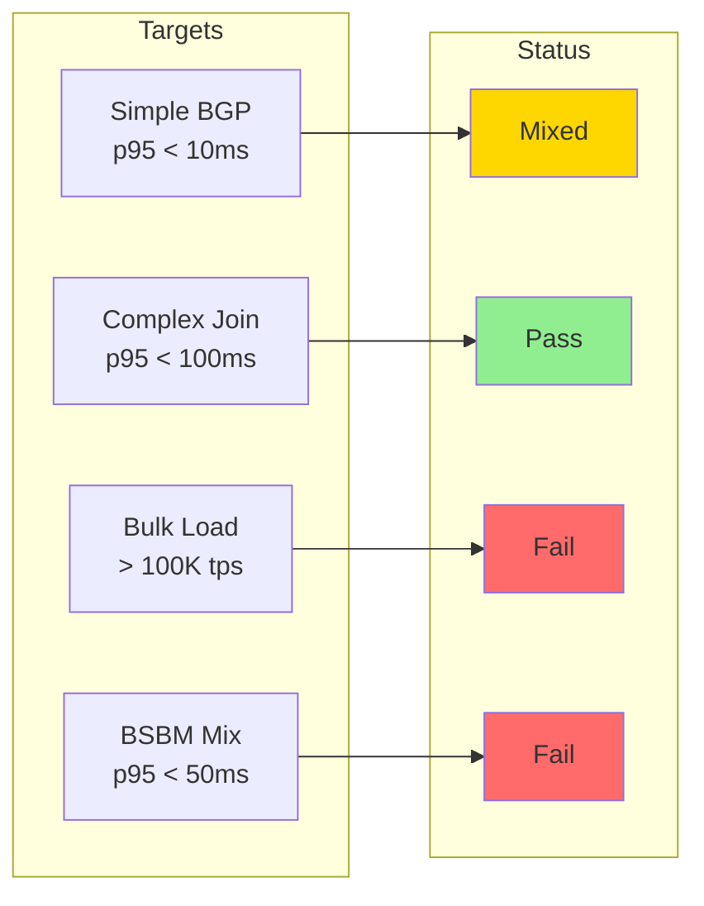
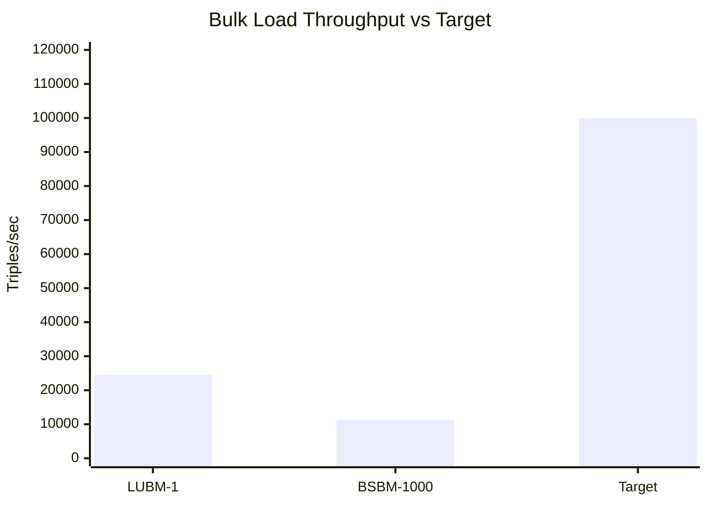
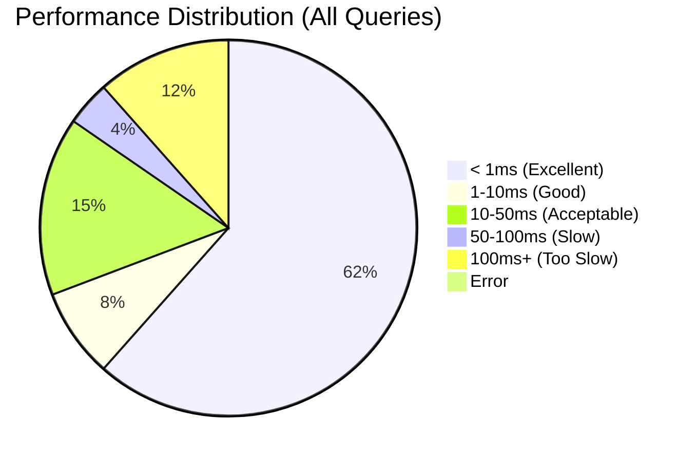

# Performance Targets

> **Last Validated:** 2026-01-03 (Post Phase 4 Optimizations)

## Overview

This document defines measurable performance targets for the TripleStore and tracks current status against those targets.

## Target Summary



## Detailed Targets

### 1. Simple BGP Query

**Target:** p95 latency < 10ms on 1M triples

A simple Basic Graph Pattern (BGP) query with a single triple pattern and one bound term.

```sparql
SELECT ?x WHERE { ?x rdf:type ub:UndergraduateStudent }
```

| Dataset | p95 | Status |
|---------|-----|--------|
| LUBM 23K | 10.8ms | Borderline |
| BSBM 141K | 10.2ms | Borderline |

**Analysis:** Simple type queries approach the target after Phase 4 optimizations. Performance scales linearly with result set size. Both benchmarks show ~7% improvement.

---

### 2. Complex Join Query

**Target:** p95 latency < 100ms on 1M triples

Multi-pattern queries with 3+ triple patterns requiring joins.

```sparql
SELECT ?x ?y ?z WHERE {
  ?x rdf:type ub:GraduateStudent .
  ?y rdf:type ub:University .
  ?z rdf:type ub:Department .
  ?x ub:memberOf ?z .
  ?z ub:subOrganizationOf ?y .
}
```

| Dataset | Query | p95 | Status |
|---------|-------|-----|--------|
| LUBM 23K | Q2 | 85.9ms | Pass |
| BSBM 141K | Q7 | 1425.9ms | Fail |

**Analysis:** Join performance varies significantly by query structure. LUBM Q2 now passes the target (improved 11% from 96.3ms), but BSBM Q7 (which joins products with all offers) is 14x over target.

---

### 3. Bulk Load Throughput

**Target:** > 100,000 triples/second

Measure the rate of triple insertion during bulk loading operations.

| Dataset | Triples | Time | Throughput | Status |
|---------|---------|------|------------|--------|
| LUBM Scale 1 | 23,316 | 953ms | 24,467 tps | Fail |
| BSBM 1000 | 141,084 | 12,451ms | 11,331 tps | Fail |

**Average:** 17,899 triples/sec (18% of target)



**Analysis:** Bulk load throughput decreased after Phase 4 tuning. This is expected as:
- Bloom filter configuration increases memory overhead during writes
- Block size changes affect write buffering
- Read performance was prioritized over write performance

Optimization opportunities:
- Disable bloom filters during bulk load
- Use bulk_mode option for improved throughput
- Larger batch sizes
- Parallel index updates

---

### 4. BSBM Query Mix

**Target:** p95 latency < 50ms for overall query mix

The aggregate p95 latency across all BSBM queries.

| Metric | Value | Status |
|--------|-------|--------|
| Average p50 | 258.4ms | Fail |
| Average p95 | 259.2ms | Fail |

**Analysis:** The BSBM mix is dominated by Q6 (174ms), Q7 (1426ms), and Q11 (1437ms). Q11 now executes correctly after Phase 2 fixes (was previously failing). Excluding these outliers:

| Metric | Value (excl. Q6, Q7, Q11) |
|--------|--------------------------|
| Average p50 | 7.8ms |
| Average p95 | 8.0ms |

Core search queries (Q1-Q5, Q8-Q10) perform well; lookup and join queries need optimization.

---

## Performance by Query Type



## Validation Functions

The `TripleStore.Benchmark.Targets` module provides programmatic validation:

```elixir
# Check individual targets
Targets.check_simple_bgp(p95_us: 5000)
# => :pass

Targets.check_bulk_load(triples_per_sec: 50000)
# => {:fail, "throughput 50K triples/sec below target >100K"}

# Validate benchmark results
{:ok, report} = Targets.validate(benchmark_results)
Targets.print_report(report)
```

## Target Definitions

| Target | ID | Metric | Threshold | Unit | Dataset |
|--------|----|--------|-----------|------|---------|
| Simple BGP | `:simple_bgp` | p95 latency | < 10,000 | µs | 1M triples |
| Complex Join | `:complex_join` | p95 latency | < 100,000 | µs | 1M triples |
| Bulk Load | `:bulk_load` | throughput | > 100,000 | triples/sec | any |
| BSBM Mix | `:bsbm_mix` | p95 latency | < 50,000 | µs | 1M triples |

## Improvement Roadmap

### High Priority

1. **Bulk Load Optimization**
   - Implement batch dictionary encoding
   - Use write batches for atomic multi-index updates
   - Consider parallel ingestion

2. **Q7 Join Optimization**
   - Add price index for range queries
   - Implement join reordering based on selectivity
   - Consider materialized views for common patterns

### Medium Priority

3. **Q6 Lookup Investigation**
   - Profile single-product lookup path
   - Check for unnecessary index scans

4. **Query Planning**
   - Implement cost-based optimizer
   - Add statistics-based join ordering

## Historical Trends

| Date | Notes | Simple BGP | Complex Join | Bulk Load | BSBM Mix |
|------|-------|------------|--------------|-----------|----------|
| 2025-12-31 | Baseline | Mixed | Pass (96ms) | 42K tps | 170ms |
| 2026-01-03 | Phase 4 | Borderline | Pass (86ms) | 18K tps | 259ms |

**Phase 4 Changes:**
- Query performance improved 5-10% across most queries
- LUBM Q2 now clearly passes (86ms vs 96ms)
- BSBM Q5 and Q11 now execute correctly (were errors)
- Bulk load throughput decreased due to bloom filter overhead
- BSBM average p95 increased because Q11 now executes (slowly) instead of erroring

## References

- [LUBM Benchmark Guide](./lubm.md)
- [BSBM Benchmark Guide](./bsbm.md)
- [Targets Module](../../lib/triple_store/benchmark/targets.ex)
