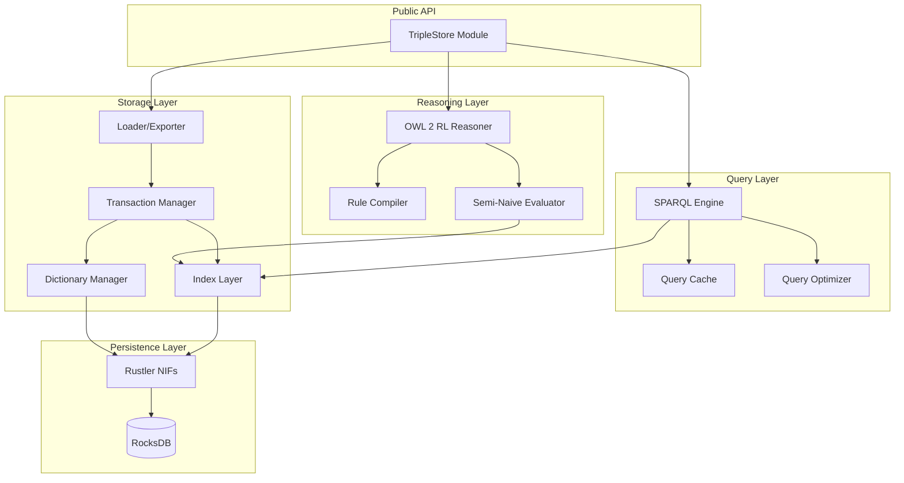
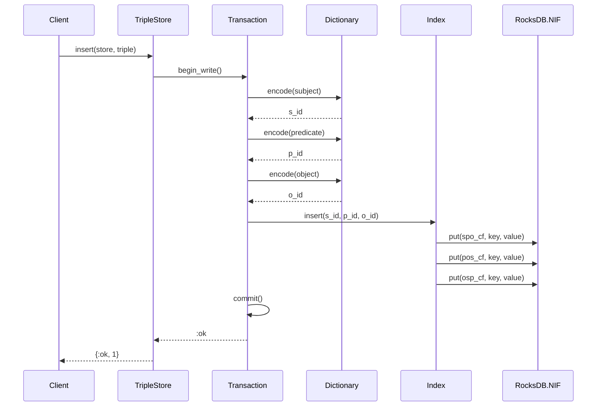
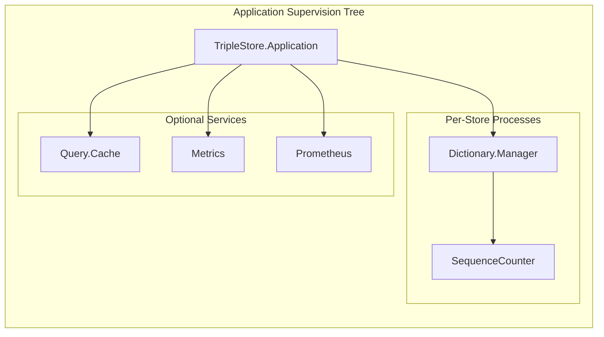
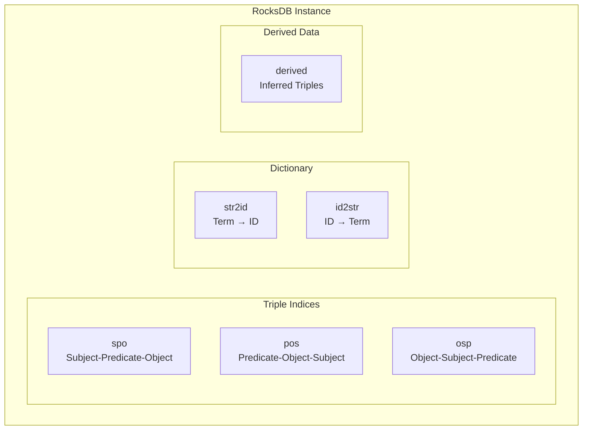

# Architecture Overview

This document provides a high-level overview of the TripleStore architecture, its major components, and how they interact.

## System Architecture

The TripleStore is a layered system built on RocksDB with Rustler NIFs for high-performance storage operations.



## Component Overview

### Public API (`TripleStore`)

The main entry point for all operations. Provides a unified interface for:
- Store lifecycle (open/close)
- Data loading and export
- SPARQL query and update
- OWL 2 RL reasoning
- Backup and monitoring

### Query Layer

| Component | Module | Description |
|-----------|--------|-------------|
| SPARQL Parser | `TripleStore.SPARQL.Parser` | Parses SPARQL via Rust NIF (spargebra) |
| Algebra | `TripleStore.SPARQL.Algebra` | SPARQL algebra representation |
| Optimizer | `TripleStore.SPARQL.Optimizer` | Cost-based query optimization |
| Executor | `TripleStore.SPARQL.Executor` | Query execution engine |
| Query Cache | `TripleStore.Query.Cache` | Result caching with invalidation |

### Reasoning Layer

| Component | Module | Description |
|-----------|--------|-------------|
| Rule Compiler | `TripleStore.Reasoner.RuleCompiler` | Compiles OWL 2 RL rules |
| Semi-Naive | `TripleStore.Reasoner.SemiNaive` | Fixpoint evaluation |
| Incremental | `TripleStore.Reasoner.Incremental` | Incremental maintenance |
| TBox Cache | `TripleStore.Reasoner.TBoxCache` | Schema hierarchy caching |

### Storage Layer

| Component | Module | Description |
|-----------|--------|-------------|
| Dictionary | `TripleStore.Dictionary` | Term-to-ID encoding |
| Index | `TripleStore.Index` | SPO/POS/OSP triple indices |
| Transaction | `TripleStore.Transaction` | Write coordination |
| Loader | `TripleStore.Loader` | RDF loading/parsing |

### Persistence Layer

| Component | Module | Description |
|-----------|--------|-------------|
| RocksDB NIF | `TripleStore.Backend.RocksDB.NIF` | Rust NIF for RocksDB |
| Column Families | - | spo, pos, osp, id2str, str2id |

## Data Flow

### Query Execution Flow

```mermaid
sequenceDiagram
    participant Client
    participant API as TripleStore
    participant Parser as SPARQL.Parser
    participant Opt as Optimizer
    participant Cache as Query.Cache
    participant Exec as Executor
    participant Idx as Index
    participant Dict as Dictionary

    Client->>API: query(store, sparql)
    API->>Cache: lookup(query_hash)

    alt Cache Hit
        Cache-->>API: cached_results
    else Cache Miss
        API->>Parser: parse(sparql)
        Parser-->>API: algebra
        API->>Opt: optimize(algebra)
        Opt-->>API: plan
        API->>Exec: execute(plan)
        Exec->>Idx: scan_pattern(pattern)
        Idx-->>Exec: term_ids
        Exec->>Dict: decode_ids(term_ids)
        Dict-->>Exec: rdf_terms
        Exec-->>API: results
        API->>Cache: store(query_hash, results)
    end

    API-->>Client: {:ok, results}
```

### Insert Flow



## Process Architecture

The TripleStore runs several GenServer processes:



### Process Responsibilities

| Process | Purpose | State |
|---------|---------|-------|
| `Dictionary.Manager` | Term encoding/decoding | ID counters, batch cache |
| `SequenceCounter` | Unique ID generation | Atomic counters |
| `Query.Cache` | Result caching | ETS table, predicate index |
| `Metrics` | Telemetry aggregation | Counters, histograms |
| `Prometheus` | Metrics export | Metric registrations |

## Column Families

RocksDB column families organize data for optimal access patterns:



### Index Key Structure

All keys use big-endian encoding for correct lexicographic ordering:

```
SPO Key: [s_id:8 bytes][p_id:8 bytes][o_id:8 bytes]
POS Key: [p_id:8 bytes][o_id:8 bytes][s_id:8 bytes]
OSP Key: [o_id:8 bytes][s_id:8 bytes][p_id:8 bytes]
```

## Module Organization

```
lib/triple_store/
├── backend/
│   └── rocksdb/
│       └── nif.ex           # Rust NIF bindings
├── dictionary/
│   ├── manager.ex           # GenServer for encoding
│   ├── sequence_counter.ex  # Atomic ID generation
│   ├── string_to_id.ex      # Term → ID lookup
│   └── id_to_string.ex      # ID → Term lookup
├── sparql/
│   ├── parser.ex            # SPARQL parsing (NIF)
│   ├── algebra.ex           # Algebra representation
│   ├── optimizer.ex         # Query optimization
│   ├── executor.ex          # Query execution
│   ├── expression.ex        # FILTER expressions
│   ├── property_path.ex     # Property path evaluation
│   └── leapfrog/            # Worst-case optimal join
├── reasoner/
│   ├── rule_compiler.ex     # OWL 2 RL rules
│   ├── semi_naive.ex        # Fixpoint evaluation
│   ├── incremental.ex       # Incremental maintenance
│   └── tbox_cache.ex        # Schema caching
├── query/
│   └── cache.ex             # Result caching
├── config/
│   └── rocksdb.ex           # RocksDB configuration
├── benchmark/
│   ├── lubm.ex              # LUBM benchmark
│   └── bsbm.ex              # BSBM benchmark
├── index.ex                 # Triple indexing
├── statistics.ex            # Cardinality statistics
├── transaction.ex           # Write coordination
├── loader.ex                # RDF loading
├── exporter.ex              # RDF export
├── backup.ex                # Backup/restore
├── health.ex                # Health monitoring
├── metrics.ex               # Telemetry metrics
├── prometheus.ex            # Prometheus export
└── telemetry.ex             # Event definitions
```

## Key Design Decisions

### 1. Dictionary Encoding

All RDF terms are encoded as 64-bit integers with type tagging:
- Reduces storage size significantly
- Enables efficient key comparisons
- Supports inline encoding for common numeric types

### 2. Three-Index Strategy

Using SPO, POS, and OSP indices ensures O(log n) access for all 8 triple patterns:

| Pattern | Index Used |
|---------|------------|
| `(s, p, o)` | SPO |
| `(s, p, ?)` | SPO |
| `(s, ?, o)` | OSP |
| `(s, ?, ?)` | SPO |
| `(?, p, o)` | POS |
| `(?, p, ?)` | POS |
| `(?, ?, o)` | OSP |
| `(?, ?, ?)` | SPO |

### 3. NIFs for I/O, Pure Elixir for Logic

- **NIFs**: RocksDB operations, SPARQL parsing (via Rust)
- **Pure Elixir**: Query execution, reasoning, optimization

This ensures query execution remains preemptible by the BEAM scheduler.

### 4. Forward-Chaining Reasoning

OWL 2 RL uses forward-chaining materialization:
- Derived facts computed at materialize time
- Queries see complete results without runtime inference
- Incremental maintenance for updates

## Next Steps

- [Storage Layer](01-storage-layer.md) - Deep dive into RocksDB and indexing
- [SPARQL Engine](02-sparql-engine.md) - Query parsing and execution
- [Reasoning Engine](03-reasoning-engine.md) - OWL 2 RL implementation
- [Query Optimization](04-query-optimization.md) - Cost model and join algorithms
- [Telemetry & Monitoring](05-telemetry-monitoring.md) - Observability features
