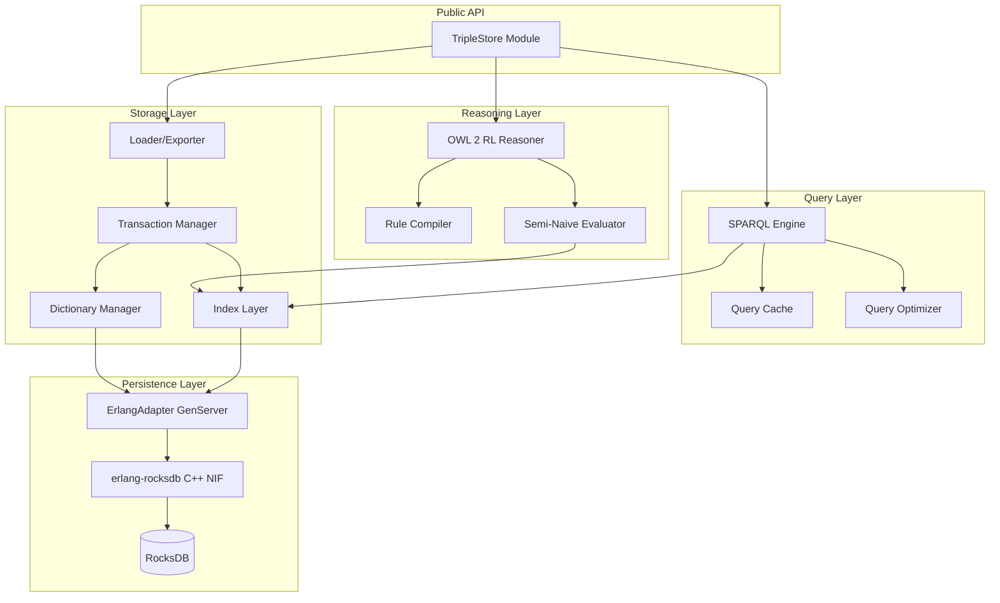
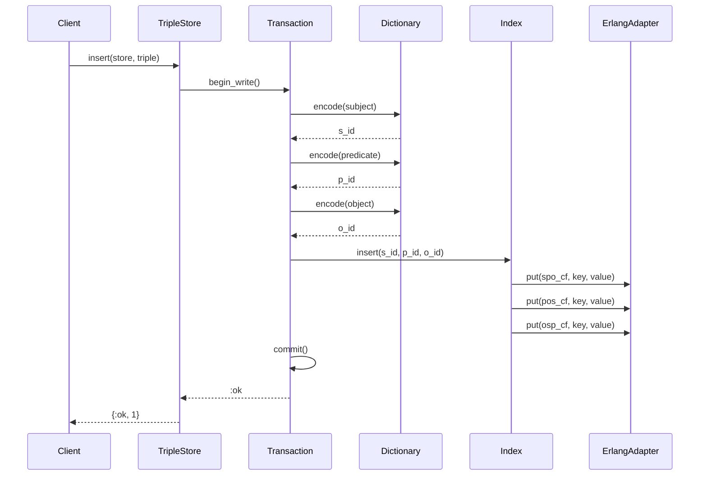
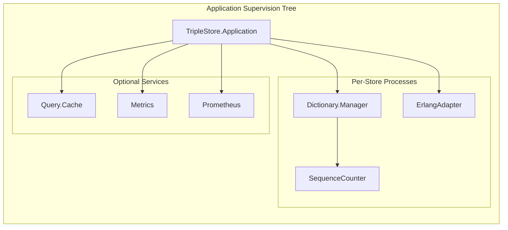
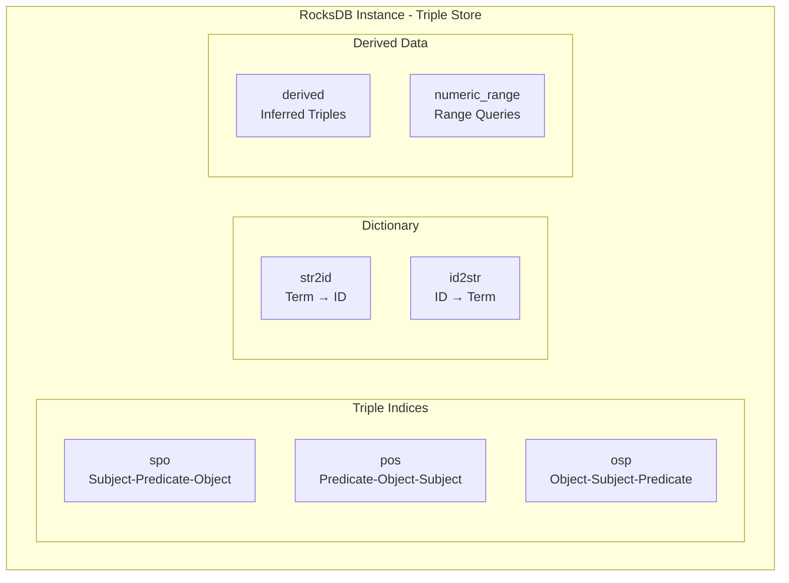
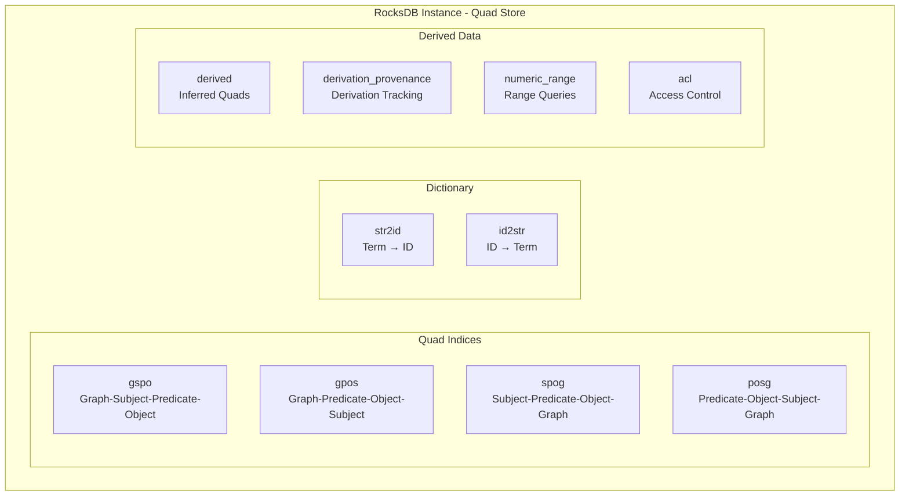

# Architecture Overview

This document provides a high-level overview of the TripleStore architecture, its major components, and how they interact.

## System Architecture

The TripleStore is a layered system built on RocksDB using the erlang-rocksdb C++ NIF library for high-performance storage operations.


```mermaid
graph TB
    subgraph "Public API"
        API[TripleStore Module]
    end

    subgraph "Query Layer"
        SPARQL[SPARQL Engine]
        CACHE[Query Cache]
        OPT[Query Optimizer]
    end

    subgraph "Reasoning Layer"
        REASONER[OWL 2 RL Reasoner]
        RULES[Rule Compiler]
        SEMI[Semi-Naive Evaluator]
    end

    subgraph "Storage Layer"
        LOADER[Loader/Exporter]
        TX[Transaction Manager]
        DICT[Dictionary Manager]
        IDX[Index Layer]
    end

    subgraph "Persistence Layer"
        ADAPTER[ErlangAdapter GenServer]
        ERLANG_ROCKSDB[erlang-rocksdb C++ NIF]
        ROCKS[(RocksDB)]
    end

    API --> SPARQL
    API --> REASONER
    API --> LOADER

    SPARQL --> CACHE
    SPARQL --> OPT
    SPARQL --> IDX

    REASONER --> RULES
    REASONER --> SEMI
    SEMI --> IDX

    LOADER --> TX
    TX --> DICT
    TX --> IDX

    DICT --> ADAPTER
    IDX --> ADAPTER
    ADAPTER --> ERLANG_ROCKSDB
    ERLANG_ROCKSDB --> ROCKS
```

## Component Overview

### Public API (`TripleStore`)

The main entry point for all operations. Provides a unified interface for:
- Store lifecycle (open/close)
- Data loading and export
- SPARQL query and update
- OWL 2 RL reasoning
- Backup and monitoring

### Query Layer

| Component | Module | Description |
|-----------|--------|-------------|
| SPARQL Parser | `TripleStore.SPARQL.Parser` | Parses SPARQL via NIF (sparql_parser_nif) |
| Algebra | `TripleStore.SPARQL.Algebra` | SPARQL algebra representation |
| Optimizer | `TripleStore.SPARQL.Optimizer` | Cost-based query optimization |
| Executor | `TripleStore.SPARQL.Executor` | Query execution engine |
| Query Cache | `TripleStore.Query.Cache` | Result caching with invalidation |

### Reasoning Layer

| Component | Module | Description |
|-----------|--------|-------------|
| Rule Compiler | `TripleStore.Reasoner.RuleCompiler` | Compiles OWL 2 RL rules |
| Semi-Naive | `TripleStore.Reasoner.SemiNaive` | Fixpoint evaluation |
| Incremental | `TripleStore.Reasoner.Incremental` | Incremental maintenance |
| TBox Cache | `TripleStore.Reasoner.TBoxCache` | Schema hierarchy caching |

### Storage Layer

| Component | Module | Description |
|-----------|--------|-------------|
| Dictionary | `TripleStore.Dictionary` | Term-to-ID encoding |
| Index | `TripleStore.Index` | SPO/POS/OSP triple indices |
| Quad Index | `TripleStore.QuadIndex` | GSPO/GPOS/SPOG/POSG quad indices |
| Transaction | `TripleStore.Transaction` | Write coordination |
| Loader | `TripleStore.Loader` | RDF loading/parsing |

### Persistence Layer

| Component | Module | Description |
|-----------|--------|-------------|
| ErlangAdapter | `TripleStore.Backend.RocksDB.ErlangAdapter` | GenServer managing erlang-rocksdb |
| Column Family Config | `TripleStore.Backend.RocksDB.ColumnFamilyConfig` | CF options and descriptors |
| erlang-rocksdb | `:rocksdb` (C++ NIF) | C++ NIF library for RocksDB |
| Column Families | - | spo, pos, osp, gspo, gpos, spog, posg, id2str, str2id, derived, derivation_provenance, numeric_range, acl |

## Data Flow

### Query Execution Flow

```mermaid
sequenceDiagram
    participant Client
    participant API as TripleStore
    participant Parser as SPARQL.Parser
    participant Opt as Optimizer
    participant Cache as Query.Cache
    participant Exec as Executor
    participant Idx as Index
    participant Dict as Dictionary

    Client->>API: query(store, sparql)
    API->>Cache: lookup(query_hash)

    alt Cache Hit
        Cache-->>API: cached_results
    else Cache Miss
        API->>Parser: parse(sparql)
        Parser-->>API: algebra
        API->>Opt: optimize(algebra)
        Opt-->>API: plan
        API->>Exec: execute(plan)
        Exec->>Idx: scan_pattern(pattern)
        Idx-->>Exec: term_ids
        Exec->>Dict: decode_ids(term_ids)
        Dict-->>Exec: rdf_terms
        Exec-->>API: results
        API->>Cache: store(query_hash, results)
    end

    API-->>Client: {:ok, results}
```

### Insert Flow


```mermaid
sequenceDiagram
    participant Client
    participant API as TripleStore
    participant TX as Transaction
    participant Dict as Dictionary
    participant Idx as Index
    participant Adapter as ErlangAdapter

    Client->>API: insert(store, triple)
    API->>TX: begin_write()
    TX->>Dict: encode(subject)
    Dict-->>TX: s_id
    TX->>Dict: encode(predicate)
    Dict-->>TX: p_id
    TX->>Dict: encode(object)
    Dict-->>TX: o_id

    TX->>Idx: insert(s_id, p_id, o_id)
    Idx->>Adapter: put(spo_cf, key, value)
    Idx->>Adapter: put(pos_cf, key, value)
    Idx->>Adapter: put(osp_cf, key, value)

    TX->>TX: commit()
    TX-->>API: :ok
    API-->>Client: {:ok, 1}
```

## Process Architecture

The TripleStore runs several GenServer processes:


```mermaid
graph LR
    subgraph "Application Supervision Tree"
        APP[TripleStore.Application]

        subgraph "Per-Store Processes"
            DM[Dictionary.Manager]
            SC[SequenceCounter]
            EA[ErlangAdapter]
        end

        subgraph "Optional Services"
            QC[Query.Cache]
            MET[Metrics]
            PROM[Prometheus]
        end
    end

    APP --> DM
    DM --> SC
    APP --> EA
    APP --> QC
    APP --> MET
    APP --> PROM
```

### Process Responsibilities

| Process | Purpose | State |
|---------|---------|-------|
| `ErlangAdapter` | Manages erlang-rocksdb DB and CF handles | Database reference, CF handle map |
| `Dictionary.Manager` | Term encoding/decoding | ID counters, batch cache |
| `SequenceCounter` | Unique ID generation | Atomic counters |
| `Query.Cache` | Result caching | ETS table, predicate index |
| `Metrics` | Telemetry aggregation | Counters, histograms |
| `Prometheus` | Metrics export | Metric registrations |

## Column Families

RocksDB column families organize data for optimal access patterns:

### Triple Store Schema (v1)


```mermaid
graph TB
    subgraph "RocksDB Instance - Triple Store"
        subgraph "Triple Indices"
            SPO[spo<br/>Subject-Predicate-Object]
            POS[pos<br/>Predicate-Object-Subject]
            OSP[osp<br/>Object-Subject-Predicate]
        end

        subgraph "Dictionary"
            S2I[str2id<br/>Term → ID]
            I2S[id2str<br/>ID → Term]
        end

        subgraph "Derived Data"
            DER[derived<br/>Inferred Triples]
            NR[numeric_range<br/>Range Queries]
        end
    end
```

### Quad Store Schema (v2)


```mermaid
graph TB
    subgraph "RocksDB Instance - Quad Store"
        subgraph "Quad Indices"
            GSPO[gspo<br/>Graph-Subject-Predicate-Object]
            GPOS[gpos<br/>Graph-Predicate-Object-Subject]
            SPOG[spog<br/>Subject-Predicate-Object-Graph]
            POSG[posg<br/>Predicate-Object-Subject-Graph]
        end

        subgraph "Dictionary"
            S2I[str2id<br/>Term → ID]
            I2S[id2str<br/>ID → Term]
        end

        subgraph "Derived Data"
            DER[derived<br/>Inferred Quads]
            DP[derivation_provenance<br/>Derivation Tracking]
            NR[numeric_range<br/>Range Queries]
            ACL[acl<br/>Access Control]
        end
    end
```

### Index Key Structure

All keys use big-endian encoding for correct lexicographic ordering:

**Triple Keys (24 bytes):**
```
SPO Key: [s_id:8 bytes][p_id:8 bytes][o_id:8 bytes]
POS Key: [p_id:8 bytes][o_id:8 bytes][s_id:8 bytes]
OSP Key: [o_id:8 bytes][s_id:8 bytes][p_id:8 bytes]
```

**Quad Keys (32 bytes):**
```
GSPO Key:  [g_id:8 bytes][s_id:8 bytes][p_id:8 bytes][o_id:8 bytes]
GPOS Key:  [g_id:8 bytes][p_id:8 bytes][o_id:8 bytes][s_id:8 bytes]
SPOG Key:  [s_id:8 bytes][p_id:8 bytes][o_id:8 bytes][g_id:8 bytes]
POSG Key:  [p_id:8 bytes][o_id:8 bytes][s_id:8 bytes][g_id:8 bytes]
```

## Module Organization

```
lib/triple_store/
├── backend/
│   └── rocksdb/
│       ├── erlang_adapter.ex       # GenServer managing erlang-rocksdb
│       ├── column_family_config.ex  # Column family configuration
│       └── nif.ex                   # Deprecated: legacy NIF wrapper
├── dictionary/
│   ├── manager.ex                   # GenServer for encoding
│   ├── sequence_counter.ex          # Atomic ID generation
│   ├── string_to_id.ex              # Term → ID lookup
│   └── id_to_string.ex              # ID → Term lookup
├── sparql/
│   ├── parser.ex                    # SPARQL parsing (Rust NIF)
│   ├── algebra.ex                   # Algebra representation
│   ├── optimizer.ex                 # Query optimization
│   ├── executor.ex                  # Query execution
│   ├── expression.ex                # FILTER expressions
│   ├── property_path.ex             # Property path evaluation
│   └── leapfrog/                    # Worst-case optimal join
├── reasoner/
│   ├── rule_compiler.ex             # OWL 2 RL rules
│   ├── semi_naive.ex                # Fixpoint evaluation
│   ├── incremental.ex               # Incremental maintenance
│   └── tbox_cache.ex                # Schema caching
├── query/
│   └── cache.ex                     # Result caching
├── index.ex                         # Triple indexing
├── quad_index.ex                    # Quad indexing
├── quad_operations.ex               # Quad operations
├── statistics.ex                    # Cardinality statistics
├── transaction.ex                   # Write coordination
├── loader.ex                        # RDF loading
├── exporter.ex                      # RDF export
├── backup.ex                        # Backup/restore
├── health.ex                        # Health monitoring
├── metrics.ex                       # Telemetry metrics
├── prometheus.ex                    # Prometheus export
└── telemetry.ex                     # Event definitions
```

## Key Design Decisions

### 1. Dictionary Encoding

All RDF terms are encoded as 64-bit integers with type tagging:
- Reduces storage size significantly
- Enables efficient key comparisons
- Supports inline encoding for common numeric types

### 2. Three-Index Strategy (Triples) / Four-Index Strategy (Quads)

**Triple Store:** Using SPO, POS, and OSP indices ensures O(log n) access for all 8 triple patterns.

**Quad Store:** Using GSPO, GPOS, SPOG, and POSG indices enables efficient graph-scoped queries.

| Pattern | Index Used |
|---------|------------|
| `(s, p, o)` | SPO |
| `(s, p, ?)` | SPO |
| `(s, ?, o)` | OSP |
| `(s, ?, ?)` | SPO |
| `(?, p, o)` | POS |
| `(?, p, ?)` | POS |
| `(?, ?, o)` | OSP |
| `(?, ?, ?)` | SPO |

### 3. NIFs for I/O, Pure Elixir for Logic

- **NIFs**: RocksDB operations (via erlang-rocksdb C++ NIF), SPARQL parsing (via sparql_parser_nif Rust NIF)
- **Pure Elixir**: Query execution, reasoning, optimization

This ensures query execution remains preemptible by the BEAM scheduler.

### 4. Forward-Chaining Reasoning

OWL 2 RL uses forward-chaining materialization:
- Derived facts computed at materialize time
- Queries see complete results without runtime inference
- Incremental maintenance for updates

### 5. ErlangAdapter GenServer Pattern

The erlang-rocksdb NIF requires careful management of database and column family handles:
- ErlangAdapter GenServer owns the database reference
- Manages column family handle mapping
- Provides GenServer call API for all operations
- Ensures proper cleanup on termination

## Next Steps

- [Storage Layer](01-storage-layer.md) - Deep dive into RocksDB and indexing
- [SPARQL Engine](02-sparql-engine.md) - Query parsing and execution
- [Reasoning Engine](03-reasoning-engine.md) - OWL 2 RL implementation
- [Query Optimization](04-query-optimization.md) - Cost model and join algorithms
- [Telemetry & Monitoring](05-telemetry-monitoring.md) - Observability features
