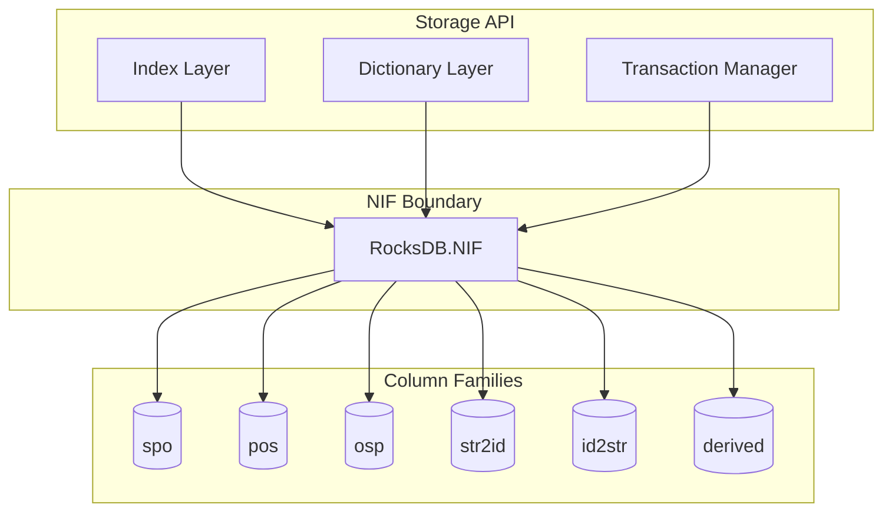
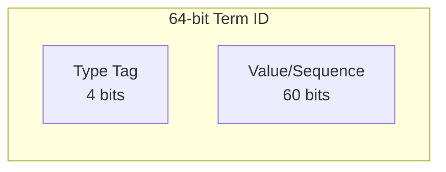
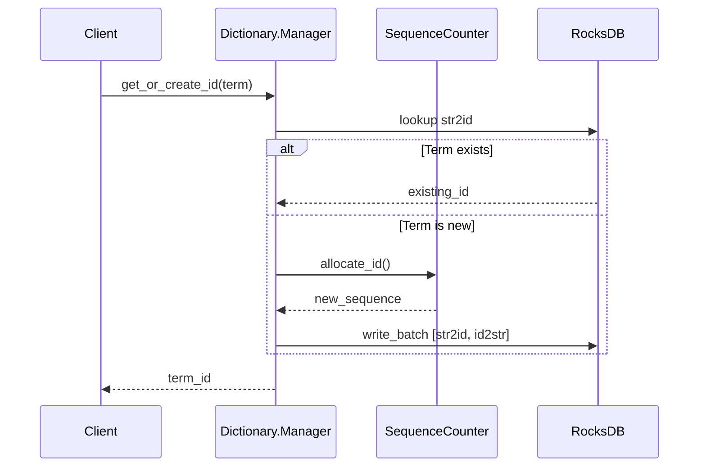
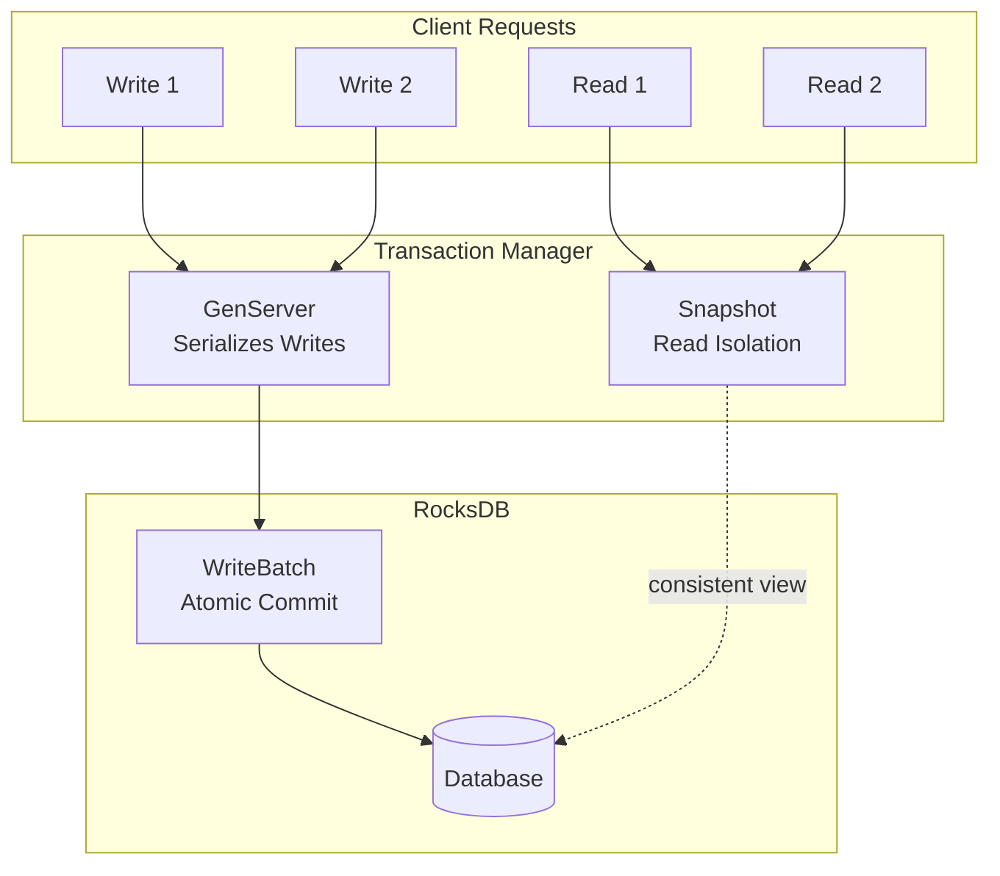
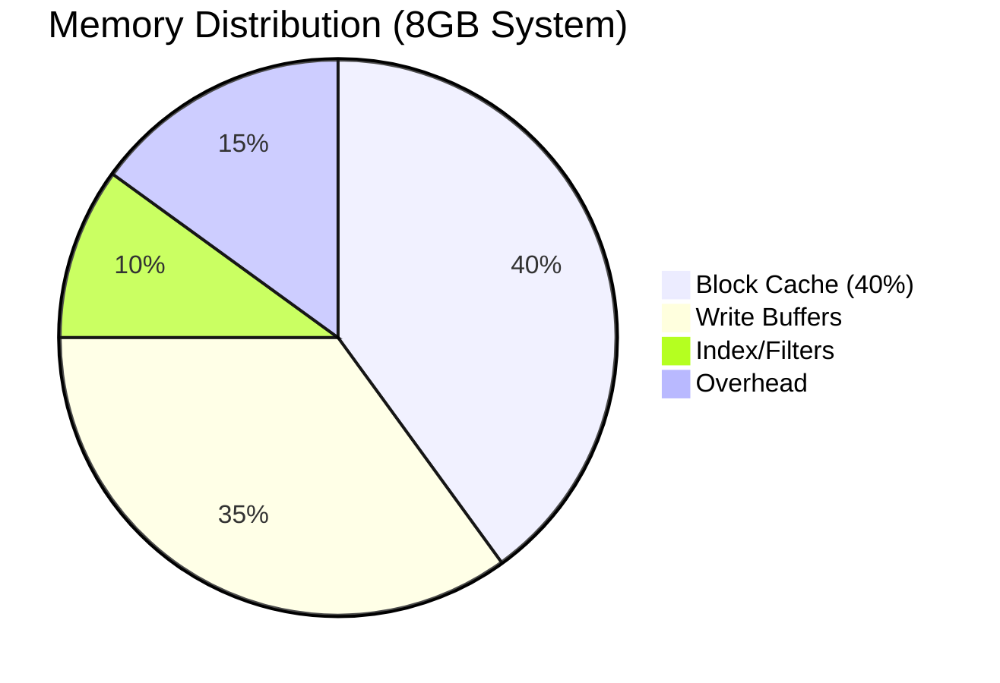

# Storage Layer

This document provides a deep dive into the TripleStore storage layer, including RocksDB integration, dictionary encoding, and triple indexing.

## Overview

The storage layer is responsible for:
- Persistent storage using RocksDB via Rustler NIFs
- Encoding RDF terms as 64-bit integer IDs
- Maintaining triple indices for efficient pattern matching
- Transaction management for SPARQL UPDATE operations



## RocksDB Backend

### NIF Architecture

The `TripleStore.Backend.RocksDB.NIF` module provides Rust-based bindings to RocksDB. All database operations are implemented as NIFs scheduled on dirty CPU schedulers to prevent blocking BEAM schedulers.

```elixir
# NIF operations use dirty schedulers for >1ms operations
# Defined in native/rocksdb_nif/src/lib.rs with:
# #[rustler::nif(schedule = "DirtyCpu")]
```

### Column Families

| Column Family | Purpose | Key Format | Value Format |
|---------------|---------|------------|--------------|
| `spo` | Subject-Predicate-Object index | 24-byte triple key | Empty |
| `pos` | Predicate-Object-Subject index | 24-byte triple key | Empty |
| `osp` | Object-Subject-Predicate index | 24-byte triple key | Empty |
| `str2id` | Term string → ID mapping | Encoded term binary | 8-byte ID |
| `id2str` | ID → Term string mapping | 8-byte ID | Encoded term binary |
| `derived` | Inferred triples from reasoning | 24-byte triple key | Empty |

### Key Operations

```elixir
# Basic operations
NIF.open(path)              # Open database
NIF.close(db)               # Close database
NIF.get(db, cf, key)        # Get value
NIF.put(db, cf, key, value) # Put value
NIF.delete(db, cf, key)     # Delete value
NIF.exists(db, cf, key)     # Check existence

# Batch operations (atomic)
NIF.write_batch(db, [{cf, key, value}, ...])
NIF.delete_batch(db, [{cf, key}, ...])
NIF.mixed_batch(db, [{:put, cf, key, value} | {:delete, cf, key}, ...])

# Iteration
NIF.prefix_iterator(db, cf, prefix)
NIF.iterator_next(iter)
NIF.iterator_seek(iter, target)
NIF.iterator_close(iter)
NIF.prefix_stream(db, cf, prefix)  # Returns Elixir Stream

# Snapshots (for transaction isolation)
NIF.snapshot(db)
NIF.snapshot_get(snap, cf, key)
NIF.release_snapshot(snap)
```

## Dictionary Encoding

The `TripleStore.Dictionary` module maps RDF terms to 64-bit integer IDs, enabling compact storage and fast comparisons.

### Type Tags

The high 4 bits of each 64-bit ID encode the term type:



| Type Tag | Binary | Term Type | Storage |
|----------|--------|-----------|---------|
| 1 | `0b0001` | URI | Dictionary lookup |
| 2 | `0b0010` | Blank node | Dictionary lookup |
| 3 | `0b0011` | Literal (string) | Dictionary lookup |
| 4 | `0b0100` | xsd:integer | Inline encoded |
| 5 | `0b0101` | xsd:decimal | Inline encoded |
| 6 | `0b0110` | xsd:dateTime | Inline encoded |

### ID Space Separation

Each type occupies a distinct range, preventing collisions:

```
Type 1 (URI):      0x1000_0000_0000_0000 to 0x1FFF_FFFF_FFFF_FFFF
Type 2 (BNode):    0x2000_0000_0000_0000 to 0x2FFF_FFFF_FFFF_FFFF
Type 3 (Literal):  0x3000_0000_0000_0000 to 0x3FFF_FFFF_FFFF_FFFF
Type 4 (Integer):  0x4000_0000_0000_0000 to 0x4FFF_FFFF_FFFF_FFFF
Type 5 (Decimal):  0x5000_0000_0000_0000 to 0x5FFF_FFFF_FFFF_FFFF
Type 6 (DateTime): 0x6000_0000_0000_0000 to 0x6FFF_FFFF_FFFF_FFFF
```

### Inline Numeric Encoding

Numeric types are encoded directly in the ID, avoiding dictionary lookup:

#### xsd:integer
- **Bit layout**: `[type:4][value:60]` (two's complement)
- **Range**: `[-2^59, 2^59)` = `[-576460752303423488, 576460752303423487]`

```elixir
# Encoding
{:ok, id} = Dictionary.encode_integer(42)
{:ok, id} = Dictionary.encode_integer(-100)

# Decoding
{:ok, 42} = Dictionary.decode_integer(id)
```

#### xsd:decimal
- **Bit layout**: `[type:4][sign:1][exponent:11][mantissa:48]`
- **Precision**: ~14-15 significant decimal digits

```elixir
# Encoding
{:ok, id} = Dictionary.encode_decimal(Decimal.new("3.14159"))

# Decoding
{:ok, decimal} = Dictionary.decode_decimal(id)
```

#### xsd:dateTime
- **Bit layout**: `[type:4][milliseconds:60]`
- **Range**: 1970-01-01 to ~year 36812066
- **Timezone**: Normalized to UTC before encoding

```elixir
# Encoding
{:ok, id} = Dictionary.encode_datetime(~U[2024-01-15 10:30:00Z])

# Decoding
{:ok, datetime} = Dictionary.decode_datetime(id)
```

### Sequence Counter

For dictionary-allocated terms (URI, blank node, string literal), IDs are assigned sequentially:



**Persistence strategy**:
- Flush interval: Every 1000 IDs allocated
- Recovery: Load persisted value + 1000 safety margin
- Graceful shutdown: Checkpoint current value

### Input Validation

| Validation | Rule |
|------------|------|
| Max term size | 16KB (16,384 bytes) |
| Null bytes | Rejected in URIs |
| Unicode | Normalized to NFC |

## Triple Indices

The `TripleStore.Index` module maintains three indices for O(log n) access to any triple pattern.

### Index Key Structure

All keys are 24 bytes (3 × 64-bit IDs) in big-endian format:

```
SPO Key: [subject:8][predicate:8][object:8]
POS Key: [predicate:8][object:8][subject:8]
OSP Key: [object:8][subject:8][predicate:8]
```

Big-endian encoding ensures lexicographic ordering matches numeric ordering.

### Pattern to Index Mapping

| Pattern | Bound | Index | Operation |
|---------|-------|-------|-----------|
| `(S, P, O)` | All | SPO | Exact lookup |
| `(S, P, ?)` | S, P | SPO | Prefix scan |
| `(S, ?, ?)` | S | SPO | Prefix scan |
| `(?, P, O)` | P, O | POS | Prefix scan |
| `(?, P, ?)` | P | POS | Prefix scan |
| `(?, ?, O)` | O | OSP | Prefix scan |
| `(S, ?, O)` | S, O | OSP | Prefix + filter |
| `(?, ?, ?)` | None | SPO | Full scan |

### Triple Operations

```elixir
# Insert single triple
Index.insert_triple(db, {subject_id, predicate_id, object_id})

# Insert multiple triples atomically
Index.insert_triples(db, [{s1, p1, o1}, {s2, p2, o2}, ...])

# Check existence
{:ok, true} = Index.triple_exists?(db, {s, p, o})

# Delete triples
Index.delete_triple(db, {s, p, o})
Index.delete_triples(db, triples)

# Pattern lookup (returns Stream)
{:ok, stream} = Index.lookup(db, {{:bound, s}, :var, :var})
triples = Enum.to_list(stream)

# Count matching triples
{:ok, count} = Index.count(db, pattern)
```

### Index Selection Example

```elixir
# Query: Find all objects for subject 123 and predicate 456
pattern = {{:bound, 123}, {:bound, 456}, :var}

%{
  index: :spo,
  prefix: <<123::64-big, 456::64-big>>,
  needs_filter: false,
  filter_position: nil
} = Index.select_index(pattern)
```

## Transaction Management

The `TripleStore.Transaction` module coordinates write operations and provides isolation for concurrent reads.

### Architecture



### Isolation Levels

| Operation | Isolation |
|-----------|-----------|
| Writers | Serialized through GenServer |
| Readers during update | Snapshot from before update |
| Readers outside update | Direct database access |

### Update Flow

```elixir
# Start transaction manager
{:ok, txn} = Transaction.start_link(
  db: db,
  dict_manager: manager,
  plan_cache: PlanCache
)

# Execute SPARQL UPDATE
{:ok, count} = Transaction.update(txn, "INSERT DATA { <s> <p> <o> }")

# Direct triple operations
{:ok, count} = Transaction.insert(txn, [{s, p, o}])
{:ok, count} = Transaction.delete(txn, [{s, p, o}])
```

### Cache Invalidation

After successful writes:
1. Plan cache is invalidated (query plans may be stale)
2. Statistics callback is invoked (cardinality estimates need refresh)

## RocksDB Configuration

The `TripleStore.Config.RocksDB` module provides intelligent memory tuning.

### Memory Allocation



| Component | Purpose | Guideline |
|-----------|---------|-----------|
| Block Cache | Caches uncompressed data blocks | 40% of available RAM |
| Write Buffers | In-memory write batching | 32-256 MB per buffer |
| Index/Filters | Bloom filters and block indices | ~10% of block cache |

### Configuration Presets

```elixir
# Automatic detection
config = TripleStore.Config.RocksDB.recommended()

# Specific presets
config = TripleStore.Config.RocksDB.preset(:development)
config = TripleStore.Config.RocksDB.preset(:production_low_memory)
config = TripleStore.Config.RocksDB.preset(:production_high_memory)
config = TripleStore.Config.RocksDB.preset(:write_heavy)

# Custom memory budget
config = TripleStore.Config.RocksDB.for_memory_budget(8 * 1024 * 1024 * 1024)
```

### Preset Comparison

| Preset | Block Cache | Write Buffer | Max Open Files |
|--------|-------------|--------------|----------------|
| development | 128 MB | 32 MB × 2 | 256 |
| production_low_memory | 256 MB | 32 MB × 2 | 512 |
| production_high_memory | 4 GB | 128 MB × 4 | 4096 |
| write_heavy | 1 GB | 256 MB × 4 | 2048 |

### Memory Estimation

```elixir
config = TripleStore.Config.RocksDB.recommended()

# Estimate total memory usage
bytes = TripleStore.Config.RocksDB.estimate_memory_usage(config)
# => Accounts for: block_cache + (6 CFs × buffers × buffer_size) + overhead

# Human-readable summary
IO.puts(TripleStore.Config.RocksDB.format_summary(config))
```

## Module Reference

| Module | Purpose |
|--------|---------|
| `TripleStore.Backend.RocksDB.NIF` | Rust NIF bindings |
| `TripleStore.Dictionary` | Term encoding/decoding |
| `TripleStore.Dictionary.Manager` | GenServer for ID allocation |
| `TripleStore.Dictionary.SequenceCounter` | Atomic ID generation |
| `TripleStore.Dictionary.StringToId` | Term → ID lookup |
| `TripleStore.Dictionary.IdToString` | ID → Term lookup |
| `TripleStore.Index` | Triple indexing |
| `TripleStore.Transaction` | Write coordination |
| `TripleStore.Config.RocksDB` | Memory configuration |

## Next Steps

- [SPARQL Engine](02-sparql-engine.md) - Query parsing and execution
- [Reasoning Engine](03-reasoning-engine.md) - OWL 2 RL implementation
- [Query Optimization](04-query-optimization.md) - Cost model and join algorithms
