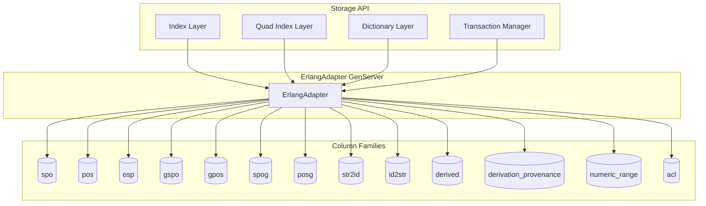
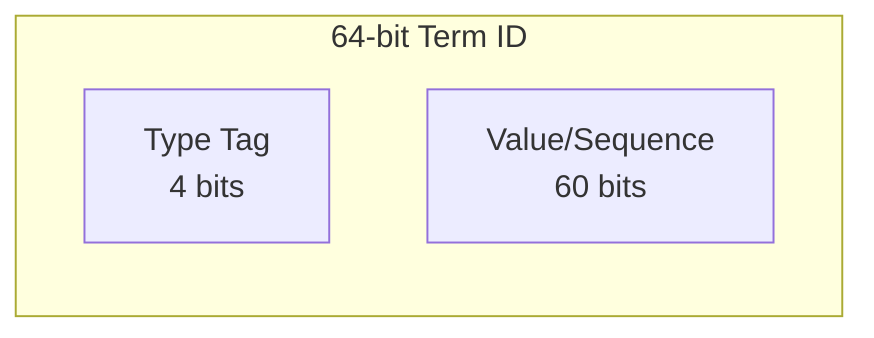
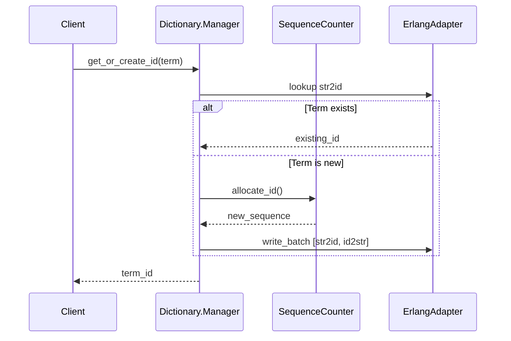
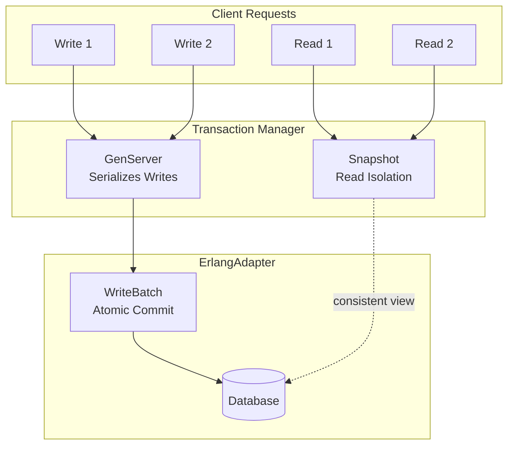

# Storage Layer

This document provides a deep dive into the TripleStore storage layer, including RocksDB integration via erlang-rocksdb, dictionary encoding, and triple/quad indexing.

## Overview

The storage layer is responsible for:
- Persistent storage using RocksDB via erlang-rocksdb (C++ NIF library)
- Encoding RDF terms as 64-bit integer IDs
- Maintaining triple/quad indices for efficient pattern matching
- Transaction management for SPARQL UPDATE operations


```mermaid
graph TB
    subgraph "Storage API"
        IDX[Index Layer]
        QIDX[Quad Index Layer]
        DICT[Dictionary Layer]
        TXN[Transaction Manager]
    end

    subgraph "ErlangAdapter GenServer"
        ADAPTER[ErlangAdapter]
    end

    subgraph "Column Families"
        SPO[(spo)]
        POS[(pos)]
        OSP[(osp)]
        GSPO[(gspo)]
        GPOS[(gpos)]
        SPOG[(spog)]
        POSG[(posg)]
        S2I[(str2id)]
        I2S[(id2str)]
        DER[(derived)]
        DP[(derivation_provenance)]
        NR[(numeric_range)]
        ACL[(acl)]
    end

    IDX --> ADAPTER
    QIDX --> ADAPTER
    DICT --> ADAPTER
    TXN --> ADAPTER

    ADAPTER --> SPO
    ADAPTER --> POS
    ADAPTER --> OSP
    ADAPTER --> GSPO
    ADAPTER --> GPOS
    ADAPTER --> SPOG
    ADAPTER --> POSG
    ADAPTER --> S2I
    ADAPTER --> I2S
    ADAPTER --> DER
    ADAPTER --> DP
    ADAPTER --> NR
    ADAPTER --> ACL
```

## RocksDB Backend

### erlang-rocksdb Architecture

The storage layer uses the `erlang-rocksdb` C++ NIF library, which provides Erlang bindings to Facebook's RocksDB embedded key-value store. The `TripleStore.Backend.RocksDB.ErlangAdapter` GenServer manages the database connection and column family handles.

```elixir
# ErlangAdapter owns the database and provides a GenServer API
{:ok, adapter} = TripleStore.Backend.RocksDB.ErlangAdapter.open("/path/to/db")

# For quad store (schema v2)
{:ok, adapter} = TripleStore.Backend.RocksDB.ErlangAdapter.open("/path/to/quad_db", schema: :quad)
```

### Why erlang-rocksdb?

The migration from a custom Rust NIF to erlang-rocksdb provides:
- **Mature implementation**: Battle-tested in production at WhatsApp, Discord, etc.
- **Active maintenance**: Regular updates and bug fixes from the Erlang community
- **Better resource management**: Proper Erlang resource handling via GenServer pattern
- **C++ performance**: Direct C++ NIF without Rust overhead

### Column Families

#### Triple Store (Schema v1)

| Column Family | Purpose | Key Format | Value Format |
|---------------|---------|------------|--------------|
| `spo` | Subject-Predicate-Object index | 24-byte triple key | Empty |
| `pos` | Predicate-Object-Subject index | 24-byte triple key | Empty |
| `osp` | Object-Subject-Predicate index | 24-byte triple key | Empty |
| `str2id` | Term string → ID mapping | Encoded term binary | 8-byte ID |
| `id2str` | ID → Term string mapping | 8-byte ID | Encoded term binary |
| `derived` | Inferred triples from reasoning | 24-byte triple key | Empty |
| `numeric_range` | Numeric range index | Encoded range key | Empty |

#### Quad Store (Schema v2)

| Column Family | Purpose | Key Format | Value Format |
|---------------|---------|------------|--------------|
| `gspo` | Graph-Subject-Predicate-Object index | 32-byte quad key | Empty |
| `gpos` | Graph-Predicate-Object-Subject index | 32-byte quad key | Empty |
| `spog` | Subject-Predicate-Object-Graph index | 32-byte quad key | Empty |
| `posg` | Predicate-Object-Subject-Graph index | 32-byte quad key | Empty |
| `str2id` | Term string → ID mapping | Encoded term binary | 8-byte ID |
| `id2str` | ID → Term string mapping | 8-byte ID | Encoded term binary |
| `derived` | Inferred quads from reasoning | 32-byte quad key | Empty |
| `derivation_provenance` | Derivation tracking for provenance | Encoded provenance key | Provenance data |
| `numeric_range` | Numeric range index | Encoded range key | Empty |
| `acl` | Access control lists | Encoded ACL key | ACL data |

### Key Operations

```elixir
# Database operations (via ErlangAdapter GenServer)
ErlangAdapter.open(path)              # Open database
ErlangAdapter.close(adapter)          # Close database
ErlangAdapter.get(adapter, cf, key)   # Get value
ErlangAdapter.put(adapter, cf, key, value)  # Put value
ErlangAdapter.delete(adapter, cf, key)      # Delete value
ErlangAdapter.exists(adapter, cf, key)      # Check existence

# Batch operations (atomic)
ErlangAdapter.write_batch(adapter, operations)
ErlangAdapter.delete_batch(adapter, keys)

# Iteration
ErlangAdapter.prefix_stream(adapter, cf, prefix)  # Returns Elixir Stream

# Snapshots (for transaction isolation)
{:ok, snapshot} = ErlangAdapter.snapshot(adapter)
{:ok, value} = ErlangAdapter.snapshot_get(snapshot, cf, key)
:ok = ErlangAdapter.release_snapshot(adapter, snapshot)

# Fold operations
ErlangAdapter.fold(adapter, cf, prefix, acc, fun)
ErlangAdapter.fold_keys(adapter, cf, prefix, acc, fun)
```

## Dictionary Encoding

The `TripleStore.Dictionary` module maps RDF terms to 64-bit integer IDs, enabling compact storage and fast comparisons.

### Type Tags

The high 4 bits of each 64-bit ID encode the term type:


```mermaid
graph LR
    subgraph "64-bit Term ID"
        TYPE[Type Tag<br/>4 bits]
        VALUE[Value/Sequence<br/>60 bits]
    end
```

| Type Tag | Binary | Term Type | Storage |
|----------|--------|-----------|---------|
| 1 | `0b0001` | URI | Dictionary lookup |
| 2 | `0b0010` | Blank node | Dictionary lookup |
| 3 | `0b0011` | Literal (string) | Dictionary lookup |
| 4 | `0b0100` | xsd:integer | Inline encoded |
| 5 | `0b0101` | xsd:decimal | Inline encoded |
| 6 | `0b0110` | xsd:dateTime | Inline encoded |

### ID Space Separation

Each type occupies a distinct range, preventing collisions:

```
Type 1 (URI):      0x1000_0000_0000_0000 to 0x1FFF_FFFF_FFFF_FFFF
Type 2 (BNode):    0x2000_0000_0000_0000 to 0x2FFF_FFFF_FFFF_FFFF
Type 3 (Literal):  0x3000_0000_0000_0000 to 0x3FFF_FFFF_FFFF_FFFF
Type 4 (Integer):  0x4000_0000_0000_0000 to 0x4FFF_FFFF_FFFF_FFFF
Type 5 (Decimal):  0x5000_0000_0000_0000 to 0x5FFF_FFFF_FFFF_FFFF
Type 6 (DateTime): 0x6000_0000_0000_0000 to 0x6FFF_FFFF_FFFF_FFFF
```

### Inline Numeric Encoding

Numeric types are encoded directly in the ID, avoiding dictionary lookup:

#### xsd:integer
- **Bit layout**: `[type:4][value:60]` (two's complement)
- **Range**: `[-2^59, 2^59)` = `[-576460752303423488, 576460752303423487]`

```elixir
# Encoding
{:ok, id} = Dictionary.encode_integer(42)
{:ok, id} = Dictionary.encode_integer(-100)

# Decoding
{:ok, 42} = Dictionary.decode_integer(id)
```

#### xsd:decimal
- **Bit layout**: `[type:4][sign:1][exponent:11][mantissa:48]`
- **Precision**: ~14-15 significant decimal digits

```elixir
# Encoding
{:ok, id} = Dictionary.encode_decimal(Decimal.new("3.14159"))

# Decoding
{:ok, decimal} = Dictionary.decode_decimal(id)
```

#### xsd:dateTime
- **Bit layout**: `[type:4][milliseconds:60]`
- **Range**: 1970-01-01 to ~year 36812066
- **Timezone**: Normalized to UTC before encoding

```elixir
# Encoding
{:ok, id} = Dictionary.encode_datetime(~U[2024-01-15 10:30:00Z])

# Decoding
{:ok, datetime} = Dictionary.decode_datetime(id)
```

### Sequence Counter

For dictionary-allocated terms (URI, blank node, string literal), IDs are assigned sequentially:


```mermaid
sequenceDiagram
    participant Client
    participant Manager as Dictionary.Manager
    participant Counter as SequenceCounter
    participant Adapter as ErlangAdapter

    Client->>Manager: get_or_create_id(term)
    Manager->>Adapter: lookup str2id
    alt Term exists
        Adapter-->>Manager: existing_id
    else Term is new
        Manager->>Counter: allocate_id()
        Counter-->>Manager: new_sequence
        Manager->>Adapter: write_batch [str2id, id2str]
    end
    Manager-->>Client: term_id
```

**Persistence strategy**:
- Flush interval: Every 1000 IDs allocated
- Recovery: Load persisted value + 1000 safety margin
- Graceful shutdown: Checkpoint current value

### Input Validation

| Validation | Rule |
|------------|------|
| Max term size | 16KB (16,384 bytes) |
| Null bytes | Rejected in URIs |
| Unicode | Normalized to NFC |

## Triple Indices

The `TripleStore.Index` module maintains three indices for O(log n) access to any triple pattern.

### Index Key Structure

All keys are 24 bytes (3 × 64-bit IDs) in big-endian format:

```
SPO Key: [subject:8][predicate:8][object:8]
POS Key: [predicate:8][object:8][subject:8]
OSP Key: [object:8][subject:8][predicate:8]
```

Big-endian encoding ensures lexicographic ordering matches numeric ordering.

### Pattern to Index Mapping

| Pattern | Bound | Index | Operation |
|---------|-------|-------|-----------|
| `(S, P, O)` | All | SPO | Exact lookup |
| `(S, P, ?)` | S, P | SPO | Prefix scan |
| `(S, ?, ?)` | S | SPO | Prefix scan |
| `(?, P, O)` | P, O | POS | Prefix scan |
| `(?, P, ?)` | P | POS | Prefix scan |
| `(?, ?, O)` | O | OSP | Prefix scan |
| `(S, ?, O)` | S, O | OSP | Prefix + filter |
| `(?, ?, ?)` | None | SPO | Full scan |

### Triple Operations

```elixir
# Insert single triple
Index.insert_triple(db, {subject_id, predicate_id, object_id})

# Insert multiple triples atomically
Index.insert_triples(db, [{s1, p1, o1}, {s2, p2, o2}, ...])

# Check existence
{:ok, true} = Index.triple_exists?(db, {s, p, o})

# Delete triples
Index.delete_triple(db, {s, p, o})
Index.delete_triples(db, triples)

# Pattern lookup (returns Stream)
stream = Index.lookup(db, {{:bound, s}, :var, :var})
triples = Enum.to_list(stream)

# Count matching triples
{:ok, count} = Index.count(db, pattern)
```

## Quad Indices

The `TripleStore.QuadIndex` module maintains four indices for efficient graph-scoped queries.

### Index Key Structure

All keys are 32 bytes (4 × 64-bit IDs) in big-endian format:

```
GSPO Key:  [graph:8][subject:8][predicate:8][object:8]
GPOS Key:  [graph:8][predicate:8][object:8][subject:8]
SPOG Key:  [subject:8][predicate:8][object:8][graph:8]
POSG Key:  [predicate:8][object:8][subject:8][graph:8]
```

### Pattern to Index Mapping

| Pattern | Index Used | Description |
|---------|------------|-------------|
| `(g, s, p, o)` | GSPO | Exact quad match |
| `(g, s, p, ?)` | GSPO | Graph-scoped S-P |
| `(g, ?, ?, ?)` | GSPO | All quads in graph |
| `(g, ?, p, o)` | GPOS | Graph-scoped P-O |
| `(?, p, o, g)` | POSG | Predicate-object in specific graph |
| `(s, p, o, ?)` | SPOG | Triple across all graphs |
| `(?, ?, ?, g)` | GSPO | All quads in graph |

### Quad Operations

```elixir
# Insert single quad
QuadIndex.insert_quad(db, {graph_id, subject_id, predicate_id, object_id})

# Pattern lookup
quads = QuadIndex.lookup_quads(db, {:var, {:bound, s}, {:bound, p}, :var}, %{})

# Count quads in graph
{:ok, count} = QuadOperations.count_graph_quads(db, graph_id)

# Clear all quads in a graph
:ok = QuadOperations.clear_graph(db, manager, graph_id)
```

## Transaction Management

The `TripleStore.Transaction` module coordinates write operations and provides isolation for concurrent reads.

### Architecture


```mermaid
graph TB
    subgraph "Client Requests"
        W1[Write 1]
        W2[Write 2]
        R1[Read 1]
        R2[Read 2]
    end

    subgraph "Transaction Manager"
        TXN[GenServer<br/>Serializes Writes]
        SNAP[Snapshot<br/>Read Isolation]
    end

    subgraph "ErlangAdapter"
        WB[WriteBatch<br/>Atomic Commit]
        DB[(Database)]
    end

    W1 --> TXN
    W2 --> TXN
    TXN --> WB
    WB --> DB

    R1 --> SNAP
    R2 --> SNAP
    SNAP -.->|consistent view| DB
```

### Isolation Levels

| Operation | Isolation |
|-----------|-----------|
| Writers | Serialized through GenServer |
| Readers during update | Snapshot from before update |
| Readers outside update | Direct database access |

### Update Flow

```elixir
# Start transaction manager
{:ok, txn} = Transaction.start_link(
  db: db,
  dict_manager: manager,
  plan_cache: PlanCache
)

# Execute SPARQL UPDATE
{:ok, count} = Transaction.update(txn, "INSERT DATA { <s> <p> <o> }")

# Direct triple operations
{:ok, count} = Transaction.insert(txn, [{s, p, o}])
{:ok, count} = Transaction.delete(txn, [{s, p, o}])
```

### Cache Invalidation

After successful writes:
1. Plan cache is invalidated (query plans may be stale)
2. Statistics callback is invoked (cardinality estimates need refresh)

## Column Family Configuration

The `TripleStore.Backend.RocksDB.ColumnFamilyConfig` module provides optimized column family options for different access patterns.

### Dictionary CFs (id2str, str2id)
- High bloom filter (14 bits/key) for point lookups
- Small block size (2KB) for cache efficiency
- Pinned L0 filter/index in cache

### Index CFs (spo, pos, osp)
- Medium bloom filter (12 bits/key) for prefix scans
- Medium block size (8KB)
- Prefix extractor (8 bytes) for prefix-based scans

### Quad Index CFs (gspo, gpos, spog, posg)
- Lower bloom filter (10 bits/key) for memory efficiency with 4 indices
- Larger block size (16KB) for 32-byte keys
- Larger memtable (128MB) for 4x write amplification

### Derived CF
- No bloom filter (sequential bulk access)
- Large block size (32KB) for sequential scans

## Bulk Loading

For optimal bulk loading performance:

```elixir
# Open for bulk load
{:ok, adapter} = ErlangAdapter.open_for_bulk_load("/path/to/db")

# Load with larger batch size
TripleStore.load(store, "large_file.ttl", batch_size: 50_000)

# Parallel loading with Flow
Flow.from_stream([file1, file2, file3])
|> Flow.map(&parse_rdf/1)
|> Flow.partition(stages: 4)
|> Flow.each(&TripleStore.insert/2)
|> Flow.run()
```

## Module Reference

| Module | Purpose |
|--------|---------|
| `TripleStore.Backend.RocksDB.ErlangAdapter` | GenServer managing erlang-rocksdb |
| `TripleStore.Backend.RocksDB.ColumnFamilyConfig` | Column family configuration |
| `TripleStore.Dictionary` | Term encoding/decoding |
| `TripleStore.Dictionary.Manager` | GenServer for ID allocation |
| `TripleStore.Dictionary.SequenceCounter` | Atomic ID generation |
| `TripleStore.Dictionary.StringToId` | Term → ID lookup |
| `TripleStore.Dictionary.IdToString` | ID → Term lookup |
| `TripleStore.Index` | Triple indexing |
| `TripleStore.QuadIndex` | Quad indexing |
| `TripleStore.QuadOperations` | Quad operations |
| `TripleStore.Transaction` | Write coordination |

## Next Steps

- [SPARQL Engine](02-sparql-engine.md) - Query parsing and execution
- [Reasoning Engine](03-reasoning-engine.md) - OWL 2 RL implementation
- [Query Optimization](04-query-optimization.md) - Cost model and join algorithms
