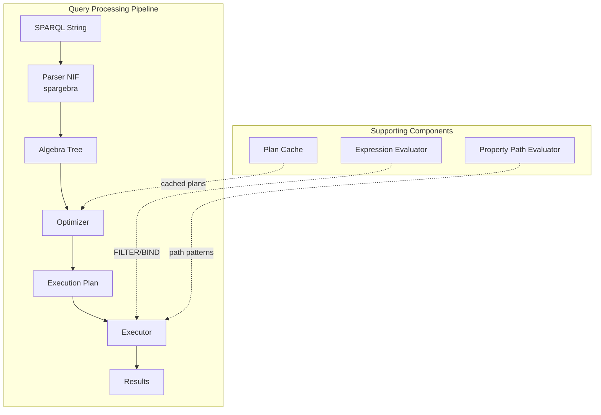
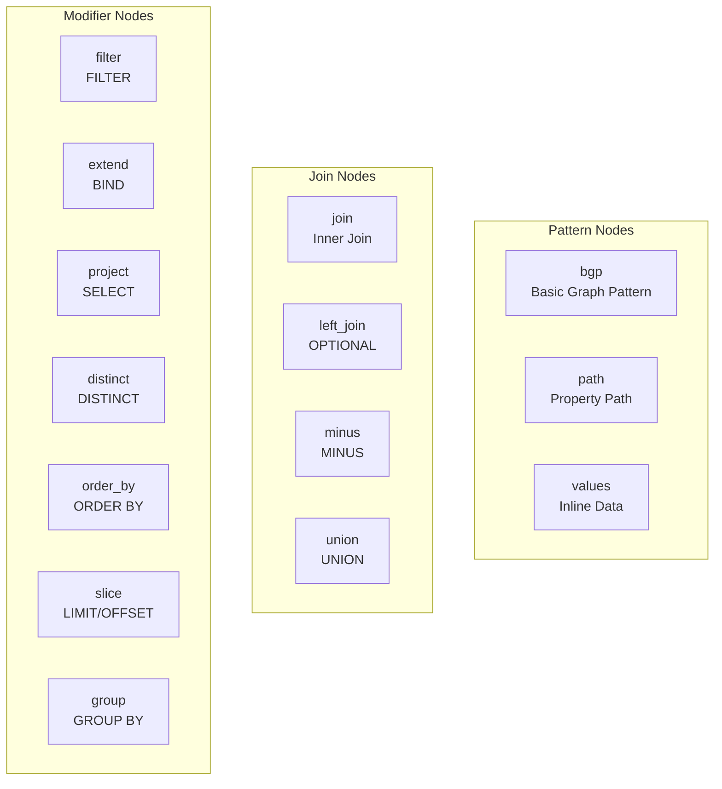
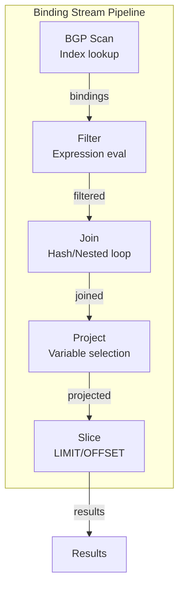
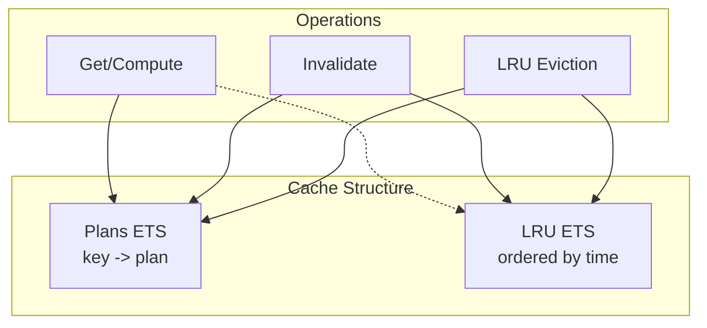

# SPARQL Engine

This document provides a deep dive into the SPARQL query engine, including parsing, optimization, and execution.

## Overview

The SPARQL engine provides full SPARQL 1.1 query and update support:

- NIF-based parsing using Rust's spargebra library
- Algebraic intermediate representation
- Cost-based query optimization
- Iterator-based lazy execution
- Property path evaluation
- Expression evaluation with type coercion



## Parser

### Architecture

The `TripleStore.SPARQL.Parser` module uses a Rust NIF wrapping the spargebra crate from the Oxigraph project. This provides:

- Complete SPARQL 1.1 Query and Update parsing
- Robust error handling with line/column positions
- High-performance parsing for large queries

```elixir
# Parse a SPARQL query
{:ok, ast} = TripleStore.SPARQL.Parser.parse("SELECT ?s WHERE { ?s ?p ?o }")

# Parse with error details
{:error, %{message: msg, line: line, column: col}} =
  TripleStore.SPARQL.Parser.parse("SELECT * WHER { ?s ?p ?o }")
```

### AST Format

The parser returns a tagged tuple structure:

```elixir
{:select, [
  {"pattern", {:project, {:bgp, [...]}, [...]}},
  {"dataset", nil},
  {"base_iri", nil}
]}
```

Query types: `:select`, `:construct`, `:ask`, `:describe`

## Algebra

The `TripleStore.SPARQL.Algebra` module represents SPARQL queries as algebraic expressions:

### Node Types



### Type Definitions

| Node | Structure | Description |
|------|-----------|-------------|
| `{:bgp, patterns}` | List of triples | Basic Graph Pattern |
| `{:triple, s, p, o}` | RDF terms | Single triple pattern |
| `{:join, left, right}` | Two patterns | Inner join |
| `{:left_join, left, right, filter}` | Two patterns + optional filter | OPTIONAL |
| `{:minus, left, right}` | Two patterns | MINUS |
| `{:union, left, right}` | Two patterns | UNION |
| `{:filter, expr, pattern}` | Expression + pattern | FILTER |
| `{:extend, pattern, var, expr}` | Pattern + binding | BIND |
| `{:project, pattern, vars}` | Pattern + variable list | Projection |
| `{:distinct, pattern}` | Single pattern | Duplicate elimination |
| `{:order_by, pattern, conditions}` | Pattern + sort specs | Ordering |
| `{:slice, pattern, offset, limit}` | Pattern + range | Pagination |
| `{:group, pattern, vars, aggregates}` | Pattern + grouping | GROUP BY |

### RDF Term Representation

```elixir
# Variables
{:variable, "name"}

# IRIs
{:named_node, "http://example.org/resource"}

# Blank nodes
{:blank_node, "b1"}

# Literals
{:literal, :simple, "plain text"}
{:literal, :lang, "texte", "fr"}
{:literal, :typed, "42", "http://www.w3.org/2001/XMLSchema#integer"}
```

### Algebra Operations

```elixir
# Create a BGP
bgp = Algebra.bgp([
  Algebra.triple({:variable, "s"}, {:named_node, "http://ex.org/name"}, {:variable, "name"})
])

# Add a filter
filtered = Algebra.filter(
  {:greater, {:variable, "age"}, {:literal, :typed, "18", @xsd_integer}},
  bgp
)

# Project specific variables
result = Algebra.project(filtered, [{:variable, "s"}, {:variable, "name"}])

# Validate the algebra tree
:ok = Algebra.validate(result)
```

## Query Optimizer

The `TripleStore.SPARQL.Optimizer` applies rule-based optimizations in three passes:


### Optimization Rules

#### 1. Constant Folding

```elixir
# Before: FILTER(1 + 2 > 2)
{:filter, {:greater, {:add, 1, 2}, 2}, pattern}

# After: FILTER(3 > 2) -> FILTER(true)
{:filter, {:literal, :typed, "true", @xsd_boolean}, pattern}
```

#### 2. BGP Reordering

Patterns are reordered by estimated selectivity:

| Pattern | Selectivity | Priority |
|---------|-------------|----------|
| `(bound, bound, bound)` | Point lookup | 1 (highest) |
| `(bound, bound, ?)` | Very selective | 2 |
| `(?, bound, bound)` | Selective | 3 |
| `(bound, ?, ?)` | Moderate | 4 |
| `(?, bound, ?)` | Low | 5 |
| `(?, ?, bound)` | Low | 6 |
| `(?, ?, ?)` | Full scan | 7 (lowest) |

```elixir
# Before: { ?s ?p ?o . ?s <type> <Person> }
[{:triple, {:variable, "s"}, {:variable, "p"}, {:variable, "o"}},
 {:triple, {:variable, "s"}, {:named_node, "type"}, {:named_node, "Person"}}]

# After: { ?s <type> <Person> . ?s ?p ?o }
[{:triple, {:variable, "s"}, {:named_node, "type"}, {:named_node, "Person"}},
 {:triple, {:variable, "s"}, {:variable, "p"}, {:variable, "o"}}]
```

#### 3. Filter Push-down

Filters are pushed as close to the data source as possible:

```elixir
# Before: Filter wrapping a join
{:filter, {:bound, {:variable, "x"}},
  {:join, bgp1, bgp2}}

# After: Filter pushed into applicable pattern
{:join,
  {:filter, {:bound, {:variable, "x"}}, bgp1},
  bgp2}
```

### Using the Optimizer

```elixir
# Optimize a query algebra
{:ok, optimized} = Optimizer.optimize(algebra)

# With statistics for cardinality estimation
{:ok, optimized} = Optimizer.optimize(algebra, stats: stats_fn)
```

## Query Executor

The `TripleStore.SPARQL.Executor` implements iterator-based lazy evaluation:

### Execution Model



### Binding Streams

Each operator produces a stream of bindings (variable -> value maps):

```elixir
# A binding maps variable names to RDF terms
%{
  "s" => {:named_node, "http://example.org/alice"},
  "name" => {:literal, :simple, "Alice"},
  "age" => {:literal, :typed, "30", @xsd_integer}
}
```

### Join Algorithms

The executor supports multiple join strategies:

| Algorithm | Use Case | Implementation |
|-----------|----------|----------------|
| Nested Loop | Small inputs or OPTIONAL | Stream.flat_map |
| Hash Join | Large equi-joins | ETS hash table |
| Left Outer | OPTIONAL patterns | Hash with null extension |

```elixir
# Hash join implementation
defp hash_join(left_stream, right_stream, join_vars) do
  # Build hash table from right side
  hash_table = build_hash_table(right_stream, join_vars)

  # Probe with left side
  Stream.flat_map(left_stream, fn left_binding ->
    key = extract_key(left_binding, join_vars)
    matches = :ets.lookup(hash_table, key)
    merge_bindings(left_binding, matches)
  end)
end
```

### Solution Modifiers

| Modifier | Implementation | Memory Limit |
|----------|----------------|--------------|
| DISTINCT | MapSet accumulation | 100,000 solutions |
| ORDER BY | Enum.sort_by | 1,000,000 solutions |
| GROUP BY | Group accumulation | Configurable |
| LIMIT/OFFSET | Stream.drop/take | None |

### Security Limits

The executor enforces resource limits to prevent DoS:

```elixir
@max_distinct_size 100_000
@max_order_by_size 1_000_000
@max_describe_triples 10_000
@max_hash_table_size 1_000_000
```

### Executing Queries

```elixir
# Execute a compiled query
{:ok, results} = Executor.execute(compiled_query, ctx)

# Results structure varies by query type:
# SELECT: List of binding maps
# ASK: true/false
# CONSTRUCT: List of triples
# DESCRIBE: List of triples
```

## Property Paths

The `TripleStore.SPARQL.PropertyPath` module evaluates property path expressions:

### Path Types

```mermaid
graph LR
    subgraph "Non-Recursive"
        LINK[link<br/>predicate]
        SEQ[sequence<br/>p1/p2]
        ALT[alternative<br/>p1|p2]
        REV[reverse<br/>^p]
        NEG[negated<br/>!p]
    end

    subgraph "Recursive"
        ZERO[zero_or_more<br/>p*]
        ONE[one_or_more<br/>p+]
        OPT[zero_or_one<br/>p?]
    end
```

### Path Expressions

| Syntax | Representation | Description |
|--------|----------------|-------------|
| `p` | `{:link, iri}` | Single predicate |
| `p1/p2` | `{:sequence, p1, p2}` | Sequence |
| `p1\|p2` | `{:alternative, p1, p2}` | Alternative |
| `^p` | `{:reverse, p}` | Inverse |
| `!(p1\|p2)` | `{:negated_property_set, [p1, p2]}` | Negation |
| `p*` | `{:zero_or_more, p}` | Zero or more |
| `p+` | `{:one_or_more, p}` | One or more |
| `p?` | `{:zero_or_one, p}` | Optional |

### Evaluation Strategies

#### Fixed-Length Paths

Sequences of simple predicates are optimized as chained joins:

```elixir
# Path: foaf:knows/foaf:name
# Optimized to: Join on intermediate variable
?s foaf:knows ?_intermediate .
?_intermediate foaf:name ?o .
```

#### Recursive Paths

BFS with cycle detection for transitive closure:

```elixir
defp bfs_forward(ctx, inner_path, frontier, visited, depth) do
  # Expand frontier by one step
  next_nodes = expand_frontier(ctx, inner_path, frontier)

  # Filter already visited nodes
  new_frontier = MapSet.difference(next_nodes, visited)
  new_visited = MapSet.union(visited, new_frontier)

  # Continue until no new nodes
  if MapSet.size(new_frontier) == 0 do
    new_visited
  else
    bfs_forward(ctx, inner_path, new_frontier, new_visited, depth + 1)
  end
end
```

#### Bidirectional Search

When both endpoints are bound, search from both ends:


### Resource Limits

| Limit | Default | Purpose |
|-------|---------|---------|
| `max_path_depth` | 100 | Maximum BFS depth |
| `max_frontier_size` | 100,000 | Maximum nodes per BFS level |
| `max_visited_size` | 1,000,000 | Maximum total visited nodes |
| `max_unbounded_results` | 100,000 | Limit for unbound path queries |

## Expression Evaluation

The `TripleStore.SPARQL.Expression` module evaluates FILTER and BIND expressions:

### Expression Categories

| Category | Operators |
|----------|-----------|
| Arithmetic | `+`, `-`, `*`, `/`, unary `-` |
| Comparison | `=`, `!=`, `<`, `>`, `<=`, `>=` |
| Logical | `&&`, `\|\|`, `!` |
| Built-in | `STR`, `LANG`, `DATATYPE`, `BOUND`, `IF`, `COALESCE` |
| String | `STRLEN`, `SUBSTR`, `UCASE`, `LCASE`, `CONTAINS`, `REGEX` |
| Numeric | `ABS`, `ROUND`, `CEIL`, `FLOOR`, `RAND` |
| Date/Time | `NOW`, `YEAR`, `MONTH`, `DAY`, `HOURS`, `MINUTES` |
| Hash | `MD5`, `SHA1`, `SHA256`, `SHA384`, `SHA512` |
| Aggregate | `COUNT`, `SUM`, `AVG`, `MIN`, `MAX`, `GROUP_CONCAT`, `SAMPLE` |

### Evaluation Flow

```elixir
# Evaluate an expression against bindings
bindings = %{"x" => {:literal, :typed, "10", @xsd_integer}}
expr = {:greater, {:variable, "x"}, {:literal, :typed, "5", @xsd_integer}}

{:ok, {:literal, :typed, "true", @xsd_boolean}} =
  Expression.evaluate(expr, bindings)
```

### Type Coercion

Numeric types are automatically promoted:

```
integer + decimal -> decimal
decimal + float   -> float
float + double    -> double
```

### Effective Boolean Value

Non-boolean values are coerced for FILTER:

| Type | True | False |
|------|------|-------|
| Boolean | "true" | "false" |
| String | non-empty | empty |
| Numeric | non-zero | zero |

### Regex Safety

REGEX expressions are protected against ReDoS attacks:

```elixir
@regex_timeout_ms 1000
@max_regex_pattern_length 1000

# Patterns with catastrophic backtracking are rejected
# e.g., (a+)+, (a*)*
```

## Plan Cache

The `TripleStore.SPARQL.PlanCache` caches optimized query plans:

### Architecture



### Key Normalization

Cache keys are computed by normalizing variable names:

```elixir
# These two queries share the same cache entry:
"SELECT ?x WHERE { ?x ?y ?z }"
"SELECT ?a WHERE { ?a ?b ?c }"

# Normalized form: variables replaced with positional indices
{:variable, 0}, {:variable, 1}, {:variable, 2}
```

### Cache Operations

```elixir
# Get or compute a plan
plan = PlanCache.get_or_compute(query, fn ->
  JoinEnumeration.enumerate(patterns, stats)
end)

# Invalidate after data change
PlanCache.invalidate()

# Get statistics
stats = PlanCache.stats()
# => %{size: 42, hits: 1000, misses: 50, hit_rate: 0.95, evictions: 10}
```

### Invalidation Triggers

The cache should be invalidated when:

1. Bulk data is loaded
2. Statistics are refreshed
3. Schema changes occur

## Query Execution Example

Complete query execution flow:

```elixir
sparql = """
SELECT ?name ?age
WHERE {
  ?person a <http://example.org/Person> .
  ?person <http://example.org/name> ?name .
  OPTIONAL { ?person <http://example.org/age> ?age }
  FILTER(?age > 18)
}
ORDER BY ?name
LIMIT 10
"""

# 1. Parse
{:ok, ast} = Parser.parse(sparql)

# 2. Compile to algebra
{:ok, compiled} = Algebra.from_ast(ast)

# 3. Optimize
{:ok, optimized} = Optimizer.optimize(compiled.pattern)

# 4. Execute
{:ok, results} = Executor.execute(%{compiled | pattern: optimized}, ctx)

# Results: List of binding maps
[
  %{"name" => {:literal, :simple, "Alice"}, "age" => {:literal, :typed, "25", @xsd_integer}},
  %{"name" => {:literal, :simple, "Bob"}, "age" => {:literal, :typed, "30", @xsd_integer}},
  ...
]
```

## Module Reference

| Module | Purpose |
|--------|---------|
| `TripleStore.SPARQL.Parser` | SPARQL parsing via Rust NIF |
| `TripleStore.SPARQL.Algebra` | Algebra tree representation |
| `TripleStore.SPARQL.Optimizer` | Query optimization |
| `TripleStore.SPARQL.Executor` | Query execution |
| `TripleStore.SPARQL.Expression` | Expression evaluation |
| `TripleStore.SPARQL.PropertyPath` | Property path evaluation |
| `TripleStore.SPARQL.PlanCache` | Plan caching |
| `TripleStore.SPARQL.UpdateExecutor` | SPARQL UPDATE |
| `TripleStore.SPARQL.Term` | Term encoding/decoding |
| `TripleStore.SPARQL.Cardinality` | Cardinality estimation |
| `TripleStore.SPARQL.CostModel` | Query cost estimation |
| `TripleStore.SPARQL.JoinEnumeration` | Join order optimization |

## Next Steps

- [Reasoning Engine](03-reasoning-engine.md) - OWL 2 RL implementation
- [Query Optimization](04-query-optimization.md) - Cost model and join algorithms
- [Telemetry & Monitoring](05-telemetry-monitoring.md) - Observability features
