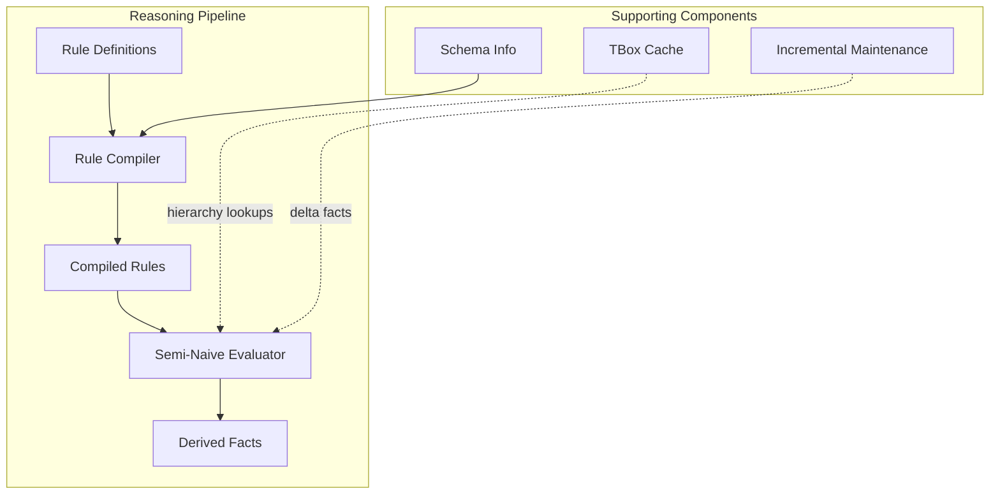
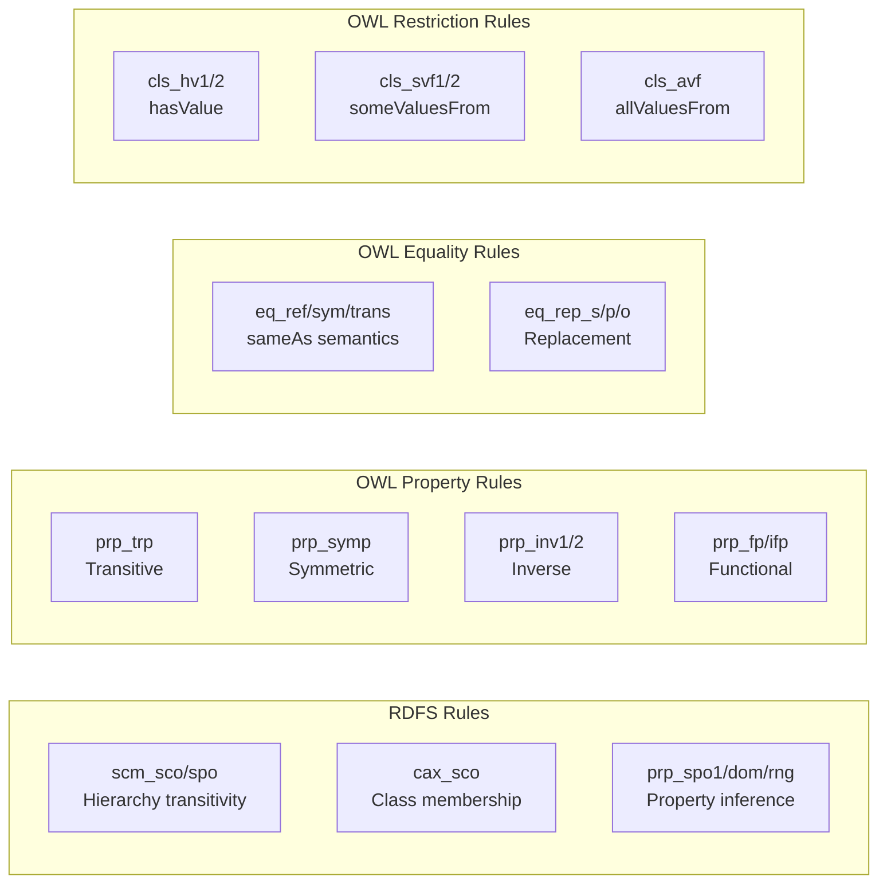
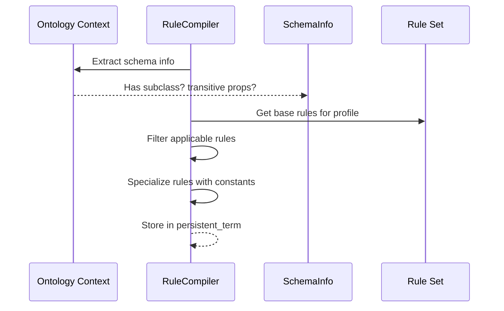
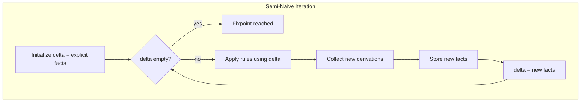
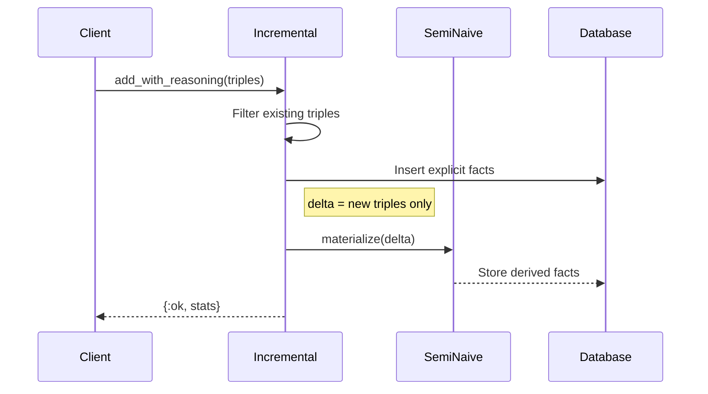

# Reasoning Engine

This document provides a deep dive into the OWL 2 RL reasoning engine, including rule compilation, semi-naive evaluation, incremental maintenance, and schema caching.

## Overview

The reasoning engine provides forward-chaining materialization for OWL 2 RL:

- Rule-based inference with ontology-specific compilation
- Semi-naive evaluation for efficient fixpoint computation
- Incremental addition with delta-based processing
- TBox (schema) caching for O(1) hierarchy lookups



## Rule Definitions

The `TripleStore.Reasoner.Rules` module defines the complete OWL 2 RL rule set:

### Rule Categories



### RDFS Rules

| Rule | Pattern | Derives |
|------|---------|---------|
| `scm_sco` | `?c1 subClassOf ?c2 . ?c2 subClassOf ?c3` | `?c1 subClassOf ?c3` |
| `scm_spo` | `?p1 subPropertyOf ?p2 . ?p2 subPropertyOf ?p3` | `?p1 subPropertyOf ?p3` |
| `cax_sco` | `?x type ?c1 . ?c1 subClassOf ?c2` | `?x type ?c2` |
| `prp_spo1` | `?x ?p1 ?y . ?p1 subPropertyOf ?p2` | `?x ?p2 ?y` |
| `prp_dom` | `?x ?p ?y . ?p domain ?c` | `?x type ?c` |
| `prp_rng` | `?x ?p ?y . ?p range ?c` | `?y type ?c` |

### OWL 2 RL Property Rules

| Rule | Pattern | Derives |
|------|---------|---------|
| `prp_trp` | `?p type TransitiveProperty . ?x ?p ?y . ?y ?p ?z` | `?x ?p ?z` |
| `prp_symp` | `?p type SymmetricProperty . ?x ?p ?y` | `?y ?p ?x` |
| `prp_inv1` | `?p1 inverseOf ?p2 . ?x ?p1 ?y` | `?y ?p2 ?x` |
| `prp_inv2` | `?p1 inverseOf ?p2 . ?x ?p2 ?y` | `?y ?p1 ?x` |
| `prp_fp` | `?p type FunctionalProperty . ?x ?p ?y1 . ?x ?p ?y2` | `?y1 sameAs ?y2` |
| `prp_ifp` | `?p type InverseFunctionalProperty . ?x1 ?p ?y . ?x2 ?p ?y` | `?x1 sameAs ?x2` |

### OWL 2 RL Equality Rules

| Rule | Pattern | Derives |
|------|---------|---------|
| `eq_ref` | `?x` (any resource) | `?x sameAs ?x` |
| `eq_sym` | `?x sameAs ?y` | `?y sameAs ?x` |
| `eq_trans` | `?x sameAs ?y . ?y sameAs ?z` | `?x sameAs ?z` |
| `eq_rep_s` | `?s sameAs ?s' . ?s ?p ?o` | `?s' ?p ?o` |
| `eq_rep_p` | `?p sameAs ?p' . ?s ?p ?o` | `?s ?p' ?o` |
| `eq_rep_o` | `?o sameAs ?o' . ?s ?p ?o` | `?s ?p ?o'` |

### Using Rules

```elixir
# Get all RDFS rules
rules = Rules.rdfs_rules()

# Get all OWL 2 RL rules (includes RDFS)
rules = Rules.all_rules()

# Get a specific rule by name
rule = Rules.get_rule(:prp_trp)

# Get rules by profile
rules = Rules.rules_for_profile(:owl2rl)
```

## Rule Compiler

The `TripleStore.Reasoner.RuleCompiler` analyzes ontologies and produces optimized rule sets:

### Compilation Process



### Rule Applicability

Rules are filtered based on ontology content:

| Rule | Applicable When |
|------|-----------------|
| `scm_sco`, `cax_sco` | Ontology has `rdfs:subClassOf` |
| `scm_spo`, `prp_spo1` | Ontology has `rdfs:subPropertyOf` |
| `prp_trp` | Ontology declares `owl:TransitiveProperty` |
| `prp_symp` | Ontology declares `owl:SymmetricProperty` |
| `prp_inv1/2` | Ontology has `owl:inverseOf` |
| `eq_*` | Ontology uses `owl:sameAs` |

### Rule Specialization

Generic rules are specialized with ontology constants:

```elixir
# Generic prp_trp rule:
# ?p type TransitiveProperty . ?x ?p ?y . ?y ?p ?z -> ?x ?p ?z

# Specialized for ex:contains (a transitive property):
# ?x ex:contains ?y . ?y ex:contains ?z -> ?x ex:contains ?z

# The type check is eliminated, improving performance
```

### Compiling Rules

```elixir
# Compile rules for an ontology context
{:ok, compiled} = RuleCompiler.compile(ctx, profile: :owl2rl)

# With specialization limit
{:ok, compiled} = RuleCompiler.compile(ctx,
  profile: :owl2rl,
  specialize: true,
  max_specializations: 1000
)

# Get the compiled rules
rules = RuleCompiler.get_rules(compiled)

# Store for reuse (in persistent_term)
RuleCompiler.store(compiled, :my_ontology)

# Load later
{:ok, compiled} = RuleCompiler.load(:my_ontology)
```

### Schema Information

The compiler extracts schema info from the ontology:

```elixir
%SchemaInfo{
  has_subclass: true,
  has_subproperty: false,
  has_domain: true,
  has_range: true,
  has_sameas: false,
  has_restrictions: false,
  transitive_properties: ["http://example.org/contains"],
  symmetric_properties: [],
  inverse_properties: [{"http://ex.org/hasParent", "http://ex.org/hasChild"}],
  functional_properties: [],
  inverse_functional_properties: []
}
```

## Semi-Naive Evaluation

The `TripleStore.Reasoner.SemiNaive` module implements the fixpoint iteration loop:

### Algorithm



### Key Insight: Delta Processing

Instead of re-evaluating all facts each iteration (naive), semi-naive only considers facts derived in the previous iteration (delta):

```
Naive:     O(|all_facts| × |rules|) per iteration
Semi-naive: O(|delta| × |rules|) per iteration
```

For ontologies where derivations converge quickly (typical: 3-10 iterations), this provides dramatic speedups.

### Materialization

```elixir
# Materialize with external storage
lookup_fn = fn pattern -> Index.lookup_all(db, pattern) end
store_fn = fn facts -> Index.insert_triples(db, facts) end

{:ok, stats} = SemiNaive.materialize(lookup_fn, store_fn, rules, initial_facts)
# => %{iterations: 5, total_derived: 10000, duration_ms: 1234}

# Materialize in memory (for testing)
{:ok, all_facts, stats} = SemiNaive.materialize_in_memory(rules, initial_facts)

# With parallel rule evaluation
{:ok, stats} = SemiNaive.materialize_parallel(lookup_fn, store_fn, rules, initial_facts,
  max_concurrency: 8
)
```

### Configuration

| Option | Default | Description |
|--------|---------|-------------|
| `max_iterations` | 1000 | Maximum iterations before stopping |
| `max_facts` | 10,000,000 | Maximum facts before stopping |
| `parallel` | false | Enable parallel rule evaluation |
| `max_concurrency` | CPUs | Maximum parallel tasks |
| `task_timeout` | 60,000ms | Timeout per rule evaluation |
| `emit_telemetry` | true | Emit telemetry events |

### Telemetry Events

| Event | Measurements | Metadata |
|-------|--------------|----------|
| `[:triple_store, :reasoner, :materialize, :start]` | - | rule_count, initial_fact_count, parallel |
| `[:triple_store, :reasoner, :materialize, :iteration]` | count | iteration_number |
| `[:triple_store, :reasoner, :materialize, :stop]` | duration | iterations, total_derived |

## Incremental Maintenance

The `TripleStore.Reasoner.Incremental` module handles adding facts efficiently:

### Incremental Addition

When facts are added, only their consequences are computed:



### Usage

```elixir
# In-memory incremental addition
existing = MapSet.new([{student_uri, subclass_of, person_uri}])
new_triples = [{alice_uri, type_uri, student_uri}]

{:ok, all_facts, stats} = Incremental.add_in_memory(new_triples, existing, rules)
# alice now has type Person (derived)

# Database incremental addition
{:ok, stats} = Incremental.add_with_reasoning(db, id_triples, rules)

# Preview what would be derived (dry run)
{:ok, derived} = Incremental.preview_in_memory(new_triples, existing, rules)
```

### Performance Comparison

| Operation | Full Rematerialization | Incremental |
|-----------|------------------------|-------------|
| Add 1 triple to 1M triples | O(1M × rules × iterations) | O(derivations × rules × iterations) |
| Typical speedup | - | 100-10000x |

## TBox Cache

The `TripleStore.Reasoner.TBoxCache` caches schema hierarchies for fast lookups:

### Cached Information

```mermaid
graph TB
    subgraph "Class Hierarchy"
        SUP[Superclass Map<br/>Student → {Person, Agent}]
        SUB[Subclass Map<br/>Person → {Student, Employee}]
    end

    subgraph "Property Hierarchy"
        SUPP[Superproperty Map]
        SUBP[Subproperty Map]
        CHAR[Characteristics]
    end

    subgraph "Characteristics"
        TRANS[Transitive Props]
        SYM[Symmetric Props]
        FUNC[Functional Props]
        INV[Inverse Pairs]
    end

    CHAR --> TRANS
    CHAR --> SYM
    CHAR --> FUNC
    CHAR --> INV
```

### Computing Hierarchies

```elixir
# Compute class hierarchy from facts
{:ok, hierarchy} = TBoxCache.compute_class_hierarchy_in_memory(facts)

# Query the hierarchy
superclasses = TBoxCache.superclasses_from(hierarchy, {:iri, "Student"})
# => MapSet.new([{:iri, "Person"}, {:iri, "Agent"}])

subclasses = TBoxCache.subclasses_from(hierarchy, {:iri, "Person"})
# => MapSet.new([{:iri, "Student"}, {:iri, "Employee"}])

# Check relationships
TBoxCache.superclass?(hierarchy, {:iri, "Student"}, {:iri, "Person"})
# => true

# Compute and store in persistent_term for global access
{:ok, stats} = TBoxCache.compute_and_store_class_hierarchy(facts, :my_ontology)

# Query cached hierarchy
superclasses = TBoxCache.superclasses({:iri, "Student"}, :my_ontology)
```

### Property Characteristics

```elixir
# Compute property hierarchy
{:ok, prop_hierarchy} = TBoxCache.compute_property_hierarchy_in_memory(facts)

# Check property characteristics
TBoxCache.transitive_property?(prop_hierarchy, {:iri, "contains"})
TBoxCache.symmetric_property?(prop_hierarchy, {:iri, "knows"})
TBoxCache.functional_property?(prop_hierarchy, {:iri, "hasFather"})

# Get inverse property
TBoxCache.inverse_of(prop_hierarchy, {:iri, "hasParent"})
# => {:iri, "hasChild"}

# Get all properties of a type
transitive_props = TBoxCache.transitive_properties(prop_hierarchy)
```

### TBox Update Detection

The cache detects when schema-modifying triples are added:

```elixir
# Check if triples affect TBox
TBoxCache.tbox_triple?({{:iri, "Student"}, {:iri, "rdfs:subClassOf"}, {:iri, "Person"}})
# => true (affects class hierarchy)

TBoxCache.tbox_triple?({{:iri, "alice"}, {:iri, "rdf:type"}, {:iri, "Person"}})
# => false (instance data, not schema)

# Handle TBox updates
{:ok, result} = TBoxCache.handle_tbox_update(modified_triples, current_facts, :my_ontology)
# => %{tbox_modified: true, invalidated: %{class_hierarchy: true}, recomputed: ...}
```

### Storage in persistent_term

Hierarchies are stored in `:persistent_term` for zero-copy access:

```elixir
# Store
TBoxCache.compute_and_store_class_hierarchy(facts, :my_ontology)

# Check if cached
TBoxCache.cached?(:class_hierarchy, :my_ontology)

# Get version for cache invalidation
{:ok, version} = TBoxCache.version(:class_hierarchy, :my_ontology)

# Clear cache
TBoxCache.clear(:class_hierarchy, :my_ontology)

# Clear all caches
TBoxCache.clear_all()
```

## Reasoning Workflow

Complete reasoning workflow example:

```elixir
# 1. Load ontology schema
{:ok, store} = TripleStore.open("/data/knowledge_base")
{:ok, _} = TripleStore.load(store, "ontology.ttl")

# 2. Extract schema info and compile rules
{:ok, compiled} = RuleCompiler.compile(store, profile: :owl2rl)
rules = RuleCompiler.get_rules(compiled)

# 3. Compute and cache hierarchies
{:ok, _} = TBoxCache.compute_and_store_class_hierarchy(store, :my_kb)
{:ok, _} = TBoxCache.compute_and_store_property_hierarchy(store, :my_kb)

# 4. Materialize initial inferences
{:ok, stats} = TripleStore.materialize(store, rules)
# => %{iterations: 5, total_derived: 50000}

# 5. Incrementally add new data
new_triples = [{alice, type, student}]
{:ok, stats} = Incremental.add_with_reasoning(store.db, new_triples, rules)
# Only derives consequences of new triples

# 6. Query includes derived facts
{:ok, results} = TripleStore.query(store, """
  SELECT ?x WHERE { ?x rdf:type ex:Person }
""")
# Includes alice (derived from Student subClassOf Person)
```

## Performance Characteristics

### Time Complexity

| Operation | Complexity |
|-----------|------------|
| Rule compilation | O(rules × schema_size) |
| Semi-naive iteration | O(delta × rules × pattern_matches) |
| Total materialization | O(derived × rules × iterations) |
| Incremental addition | O(new_derivations × rules × iterations) |
| Hierarchy lookup | O(1) with TBox cache |

### Space Complexity

| Component | Memory |
|-----------|--------|
| Compiled rules | O(rules + specializations) |
| TBox cache | O(classes + properties) |
| Derived facts | O(derived) in database |

### Typical Performance

| Ontology Size | Classes | Materialization Time | Iterations |
|---------------|---------|----------------------|------------|
| Small | 100 | < 1 second | 3-5 |
| Medium | 10,000 | 1-10 seconds | 5-8 |
| Large | 100,000 | 10-60 seconds | 8-12 |

## Module Reference

| Module | Purpose |
|--------|---------|
| `TripleStore.Reasoner.Rules` | OWL 2 RL rule definitions |
| `TripleStore.Reasoner.Rule` | Rule data structure |
| `TripleStore.Reasoner.RuleCompiler` | Ontology-specific compilation |
| `TripleStore.Reasoner.SemiNaive` | Fixpoint evaluation |
| `TripleStore.Reasoner.Incremental` | Incremental maintenance |
| `TripleStore.Reasoner.TBoxCache` | Schema hierarchy caching |
| `TripleStore.Reasoner.SchemaInfo` | Extracted schema information |
| `TripleStore.Reasoner.PatternMatcher` | Triple pattern matching |
| `TripleStore.Reasoner.DerivedStore` | Derived fact storage |
| `TripleStore.Reasoner.Namespaces` | RDF/OWL namespace constants |

## Next Steps

- [Query Optimization](04-query-optimization.md) - Cost model and join algorithms
- [Telemetry & Monitoring](05-telemetry-monitoring.md) - Observability features
