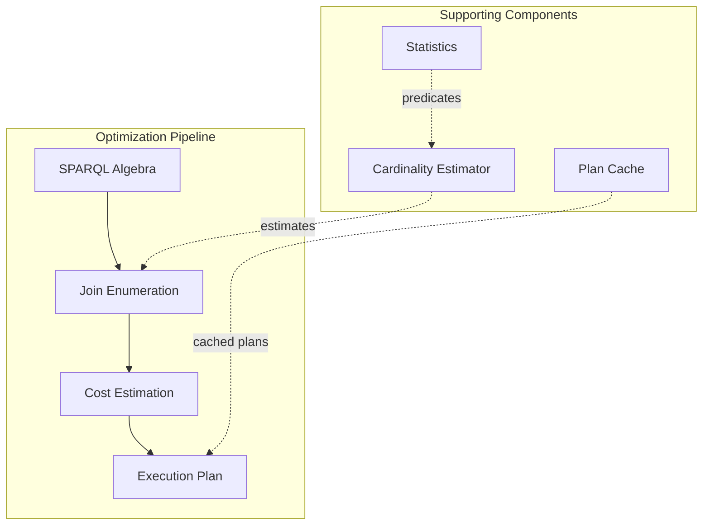
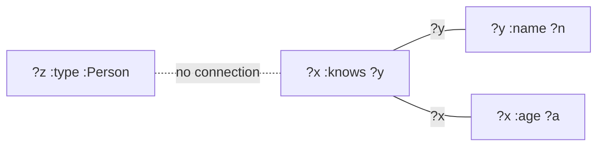
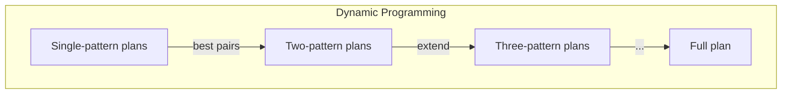
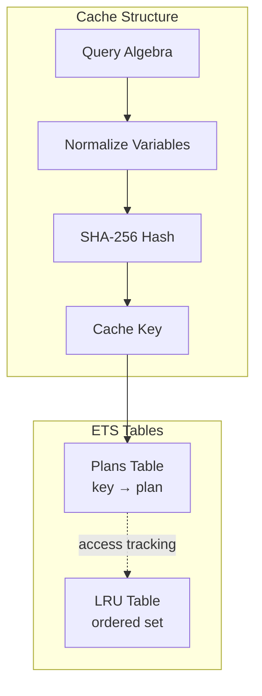

# Query Optimization

This document provides a deep dive into the query optimization subsystem, including the cost model, cardinality estimation, join enumeration, and plan caching.

## Overview

The query optimizer transforms SPARQL queries into efficient execution plans:

- Cost model for comparing alternative plans
- Cardinality estimation for predicting result sizes
- Join enumeration to find optimal join orderings
- Plan caching to avoid repeated optimization



## Cost Model

The `TripleStore.SPARQL.CostModel` estimates execution costs for query operations:

### Cost Components

Each cost estimate includes:

| Component | Description | Weight |
|-----------|-------------|--------|
| `cpu` | Processing time for comparisons, hashing | 1.0 |
| `io` | Disk access for index seeks and scans | 10.0 |
| `memory` | Memory usage for hash tables, materialization | 1.0 |
| `total` | Combined cost for comparison | cpu + io + memory |

### Join Strategies

The cost model supports three join strategies:

```mermaid
graph LR
    subgraph "Nested Loop"
        NL[O(n × m) CPU<br/>O(1) memory]
    end

    subgraph "Hash Join"
        HJ[O(n + m) CPU<br/>O(n) memory]
    end

    subgraph "Leapfrog"
        LF[O(output × k × log N)<br/>O(k) memory]
    end
```

#### Nested Loop Join

```elixir
# Cost formula
cpu = left_card * right_card * comparison_cost
memory = right_card * memory_weight

# Best for:
# - Very small inputs (< 100 tuples each)
# - When outer relation is highly selective
```

#### Hash Join

```elixir
# Cost formula
build_cost = left_card * hash_cost
probe_cost = right_card * probe_cost
memory = left_card * memory_weight

# Best for:
# - Medium to large inputs
# - Equi-joins with good hash distribution
```

#### Leapfrog Triejoin

```elixir
# Cost based on AGM bound
output_estimate = geometric_mean(cardinalities) * selectivity
cpu = output_estimate * k * (seek_cost * log(N) + comparison_cost)
memory = k * memory_weight

# Best for:
# - 4+ patterns with shared variables
# - Cyclic query structures
# - Worst-case optimal behavior
```

### Index Scan Costs

| Scan Type | When Used | I/O Cost |
|-----------|-----------|----------|
| Point Lookup | `(S, P, O)` fully bound | 10.0 (single seek) |
| Prefix Scan | `(S, P, ?)`, `(?, P, O)` | 10.0 + 0.1 × results |
| Full Scan | `(?, ?, ?)` unbound | 0.1 × total_triples |

### Strategy Selection

```elixir
# Automatic strategy selection
{strategy, cost} = CostModel.select_join_strategy(left_card, right_card, join_vars, stats)

# Example outcomes:
# Small inputs (< 100 each): :nested_loop
# Large inputs with shared vars: :hash_join
# 4+ patterns with cycles: :leapfrog (via should_use_leapfrog?)
```

## Cardinality Estimation

The `TripleStore.SPARQL.Cardinality` module estimates result sizes:

### Pattern Selectivity

| Pattern | Selectivity | Estimation |
|---------|-------------|------------|
| `(S, P, O)` | 1 / N | Single result expected |
| `(S, P, ?)` | 1 / distinct_subjects | N / distinct_subjects |
| `(?, P, ?)` | 1 / distinct_predicates | N / distinct_predicates |
| `(?, P, O)` | 1 / (distinct_predicates × distinct_objects) | Compound selectivity |
| `(?, ?, ?)` | 1.0 | Full scan |

### Join Selectivity

```elixir
# Independence assumption
# P(A ∩ B) = P(A) × P(B) × join_factor

join_selectivity = left_card * right_card * variable_selectivity

# Join factor based on shared variables
variable_selectivity = 1 / sqrt(distinct_values)
```

### Statistics Sources

```elixir
stats = %{
  triple_count: 1_000_000,
  distinct_subjects: 100_000,
  distinct_predicates: 50,
  distinct_objects: 500_000,
  predicate_counts: %{"rdf:type" => 200_000, ...}
}
```

## Join Enumeration

The `TripleStore.SPARQL.JoinEnumeration` module finds optimal join orderings:

### Algorithm Selection

| Pattern Count | Algorithm | Complexity |
|---------------|-----------|------------|
| n ≤ 5 | Exhaustive | O(n!) |
| n > 5 | DPccp | O(3^n) |

### Join Graph

Patterns are connected if they share variables:



### Exhaustive Enumeration

For small queries (≤ 5 patterns):

1. Generate all permutations
2. Build left-deep plans for each
3. Filter out plans with Cartesian products
4. Select minimum cost plan

```elixir
# Left-deep plan structure
{:join, :hash_join,
  {:join, :hash_join,
    {:scan, pattern1},
    {:scan, pattern2},
    ["x"]},
  {:scan, pattern3},
  ["y"]}
```

### DPccp Algorithm

For larger queries:



1. Initialize with single-pattern scans
2. For each subset size 2..n:
   - Generate connected complement pairs (ccp)
   - Combine best sub-plans for each pair
   - Keep only the cheapest plan per subset
3. Return best plan for full pattern set

### Leapfrog Detection

Leapfrog is preferred when:

```elixir
# Criteria for Leapfrog selection
should_use_leapfrog?(patterns, stats) when
  length(patterns) >= 4 and
  has_multi_occurrence_variable(patterns) and
  leapfrog_cost < cascade_hash_join_cost
```

### Execution Plan Structure

```elixir
%{
  tree: {:join, :hash_join,
    {:scan, {:triple, {:variable, "s"}, 1, {:variable, "o"}}},
    {:scan, {:triple, {:variable, "o"}, 2, {:variable, "z"}}},
    ["o"]},
  cost: %{cpu: 1500.0, io: 20.0, memory: 1000.0, total: 2520.0},
  cardinality: 5000.0
}
```

## Plan Cache

The `TripleStore.SPARQL.PlanCache` caches optimized plans:

### Architecture



### Key Normalization

Variable names are normalized so structurally identical queries share cache entries:

```elixir
# These two queries share the same cache key:
"SELECT ?x WHERE { ?x ?y ?z }"
"SELECT ?a WHERE { ?a ?b ?c }"

# Normalized form:
{:variable, 0}, {:variable, 1}, {:variable, 2}
```

### LRU Eviction

When cache exceeds max size, oldest entries are evicted:

```elixir
# Default max size: 1000 plans
{:ok, _} = PlanCache.start_link(max_size: 1000)

# Eviction happens automatically on insert
```

### Cache Operations

```elixir
# Get or compute a plan
plan = PlanCache.get_or_compute(query, fn ->
  JoinEnumeration.enumerate(patterns, stats)
end)

# Invalidate after data change
PlanCache.invalidate()

# Get statistics
stats = PlanCache.stats()
# => %{size: 42, hits: 1000, misses: 50, hit_rate: 0.95, evictions: 10}
```

### Invalidation Triggers

The cache should be invalidated when:

1. **Bulk data loaded** - Statistics change significantly
2. **Schema modified** - New predicates added
3. **Manual trigger** - Application-specific events

## Optimization Workflow

Complete query optimization flow:

```elixir
def optimize_query(sparql, ctx) do
  # 1. Parse SPARQL
  {:ok, algebra} = Parser.parse(sparql)

  # 2. Check plan cache
  case PlanCache.get(algebra) do
    {:ok, cached_plan} ->
      {:ok, cached_plan}

    :miss ->
      # 3. Get cardinality statistics
      stats = Statistics.get(ctx)

      # 4. Extract patterns from algebra
      patterns = Algebra.extract_patterns(algebra)

      # 5. Enumerate join orderings
      {:ok, plan} = JoinEnumeration.enumerate(patterns, stats)

      # 6. Cache the plan
      PlanCache.put(algebra, plan)

      {:ok, plan}
  end
end
```

## Performance Tuning

### When to Rebuild Statistics

```elixir
# After bulk loading
TripleStore.load(store, "data.ttl")
TripleStore.refresh_statistics(store)

# After significant changes (>10% of data)
TripleStore.refresh_statistics(store)
```

### Plan Cache Sizing

| Use Case | Recommended Size |
|----------|------------------|
| Low query diversity | 100-500 |
| High query diversity | 1000-5000 |
| Ad-hoc analytics | 5000-10000 |

### Monitoring Optimization

```elixir
# Check cache effectiveness
stats = PlanCache.stats()
if stats.hit_rate < 0.5 do
  Logger.warn("Low plan cache hit rate: #{stats.hit_rate}")
end

# Monitor optimization time
Telemetry.attach("optimizer-monitor", [:triple_store, :query, :optimize, :stop],
  fn _event, %{duration: d}, _meta, _config ->
    if d > 100_000_000 do  # 100ms in nanoseconds
      Logger.warn("Slow query optimization")
    end
  end
)
```

## Module Reference

| Module | Purpose |
|--------|---------|
| `TripleStore.SPARQL.CostModel` | Cost estimation for operators |
| `TripleStore.SPARQL.Cardinality` | Result size estimation |
| `TripleStore.SPARQL.JoinEnumeration` | Join ordering algorithms |
| `TripleStore.SPARQL.PlanCache` | Optimized plan caching |
| `TripleStore.Statistics` | Database statistics collection |

## Next Steps

- [Telemetry & Monitoring](05-telemetry-monitoring.md) - Observability features
