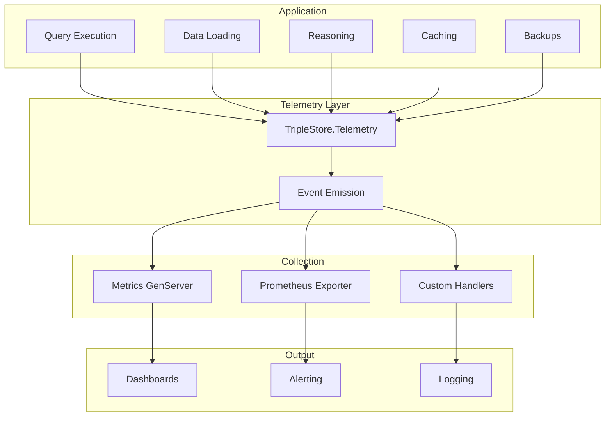
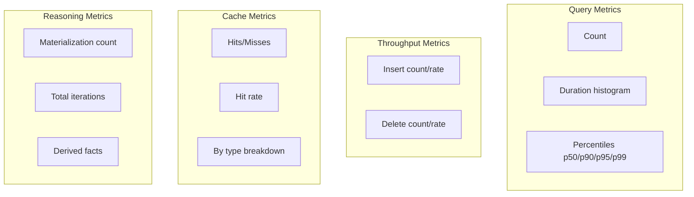

# Telemetry & Monitoring

This document provides a deep dive into the observability features, including telemetry events, metrics collection, and monitoring integration.

## Overview

The TripleStore provides comprehensive observability through:

- Telemetry events for all major operations
- Metrics collector for aggregated statistics
- Prometheus integration for external monitoring
- Health checks for operational status



## Telemetry Events

The `TripleStore.Telemetry` module provides centralized event instrumentation:

### Event Naming Convention

All events follow the pattern:

```
[:triple_store, :subsystem, :operation, :phase]
```

Where:
- `:subsystem` - Component (`:query`, `:reasoner`, `:cache`, `:backup`)
- `:operation` - Action (`:execute`, `:compile`, `:lookup`)
- `:phase` - Timing (`:start`, `:stop`, `:exception`)

### Event Categories

#### Query Events

| Event | Measurements | Metadata |
|-------|--------------|----------|
| `[:triple_store, :query, :parse, :start]` | system_time | query_hash, query_type |
| `[:triple_store, :query, :parse, :stop]` | duration | query_hash |
| `[:triple_store, :query, :execute, :start]` | system_time | query_hash, query_type |
| `[:triple_store, :query, :execute, :stop]` | duration | query_hash, result_count |
| `[:triple_store, :query, :execute, :exception]` | duration | exception_type, exception_message |

#### Data Modification Events

| Event | Measurements | Metadata |
|-------|--------------|----------|
| `[:triple_store, :insert, :start]` | system_time | count |
| `[:triple_store, :insert, :stop]` | duration | count |
| `[:triple_store, :delete, :start]` | system_time | count |
| `[:triple_store, :delete, :stop]` | duration | count |
| `[:triple_store, :load, :stop]` | duration | total_count, format |
| `[:triple_store, :load, :batch, :complete]` | count | batch_number |

#### Cache Events

| Event | Measurements | Metadata |
|-------|--------------|----------|
| `[:triple_store, :cache, :plan, :hit]` | count: 1 | key |
| `[:triple_store, :cache, :plan, :miss]` | count: 1 | key |
| `[:triple_store, :cache, :query, :hit]` | count: 1 | query_hash |
| `[:triple_store, :cache, :query, :miss]` | count: 1 | query_hash |
| `[:triple_store, :cache, :query, :expired]` | count: 1 | query_hash, age_ms |

#### Reasoning Events

| Event | Measurements | Metadata |
|-------|--------------|----------|
| `[:triple_store, :reasoner, :materialize, :start]` | system_time | rule_count, initial_fact_count |
| `[:triple_store, :reasoner, :materialize, :stop]` | duration | iterations, total_derived |
| `[:triple_store, :reasoner, :materialize, :iteration]` | derivations | iteration_number |

#### Backup Events

| Event | Measurements | Metadata |
|-------|--------------|----------|
| `[:triple_store, :backup, :create, :start]` | system_time | path |
| `[:triple_store, :backup, :create, :stop]` | duration | path, size_bytes |
| `[:triple_store, :backup, :restore, :start]` | system_time | path |
| `[:triple_store, :backup, :restore, :stop]` | duration | path |
| `[:triple_store, :scheduled_backup, :tick]` | count | backup_dir, interval_ms |
| `[:triple_store, :scheduled_backup, :error]` | - | reason, backup_dir |

### Using Telemetry

#### Span API

The span pattern provides automatic start/stop/exception events:

```elixir
def execute_query(query) do
  # Sanitize query for safe telemetry
  metadata = Telemetry.sanitize_query(query)

  Telemetry.span(:query, :execute, metadata, fn ->
    result = do_execute(query)
    # Return extra metadata for stop event
    {result, %{result_count: length(result)}}
  end)
end
```

#### Cache Events

```elixir
# Emit cache hit
Telemetry.emit_cache_hit(:plan, %{key: cache_key})

# Emit cache miss
Telemetry.emit_cache_miss(:query, %{query_hash: hash})
```

#### Attaching Handlers

```elixir
# Attach to all TripleStore events
:ok = Telemetry.attach_handler("my-handler", fn event, measurements, metadata, _config ->
  Logger.info("Event: #{inspect(event)}, duration: #{measurements[:duration_ms]}ms")
end)

# Attach to specific events
:telemetry.attach("query-monitor",
  [:triple_store, :query, :execute, :stop],
  &handle_query_complete/4,
  nil
)
```

### Query Sanitization

The telemetry module sanitizes queries to prevent sensitive data exposure:

```elixir
metadata = Telemetry.sanitize_query("SELECT * WHERE { ?s :ssn ?num }")
# => %{
#   query_hash: "a1b2c3d4...",  # SHA-256 prefix
#   query_length: 35,
#   query_type: :select
# }
```

## Metrics Collection

The `TripleStore.Metrics` module provides a GenServer-based metrics collector:

### Collected Metrics



### Starting the Collector

```elixir
# Start via supervision tree
children = [
  {TripleStore.Metrics, name: TripleStore.Metrics}
]

# Or manually
{:ok, _pid} = TripleStore.Metrics.start_link()
```

### Querying Metrics

```elixir
# Get all metrics
metrics = TripleStore.Metrics.get_all()
# => %{
#   query: %{count: 1000, mean_duration_ms: 15.5, ...},
#   throughput: %{insert_rate_per_sec: 50.0, ...},
#   cache: %{hit_rate: 0.85, ...},
#   reasoning: %{total_derived: 10000, ...},
#   collected_at: ~U[2024-01-15 10:30:00Z]
# }

# Get specific categories
query_metrics = TripleStore.Metrics.query_metrics()
cache_metrics = TripleStore.Metrics.cache_metrics()

# Reset metrics
TripleStore.Metrics.reset()
```

### Query Duration Histogram

The collector maintains a histogram with configurable buckets:

```elixir
# Default buckets (milliseconds)
@default_buckets [1, 5, 10, 25, 50, 100, 250, 500, 1000, 5000]

# Custom buckets
{:ok, _} = TripleStore.Metrics.start_link(
  histogram_buckets: [1, 10, 100, 1000, 10000]
)

# Access histogram
%{histogram: %{le_1ms: 500, le_10ms: 300, le_100ms: 150, ...}} =
  TripleStore.Metrics.query_metrics()
```

### Percentile Calculation

The collector tracks the last 1000 durations for accurate percentiles:

```elixir
%{percentiles: %{
  p50: 12.5,   # Median
  p90: 45.0,   # 90th percentile
  p95: 78.0,   # 95th percentile
  p99: 150.0   # 99th percentile
}} = TripleStore.Metrics.query_metrics()
```

## Prometheus Integration

The `TripleStore.Prometheus` module exports metrics in Prometheus format:

### Exposed Metrics

```prometheus
# Query metrics
triple_store_query_total{status="success"} 1000
triple_store_query_duration_seconds_bucket{le="0.01"} 500
triple_store_query_duration_seconds_bucket{le="0.1"} 850
triple_store_query_duration_seconds_sum 15.5
triple_store_query_duration_seconds_count 1000

# Insert/Delete metrics
triple_store_triples_inserted_total 50000
triple_store_triples_deleted_total 1000

# Cache metrics
triple_store_cache_hits_total{type="plan"} 800
triple_store_cache_misses_total{type="plan"} 200
triple_store_cache_hit_rate{type="plan"} 0.8

# Reasoning metrics
triple_store_materialization_total 10
triple_store_derived_facts_total 100000
triple_store_reasoning_duration_seconds_sum 45.5
```

### Configuration

```elixir
# In application supervisor
children = [
  {TripleStore.Prometheus, port: 9090}
]

# Metrics available at http://localhost:9090/metrics
```

## Health Monitoring

The `TripleStore.Health` module provides operational health checks:

### Health Check Structure

```elixir
%TripleStore.Health{
  status: :healthy,
  checks: %{
    database: :ok,
    dictionary: :ok,
    query_cache: :ok,
    backup_scheduler: :ok
  },
  latency_ms: 5,
  timestamp: ~U[2024-01-15 10:30:00Z]
}
```

### Health Endpoint

```elixir
# Check health
{:ok, health} = TripleStore.Health.check(store)

case health.status do
  :healthy -> "All systems operational"
  :degraded -> "Some non-critical issues"
  :unhealthy -> "Critical problems detected"
end
```

### Health Check Components

| Component | Check | Failure Impact |
|-----------|-------|----------------|
| Database | RocksDB accessible | :unhealthy |
| Dictionary | Manager responding | :unhealthy |
| Query Cache | ETS table exists | :degraded |
| Backup Scheduler | Process alive | :degraded |

## Alerting Patterns

### Slow Query Detection

```elixir
defmodule SlowQueryMonitor do
  def init do
    :telemetry.attach("slow-query-alert",
      [:triple_store, :query, :execute, :stop],
      &handle_query/4,
      %{threshold_ms: 1000}
    )
  end

  def handle_query(_event, measurements, metadata, config) do
    duration_ms = Telemetry.duration_ms(measurements)

    if duration_ms > config.threshold_ms do
      Logger.warn("Slow query detected",
        duration_ms: duration_ms,
        query_hash: metadata.query_hash
      )
    end
  end
end
```

### Cache Hit Rate Monitoring

```elixir
defmodule CacheMonitor do
  use GenServer

  def check_cache_health do
    metrics = TripleStore.Metrics.cache_metrics()

    if metrics.hit_rate < 0.5 do
      Logger.warn("Low cache hit rate: #{metrics.hit_rate}")
      {:alert, :low_cache_hit_rate}
    else
      :ok
    end
  end
end
```

### Reasoning Performance

```elixir
:telemetry.attach("reasoning-monitor",
  [:triple_store, :reasoner, :materialize, :stop],
  fn _event, measurements, metadata, _config ->
    duration_s = Telemetry.duration_seconds(measurements)
    iterations = metadata.iterations

    if duration_s > 60 do
      Logger.warn("Long materialization: #{duration_s}s, #{iterations} iterations")
    end
  end,
  nil
)
```

## Logging Integration

### Structured Logging

```elixir
defmodule StructuredLogger do
  def init do
    Telemetry.attach_handler("structured-logger", &handle_event/4)
  end

  def handle_event(event, measurements, metadata, _config) do
    Logger.info("telemetry_event",
      event: Enum.join(event, "."),
      duration_ms: measurements[:duration_ms],
      metadata: sanitize_metadata(metadata)
    )
  end

  defp sanitize_metadata(metadata) do
    metadata
    |> Map.drop([:query, :stacktrace])
    |> Jason.encode!()
  end
end
```

### Log Levels by Event

| Event Type | Log Level | Condition |
|------------|-----------|-----------|
| Query success | :debug | Always |
| Slow query | :warn | duration > 1s |
| Query exception | :error | Always |
| Cache miss | :debug | Always |
| Backup complete | :info | Always |
| Backup error | :error | Always |

## Dashboard Examples

### Grafana Dashboard Queries

```promql
# Query latency p99
histogram_quantile(0.99, rate(triple_store_query_duration_seconds_bucket[5m]))

# Query throughput
rate(triple_store_query_total[5m])

# Cache hit rate over time
rate(triple_store_cache_hits_total[5m]) /
  (rate(triple_store_cache_hits_total[5m]) + rate(triple_store_cache_misses_total[5m]))

# Insert rate
rate(triple_store_triples_inserted_total[5m])

# Reasoning efficiency (derived facts per second)
rate(triple_store_derived_facts_total[5m])
```

### Key Metrics to Monitor

| Metric | Good | Warning | Critical |
|--------|------|---------|----------|
| Query p99 latency | < 100ms | < 1s | > 5s |
| Cache hit rate | > 80% | > 50% | < 30% |
| Insert rate | Stable | ±50% variation | Stopped |
| Error rate | < 0.1% | < 1% | > 5% |

## Module Reference

| Module | Purpose |
|--------|---------|
| `TripleStore.Telemetry` | Event instrumentation |
| `TripleStore.Metrics` | GenServer metrics collector |
| `TripleStore.Prometheus` | Prometheus exporter |
| `TripleStore.Health` | Health checks |

## Usage Examples

### Complete Monitoring Setup

```elixir
defmodule MyApp.Application do
  use Application

  def start(_type, _args) do
    children = [
      # Core TripleStore
      {TripleStore, name: MyApp.Store, path: "/data/db"},

      # Metrics collection
      {TripleStore.Metrics, name: TripleStore.Metrics},

      # Prometheus exporter
      {TripleStore.Prometheus, port: 9090},

      # Custom monitoring
      MyApp.SlowQueryMonitor,
      MyApp.CacheMonitor
    ]

    Supervisor.start_link(children, strategy: :one_for_one)
  end
end
```

### Testing Telemetry

```elixir
defmodule TelemetryTest do
  use ExUnit.Case

  test "query emits telemetry events" do
    # Collect events
    :telemetry.attach("test", [:triple_store, :query, :execute, :stop],
      fn event, measurements, metadata, test_pid ->
        send(test_pid, {:event, event, measurements, metadata})
      end,
      self()
    )

    # Execute query
    TripleStore.query(store, "SELECT * WHERE { ?s ?p ?o } LIMIT 1")

    # Assert event received
    assert_receive {:event, [:triple_store, :query, :execute, :stop], %{duration: _}, _}
  after
    :telemetry.detach("test")
  end
end
```
