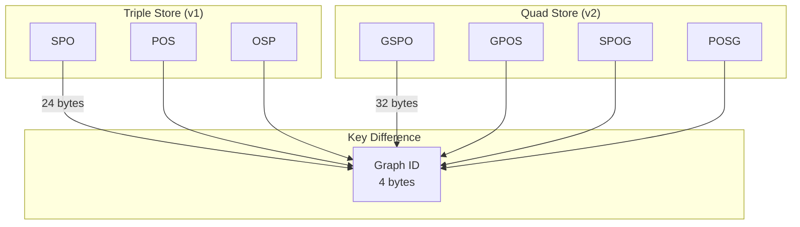
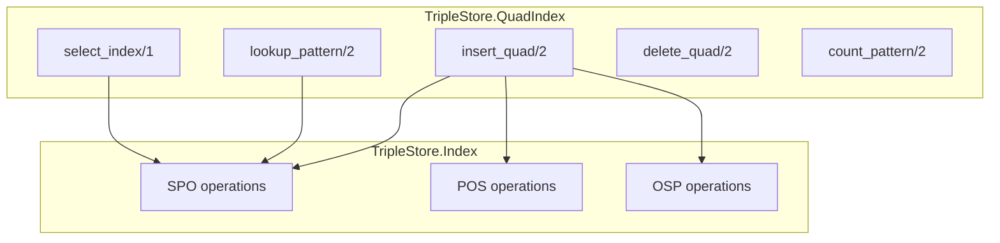
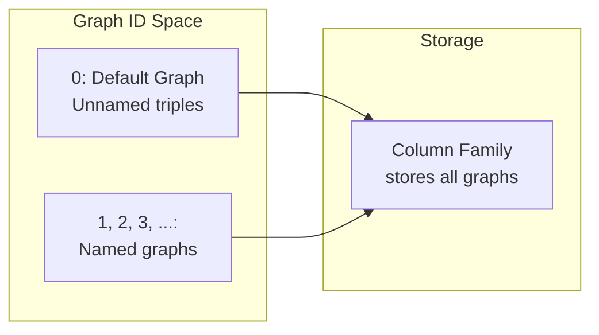
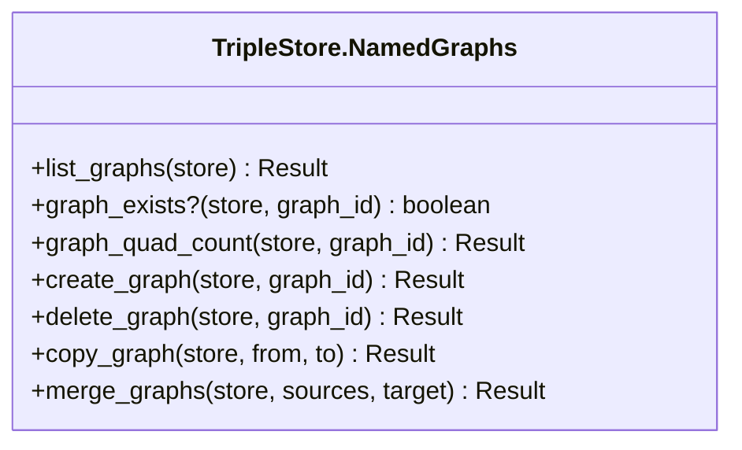
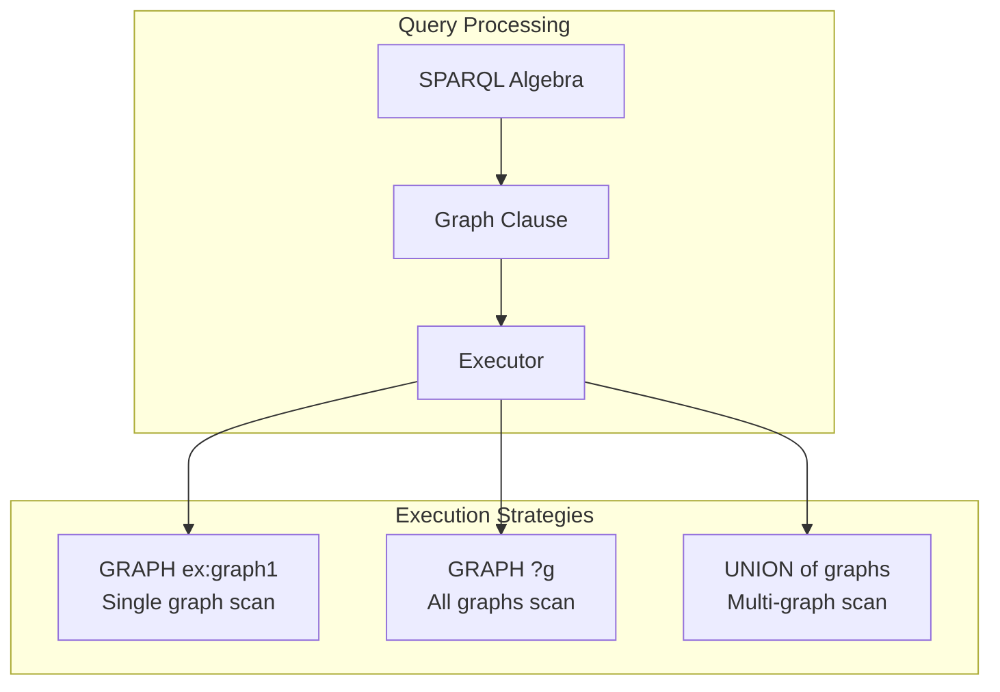
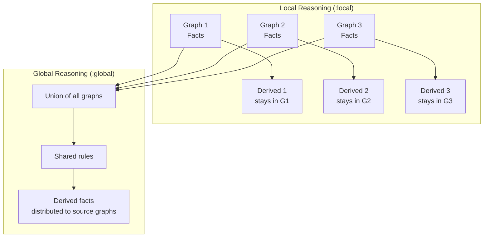
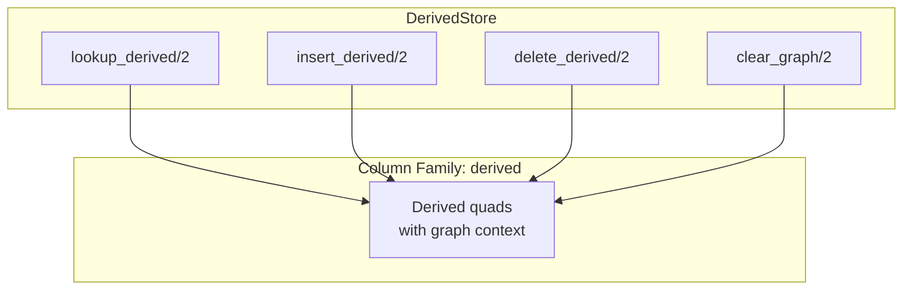

# Quad Store Architecture

This document provides a deep dive into the quad store architecture, including quad indices, named graphs, and graph-scoped reasoning.

## Overview

The quad store extends the triple store with named graph support:

- **Four indices** instead of three (GSPO, GPOS, SPOG, POSG)
- **Named graphs** for data isolation and provenance tracking
- **Graph-scoped reasoning** with local/global scope options
- **GRAPH clause** support in SPARQL queries



## Triple Store vs Quad Store

### Schema Differences

| Aspect | Triple Store | Quad Store |
|--------|--------------|-------------|
| **Data Model** | `{subject, predicate, object}` | `{graph, subject, predicate, object}` |
| **Indices** | 3 (SPO, POS, OSP) | 4 (GSPO, GPOS, SPOG, POSG) |
| **Key Size** | 24 bytes | 32 bytes |
| **Default Graph** | All data | Graph ID 0 |
| **Named Graphs** | Not supported | Full support |
| **Multi-tenancy** | Manual separation | Graph-level isolation |

### Performance Impact

| Metric | Triple Store | Quad Store | Change |
|--------|--------------|-------------|--------|
| **Key Size** | 24 bytes | 32 bytes | +33% |
| **Write Amplification** | 3x | 4x | +33% |
| **Block Cache** | 8 KB default | 16 KB default | +100% |
| **Memtable** | 64 MB | 128 MB | +100% |
| **Bloom Filter** | 12 bits/key | 10 bits/key | -17% |

## Quad Indices

The `TripleStore.QuadIndex` module maintains four indices for O(log n) access to any quad pattern.

### Index Key Structure

All keys are 32 bytes (4 × 64-bit IDs) in big-endian format:

```
GSPO Key: [graph:8][subject:8][predicate:8][object:8]
GPOS Key: [graph:8][predicate:8][object:8][subject:8]
SPOG Key: [subject:8][predicate:8][object:8][graph:8]
POSG Key: [predicate:8][object:8][subject:8][graph:8]
```

### Pattern to Index Mapping

| Pattern | Bound | Index | Operation |
|---------|-------|-------|-----------|
| `(G, S, P, O)` | All | GSPO | Exact lookup |
| `(G, S, P, ?)` | G, S, P | GSPO | Prefix scan |
| `(G, S, ?, ?)` | G, S | GSPO | Prefix scan |
| `(G, ?, P, O)` | G, P, O | GPOS | Prefix scan |
| `(G, ?, P, ?)` | G, P | GPOS | Prefix scan |
| `(G, ?, ?, O)` | G, O | GPOS + filter |
| `(S, P, O, ?)` | S, P, O | SPOG | Exact lookup |
| `(?, ?, ?, ?)` | None | GSPO | Full scan |

### Index Selection

```elixir
# QuadIndex selects optimal index based on bound components
pattern = %{
  graph: {:bound, graph_id},
  subject: {:bound, subject_id},
  predicate: :var,
  object: :var
}

# Selects GSPO with prefix scan on [graph_id, subject_id]
{:gspo, <<graph_id::64-big, subject_id::64-big>>, false} =
  QuadIndex.select_index(pattern)
```

### Module Structure



## Named Graphs

### Graph ID Representation

Graph IDs are 64-bit integers with special semantics:

| ID | Meaning |
|----|---------|
| `0` | Default graph (unnamed triples) |
| `1` | First named graph |
| `2` | Second named graph |
| `...` | Additional named graphs |



### Graph Operations

#### List Graphs

```elixir
# Get all graph IDs with data
{:ok, graphs} = TripleStore.QuadIndex.list_graphs(db)
# => [0, 1, 2, 5]
```

#### Count Quads in Graph

```elixir
# Count quads in specific graph
{:ok, count} = TripleStore.QuadIndex.count_graph(db, graph_id)
```

#### Delete Entire Graph

```elixir
# Remove all quads from a graph
{:ok, count} = TripleStore.QuadIndex.delete_graph(db, graph_id)
```

#### Copy Graph

```elixir
# Copy all quads from one graph to another
{:ok, count} = TripleStore.QuadIndex.copy_graph(
  db,
  source_graph_id,
  target_graph_id
)
```

### Graph API Module



## SPARQL GRAPH Clause

### Query Processing with GRAPH

The SPARQL engine processes the `GRAPH` keyword through dedicated operators:



### GRAPH Clause Examples

```sparql
-- Specific named graph
SELECT ?s ?p ?o
WHERE {
  GRAPH ex:graph1 {
    ?s ?p ?o
  }
}

-- All graphs (graph variable)
SELECT ?g ?s ?p ?o
WHERE {
  GRAPH ?g {
    ?s ?p ?o
  }
}

-- Filter graphs
SELECT ?g (COUNT(*) AS ?count)
WHERE {
  GRAPH ?g {
    ?s a ex:Person
  }
  FILTER (?g IN (ex:graph1, ex:graph2))
}
GROUP BY ?g
```

### Graph Clause Execution

```elixir
# TripleStore.SPARQL.Executor handles GRAPH patterns
def execute_graph_pattern(graph_ref, pattern, ctx) do
  case graph_ref do
    {:iri, graph_iri} ->
      # Single graph lookup
      graph_id = resolve_graph_id(ctx, graph_iri)
      lookup_in_graph(ctx, graph_id, pattern)

    {:variable, var_name} ->
      # All graphs scan
      all_graph_ids = list_graphs(ctx)
      Stream.flat_map(all_graph_ids, fn graph_id ->
        lookup_in_graph(ctx, graph_id, pattern)
      end)
  end
end
```

## Graph-Scoped Reasoning

### Local vs Global Reasoning

The `TripleStore.Reasoner.GraphScopedReasoner` supports two reasoning scopes:



### ReasoningConfig

```elixir
alias TripleStore.Reasoner.ReasoningConfig

# Local reasoning - each graph reasons independently
local_config = ReasoningConfig.new(
  profile: :owl2rl,
  scope: :local
)

# Global reasoning - merge all graphs for reasoning
global_config = ReasoningConfig.new(
  profile: :owl2rl,
  scope: :global
)
```

### When to Use Each Scope

| Scope | Use Case | Isolation | Performance |
|-------|----------|-----------|-------------|
| `:local` | Multi-tenancy, provenance tracking | Each graph isolated | Faster (can parallelize) |
| `:global` | Unified ontology, shared schema | Graphs can derive from each other | Slower (requires merge) |

### Graph-Scoped Materialization

```elixir
alias TripleStore.Reasoner.GraphScopedReasoner

# Materialize all graphs with local scope
{:ok, stats} = GraphScopedReasoner.materialize_all(
  store,
  config: local_config
)

# Materialize specific graph
{:ok, stats} = GraphScopedReasoner.materialize_graph(
  store,
  graph_id: 1,
  config: local_config
)
```

### Schema Placement Patterns

#### Local Reasoning Schema

```elixir
# Schema in same graph as data
TripleStore.update(store, """
  PREFIX rdfs: <http://www.w3.org/2000/01/rdf-schema#>
  PREFIX ex: <http://example.org/>

  INSERT DATA {
    GRAPH ex:tenant1 {
      ex:Student rdfs:subClassOf ex:Person .
      ex:alice a ex:Student .
    }
  }
""")
```

#### Global Reasoning Schema

```elixir
# Schema in dedicated graph, data in separate graphs
TripleStore.update(store, """
  PREFIX rdfs: <http://www.w3.org/2000/01/rdf-schema#>
  PREFIX ex: <http://example.org/>

  INSERT DATA {
    GRAPH ex:schema {
      ex:Student rdfs:subClassOf ex:Person .
    }
    GRAPH ex:tenant1 {
      ex:alice a ex:Student .
    }
    GRAPH ex:tenant2 {
      ex:bob a ex:Student .
    }
  }
""")

# Use global scope to apply schema to all graphs
config = ReasoningConfig.new(profile: :owl2rl, scope: :global)
{:ok, _} = TripleStore.materialize(store, config: config)
```

## DerivedStore for Quads

The `TripleStore.Reasoner.DerivedStore` handles materialized inferences for quad stores:



### Derived Fact Storage

Derived quads are stored in the `derived` column family with graph context:

```
Key: [graph_id:8][subject:8][predicate:8][object:8]
Value: empty
```

### Operations

```elixir
# Lookup derived quads for a graph
{:ok, stream} = DerivedStore.lookup_derived(db, graph_id)

# Insert derived quads
:ok = DerivedStore.insert_derived(db, derived_quads)

# Clear derived facts for a graph (before rematerialization)
:ok = DerivedStore.clear_graph(db, graph_id)
```

## Multi-Tenancy Patterns

### Tenant Isolation

```elixir
defmodule MultiTenantExample do
  def open_tenant_database(base_path) do
    {:ok, store} = TripleStore.open(base_path, schema: :quad)
    store
  end

  def add_tenant_data(store, tenant_id, rdf_data) do
    graph_iri = "http://example.org/tenant/#{tenant_id}"

    TripleStore.update(store, """
      INSERT DATA {
        GRAPH <#{graph_iri}> {
          #{rdf_data}
        }
      }
    """)
  end

  def query_tenant(store, tenant_id, sparql) do
    graph_iri = "http://example.org/tenant/#{tenant_id}"

    wrapped_query = """
      SELECT * WHERE {
        GRAPH <#{graph_iri}> {
          #{sparql}
        }
      }
    """

    TripleStore.query(store, wrapped_query)
  end

  def isolate_reasoning(store) do
    # Local scope ensures tenants don't derive from each other
    config = ReasoningConfig.new(profile: :owl2rl, scope: :local)
    TripleStore.materialize(store, config: config)
  end
end
```

## Provenance Tracking

Named graphs enable provenance tracking by source:

```elixir
defmodule ProvenanceExample do
  def load_with_provenance(store, data_sources) do
    Enum.each(data_sources, fn {source_id, file_path} ->
      graph_iri = "http://example.org/source/#{source_id}"

      # Load into named graph
      {:ok, count} = TripleStore.load(store, file_path,
        graph: graph_iri
      )

      IO.puts("Loaded #{count} quads from #{source_id}")
    end)
  end

  def query_provenance(store, triple_pattern) do
    # Find which graphs contain matching triples
    TripleStore.query(store, """
      PREFIX ex: <http://example.org/>

      SELECT ?source
      WHERE {
        GRAPH ?source {
          #{triple_pattern}
        }
      }
    """)
  end
end
```

## Module Reference

| Module | Purpose |
|--------|---------|
| `TripleStore.QuadIndex` | Quad indexing operations |
| `TripleStore.NamedGraphs` | Named graph management API |
| `TripleStore.Reasoner.GraphScopedReasoner` | Graph-scoped reasoning |
| `TripleStore.Reasoner.DerivedStore` | Derived fact storage for quads |
| `TripleStore.Reasoner.ReasoningConfig` | Reasoning configuration |
| `TripleStore.SPARQL.Executor` | GRAPH clause execution |

## Next Steps

- [Storage Layer](01-storage-layer.md) - For triple/quad index internals
- [SPARQL Engine](02-sparql-engine.md) - For GRAPH clause processing
- [Reasoning Engine](03-reasoning-engine.md) - For graph-scoped reasoning details
