# OTP & Concurrency Model

This document describes the OTP-based process architecture, including GenServers, supervision trees, and concurrency patterns used in TripleStore.

## Overview

TripleStore uses OTP (Open Telecom Platform) for fault tolerance and concurrency:

- **GenServers** for long-running services with state
- **Supervision trees** for process isolation and restarts
- **Dynamic supervision** for per-database processes
- **Registry** for process naming and discovery

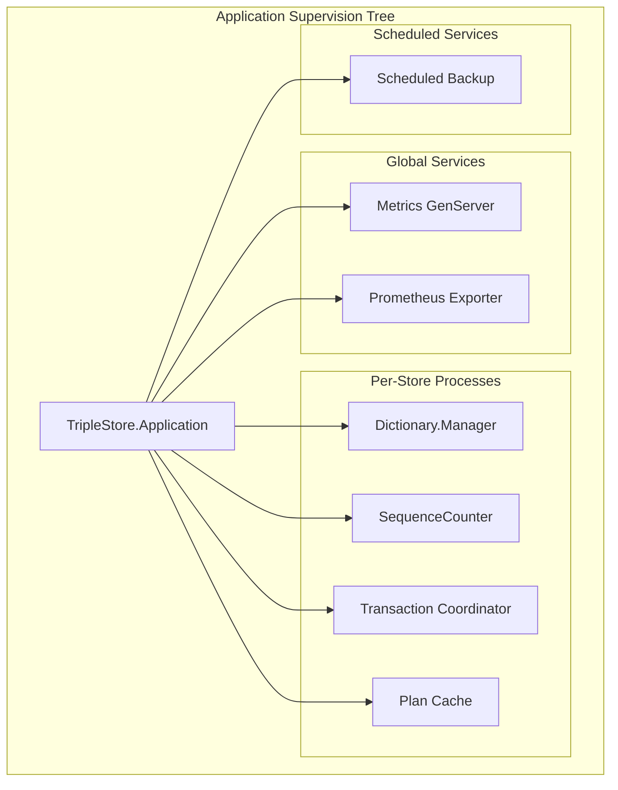

## GenServer Components

### Dictionary.Manager

The `TripleStore.Dictionary.Manager` GenServer manages term encoding:

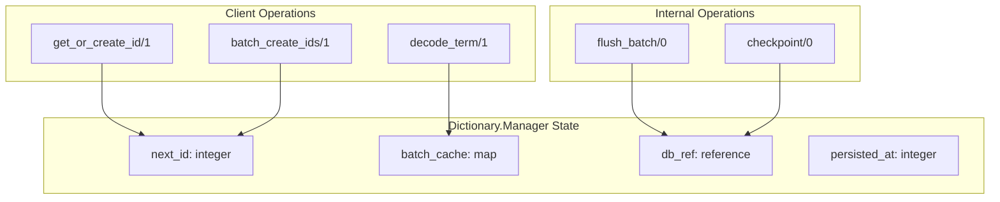

**Responsibilities:**
- Allocate sequential IDs for new terms (URIs, blank nodes, literals)
- Maintain batch cache for recently created terms
- Periodically flush ID sequences to RocksDB
- Coordinate with sharded manager for bulk loading

**State:**
```elixir
%{
  db: db_ref,
  next_id: current_sequence,
  batch_cache: %{term_binary => id},
  persisted_at: last_flushed_sequence,
  shard_count: number_of_shards
}
```

**Key Operations:**
- `get_or_create_id(term)` - Get existing ID or allocate new one
- `batch_create_ids(terms)` - Allocate multiple IDs efficiently
- `decode_term(id)` - Look up term string from ID

### SequenceCounter

The `TripleStore.Dictionary.SequenceCounter` GenServer provides atomic ID generation:

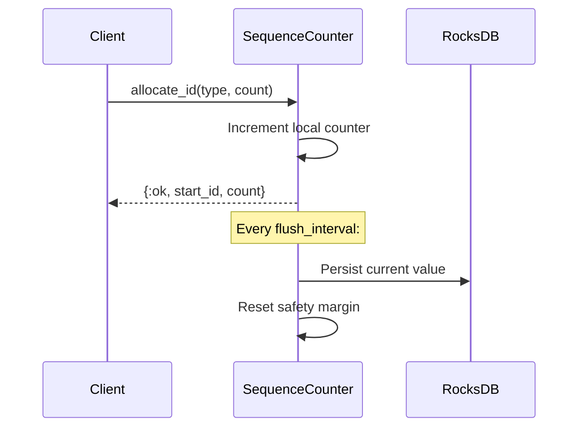

**Responsibilities:**
- Atomic ID allocation within type ranges
- Periodic persistence to RocksDB
- Recovery with safety margin (1000 IDs) on restart

### Transaction Coordinator

The `TripleStore.Transaction` GenServer serializes write operations:

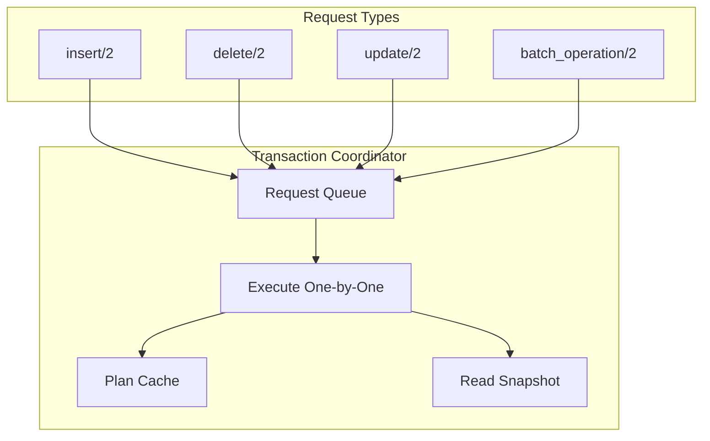

**Responsibilities:**
- Serialize write operations (prevents write conflicts)
- Create snapshots for read isolation during writes
- Invalidate plan cache after successful writes
- Coordinate with dictionary for term encoding

**Concurrency Guarantees:**

| Operation | Isolation | Guarantees |
|-----------|-----------|-------------|
| Single write | Atomic | All indices updated or none |
| Multiple writes | Serialized | Processed in order received |
| Reads during write | Snapshot | See pre-write state |
| Concurrent reads | Uncoordinated | Direct database access |

### Plan Cache

The `TripleStore.SPARQL.PlanCache` GenServer (or ETS-based implementation) caches optimized query plans:

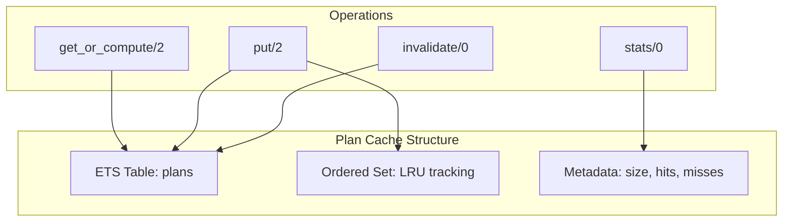

**Responsibilities:**
- Store optimized query plans by normalized query hash
- Track LRU for cache eviction
- Maintain hit/miss statistics
- Support invalidation on data changes

## Supervision Tree

### Application Supervisor

The `TripleStore.Application` module defines the supervision tree:

```elixir
defmodule TripleStore.Application do
  use Application

  def start(_type, _args) do
    children = [
      # Global services
      {TripleStore.Metrics, name: TripleStore.Metrics},
      {TripleStore.Prometheus, port: prometheus_port()},

      # Per-store processes started dynamically
      # Dictionary managers, transaction coordinators, etc.
    ]

    opts = [strategy: :one_for_one, name: TripleStore.Supervisor]
    Supervisor.start_link(children, opts)
  end
end
```

### Dynamic Supervision

Per-database processes are started under a `DynamicSupervisor`:

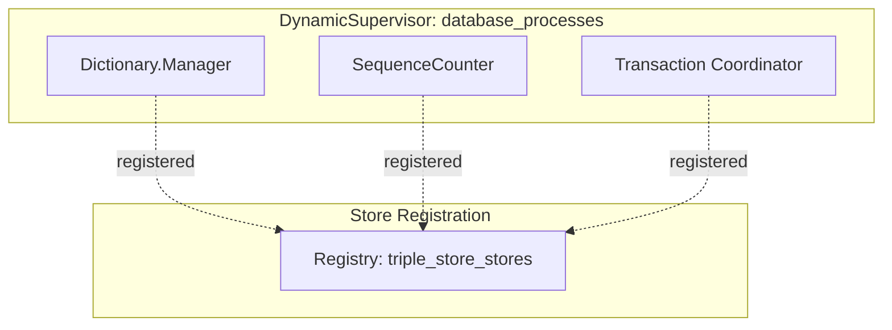

**Starting per-database processes:**

```elixir
# When opening a database
def open(path, opts) do
  # Start dictionary manager
  {:ok, _dict_pid} = DynamicSupervisor.start_child(
    TripleStore.DictionarySupervisor,
    {Dictionary.Manager, db: db_ref, name: via_name(db_ref, :dict)}
  )

  # Start sequence counter
  {:ok, _seq_pid} = DynamicSupervisor.start_child(
    TripleStore.DictionarySupervisor,
    {SequenceCounter, db: db_ref, name: via_name(db_ref, :seq)}
  )
end
```

### Process Registration

Processes are registered using `Registry` for discovery:

```mermaid
graph LR
    subgraph "Registry: triple_store_stores"
        STORE1[{store: "/data/db1"}]
        STORE2[{store: "/data/db2"}]
    end

    subgraph "Associated Processes"
        DICT1["Dictionary.Manager"]
        TXN1["Transaction Coordinator"]
        DICT2["Dictionary.Manager"]
        TXN2["Transaction Coordinator"]
    end

    STORE1 --> DICT1
    STORE1 --> TXN1
    STORE2 --> DICT2
    STORE2 --> TXN2
```

**Registry keys:**

```elixir
# Store entry
{:store, "/data/db"} => store_pid

# Dictionary manager
{:dictionary_manager, "/data/db"} => dict_pid

# Sequence counter
{:sequence_counter, "/data/db"} => seq_pid

# Transaction coordinator
{:transaction, "/data/db"} => txn_pid
```

## Concurrency Patterns

### Read-Write Concurrency

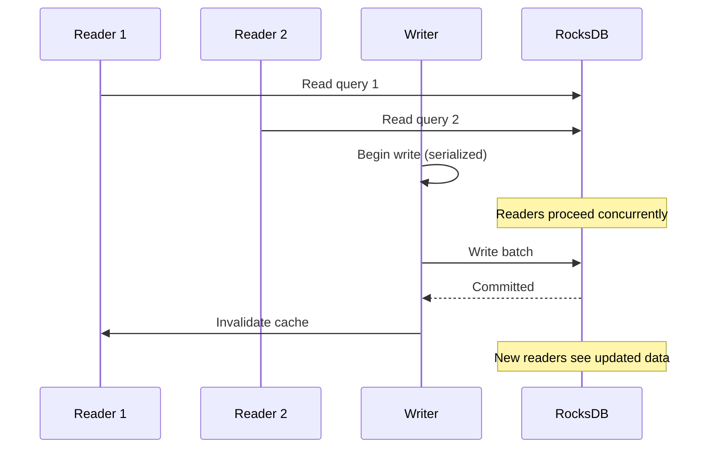

### Bulk Loading with Sharding

For bulk loading, a sharded dictionary manager enables parallel encoding:

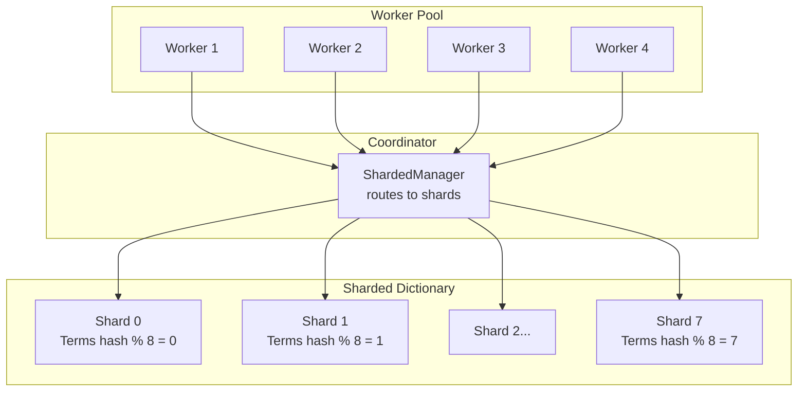

**Sharding strategy:**

```elixir
defmodule TripleStore.Dictionary.ShardedManager do
  @shard_count 8

  def get_or_create_id(shards, term) do
    shard_index = :erlang.phash2(term, @shard_count)
    shard = Enum.at(shards, shard_index)
    Dictionary.Manager.get_or_create_id(shard, term)
  end
end
```

### Parallel Query Execution

Independent query operations can run in parallel:

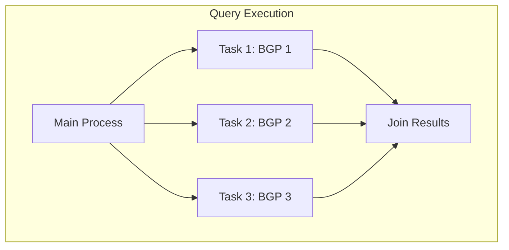

**Parallel processing example:**

```elixir
defmodule ParallelExecutor do
  def execute_parallel_patterns(patterns, ctx) do
    patterns
    |> Task.async_stream(
      fn pattern -> execute_pattern(pattern, ctx) end,
      max_concurrency: System.schedulers_online(),
      timeout: :infinity
    )
    |> Enum.flat_map(fn {:ok, results} -> results end)
  end
end
```

## State Management

### GenServer State Patterns

#### Dictionary Manager State

```elixir
%{
  # Database reference
  db: db_ref,

  # ID allocation state
  next_id: current_sequence,
  persisted_at: last_flushed_sequence,

  # Batch cache for recent allocations
  batch_cache: %{
    term_binary => id
  },

  # Sharding configuration
  shard_count: 8,
  shard_index: 0
}
```

#### Transaction Coordinator State

```elixir
%{
  # Dependencies
  db: db_ref,
  dict_manager: dict_pid,
  plan_cache: cache_module,

  # Request queue (for serialization)
  queue: :queue.from_list([]),
  current: nil,

  # Snapshot for reads
  snapshot: nil
}
```

#### Metrics Collector State

```elixir
%{
  # Counters
  query_count: 0,
  insert_count: 0,
  delete_count: 0,

  # Duration tracking
  query_durations: :queue.new(),

  # Cache metrics
  cache_hits: 0,
  cache_misses: 0,

  # Config
  histogram_buckets: [1, 5, 10, 25, 50, 100, 250, 500, 1000]
}
```

## Process Lifecycle

### Starting a Store

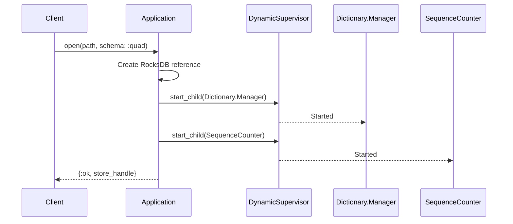

### Graceful Shutdown

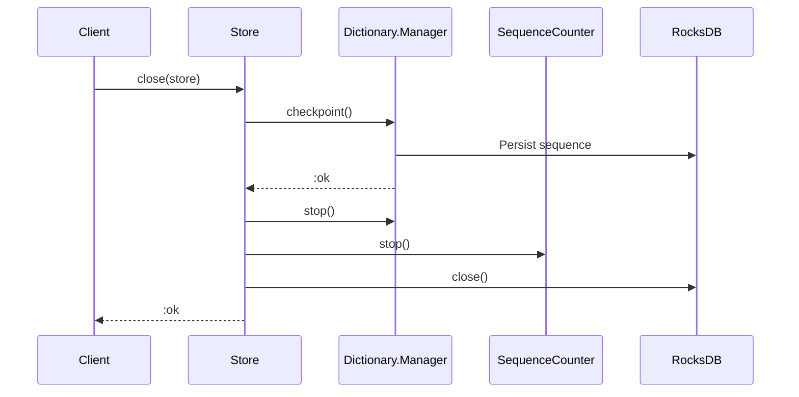

## Error Handling

### Supervision Strategies

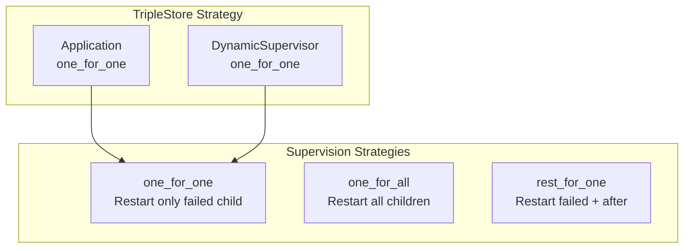

**Strategy by process:**

| Process | Strategy | Reason |
|---------|----------|--------|
| Dictionary.Manager | `:permanent` | Must always be running |
| SequenceCounter | `:permanent` | Must always be running |
| Transaction Coordinator | `:permanent` | Must always be running |
| Metrics | `:transient` | Can be restarted |
| Scheduled Backup | `:transient` | Can be restarted |

### Restart Scenarios

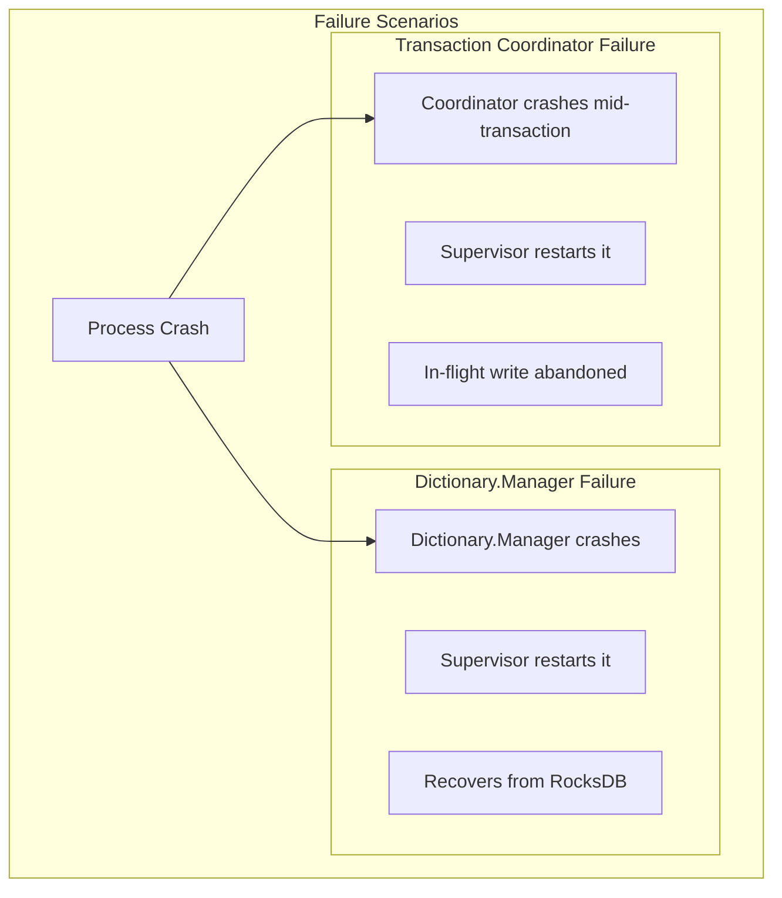

## Module Reference

| Module | Type | Purpose |
|--------|------|---------|
| `TripleStore.Application` | Application | Root supervisor |
| `TripleStore.Dictionary.Manager` | GenServer | Term encoding coordination |
| `TripleStore.Dictionary.SequenceCounter` | GenServer | Atomic ID allocation |
| `TripleStore.Transaction` | GenServer | Write serialization |
| `TripleStore.SPARQL.PlanCache` | GenServer/ETS | Query plan caching |
| `TripleStore.Metrics` | GenServer | Metrics aggregation |
| `TripleStore.ScheduledBackup` | GenServer | Backup scheduling |

## Best Practices

### When to Use GenServers

**Use GenServers for:**
- Long-lived state (dictionary, caches)
- Coordinating access to shared resources (transactions)
- Periodic background tasks (backups, metrics)

**Avoid GenServers for:**
- Query execution (use Task or Stream)
- One-off operations (use direct function calls)
- CPU-bound work (use Task with dirty schedulers)

### Process Naming

```elixir
# Good: Registry-based naming
{:via, Registry, {TripleStore.Registry, {Dictionary.Manager, "/data/db"}}}

# Avoid: Global names
:name: :my_dictionary_manager  # Can't have multiple instances
```

### Timeout Handling

```elixir
# For long-running operations, use :infinity cautiously
GenServer.call(server_pid, :long_operation, 30_000)  # 30 second timeout

# Or use cast + handle_info for async operations
GenServer.cast(server_pid, :async_operation)
```

## Next Steps

- [Architecture Overview](00-architecture-overview.md) - For high-level component interaction
- [Storage Layer](01-storage-layer.md) - For RocksDB integration details
- [Data Flow](08-data-flow.md) - For end-to-end request processing
