# Data Flow

This document describes the end-to-end data flows for all major operations in TripleStore.

## Overview

Data flows through several layers from API to storage:

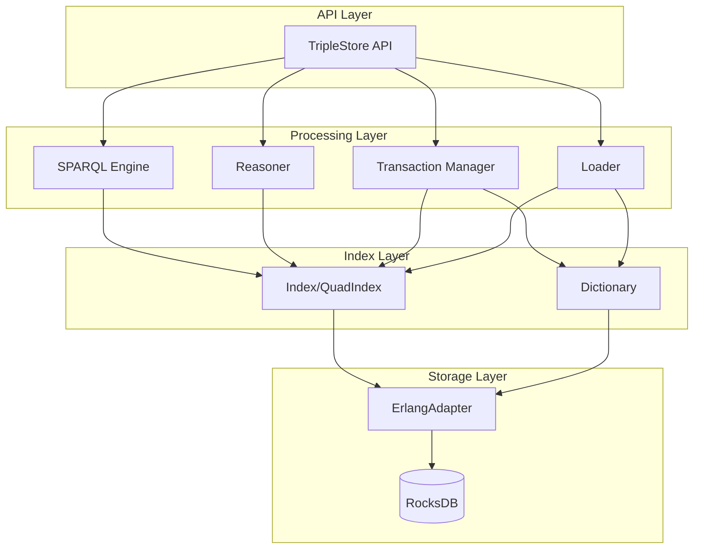

## Query Processing Flow

### SELECT Query

```mermaid
sequenceDiagram
    participant Client
    participant API as TripleStore
    participant Cache as PlanCache
    participant Parser as SPARQL.Parser
    participant Opt as Optimizer
    participant Exec as Executor
    participant Idx as Index
    participant Dict as Dictionary

    Client->>API: query(store, sparql)
    API->>Cache: lookup(query_hash)

    alt Cache Hit
        Cache-->>API: cached_plan
    else Cache Miss
        API->>Parser: parse(sparql)
        Parser-->>API: algebra_ast
        API->>Opt: optimize(algebra)
        Opt-->>API: execution_plan
        API->>Cache: store(query_hash, plan)
    end

    API->>Exec: execute(plan)
    Exec->>Idx: lookup_pattern(pattern)

    loop For each binding
        Idx-->>Exec: term_ids
        Exec->>Dict: decode_ids(term_ids)
        Dict-->>Exec: rdf_terms
    end

    Exec-->>API: result_bindings
    API-->>Client: {:ok, results}
```

### Query Flow Stages

| Stage | Module | Input | Output |
|-------|--------|-------|--------|
| 1. Parse | `SPARQL.Parser` | SPARQL string | AST |
| 2. Compile | `SPARQL.Algebra` | AST | Algebra tree |
| 3. Optimize | `SPARQL.Optimizer` | Algebra | Optimized plan |
| 4. Execute | `SPARQL.Executor` | Plan | Bindings |
| 5. Decode | `Dictionary` | Term IDs | RDF terms |

### ASK Query

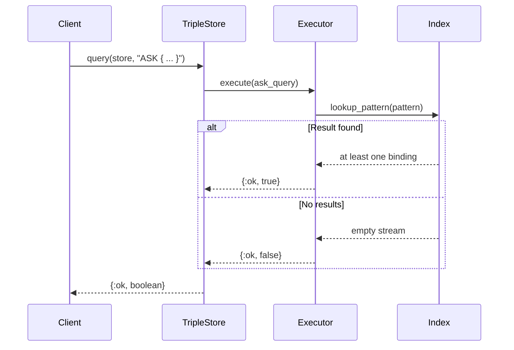

### CONSTRUCT Query

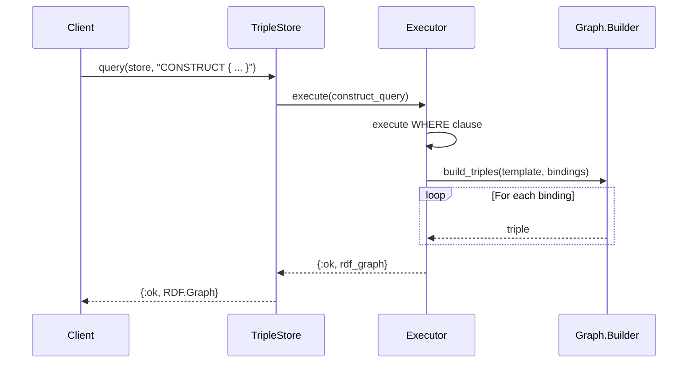

## Data Loading Flow

### Load File

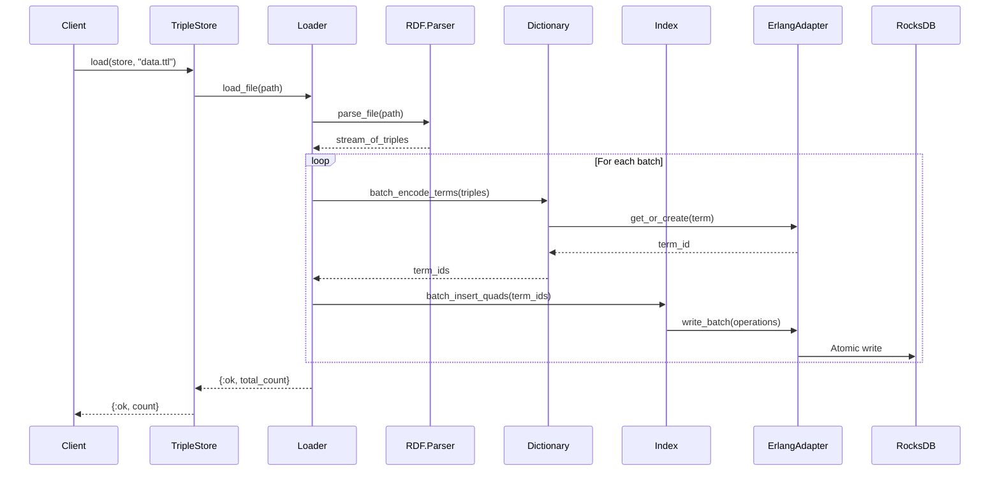

### Load with Named Graph

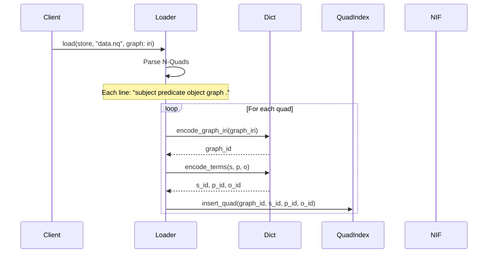

### Batch Size Selection

| File Size | Recommended Batch | Rationale |
|-----------|-------------------|-----------|
| < 1 MB | 100-500 | Low overhead, commit frequently |
| 1-100 MB | 1,000-5,000 | Balance throughput and memory |
| 100 MB - 1 GB | 5,000-10,000 | Larger writes, amortize overhead |
| > 1 GB | 10,000-50,000 | Maximize throughput |

## Update Operations Flow

### INSERT DATA

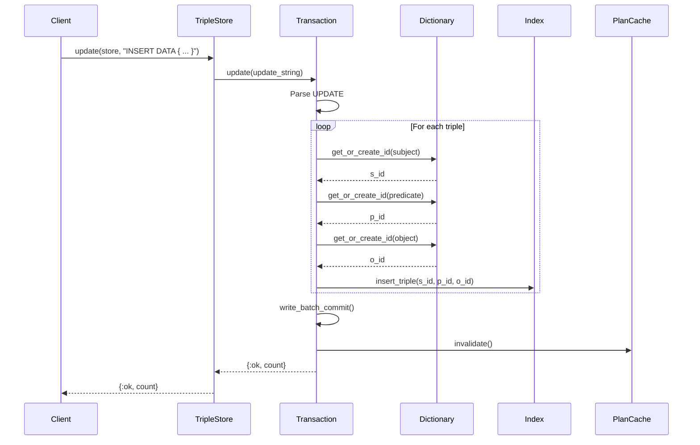

### DELETE ... WHERE

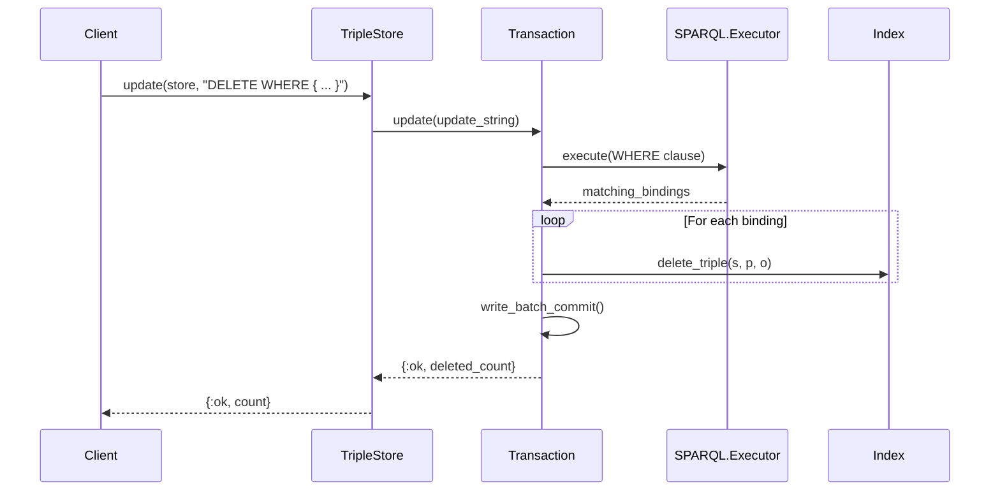

### DELETE/INSERT ... WHERE

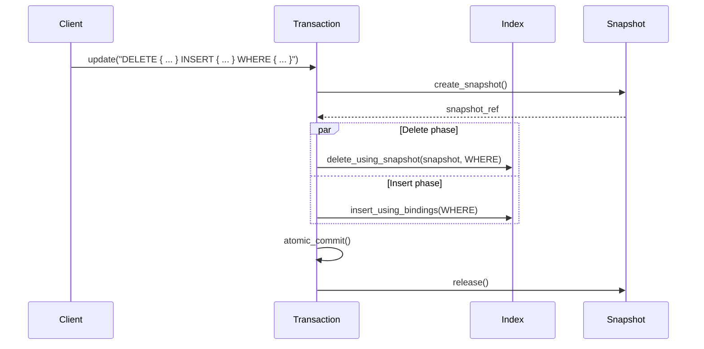

## Reasoning Flow

### Full Materialization

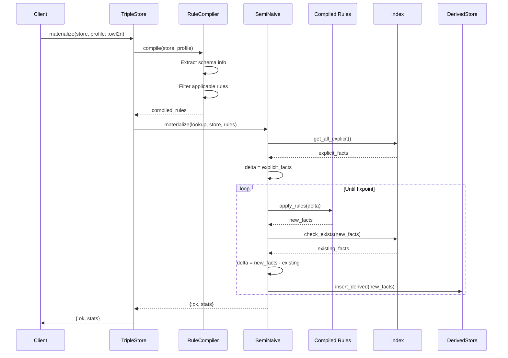

### Semi-Naive Evaluation

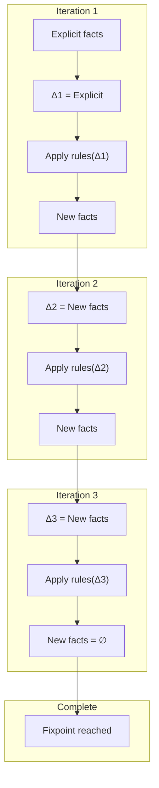

### Incremental Addition

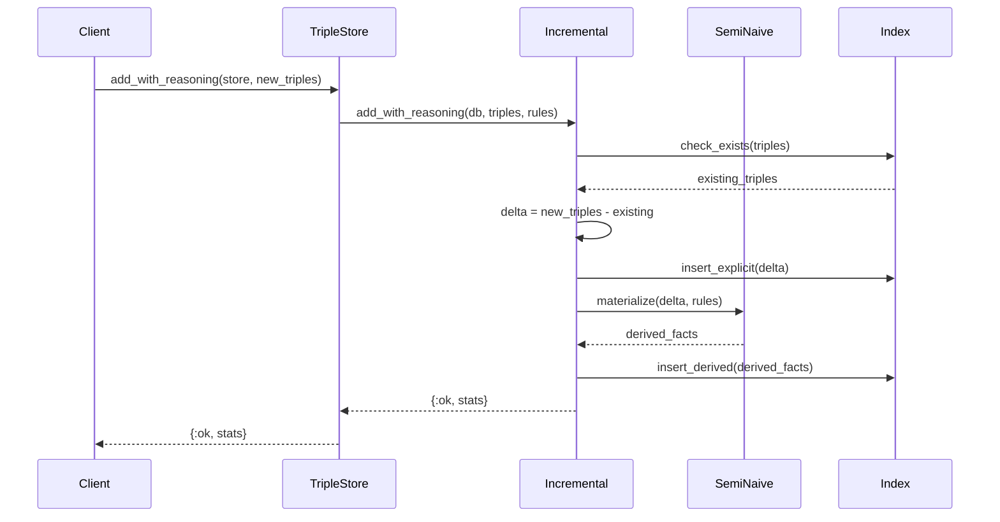

## GRAPH Clause Flow

### Query Specific Graph

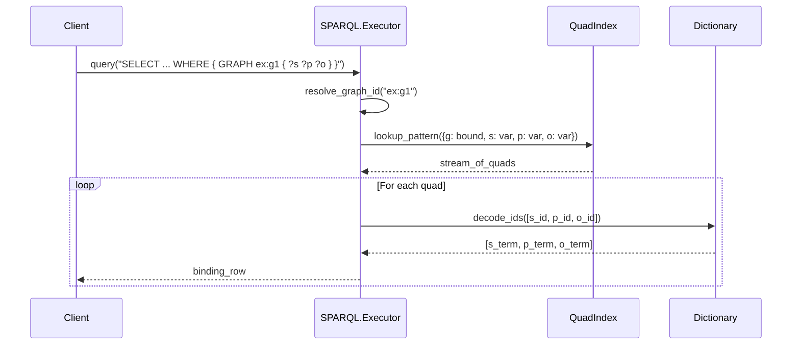

### Query All Graphs

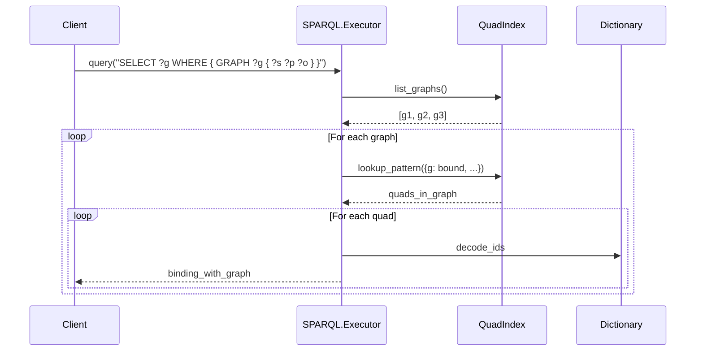

## Backup Flow

### Create Backup

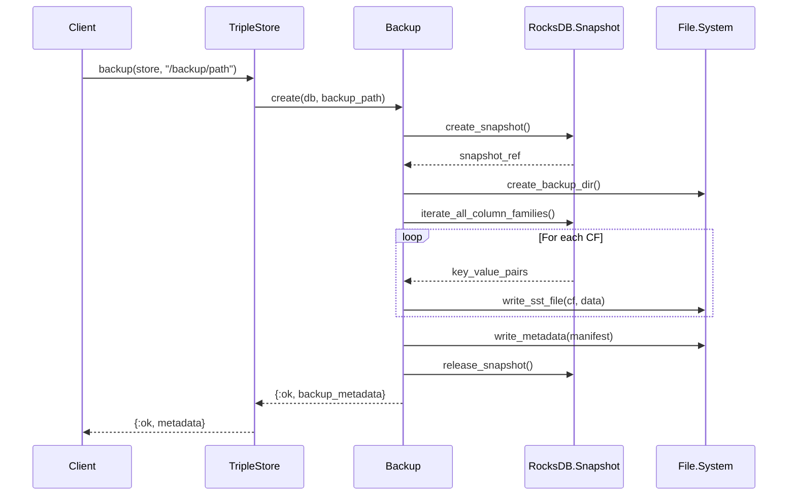

### Restore Backup

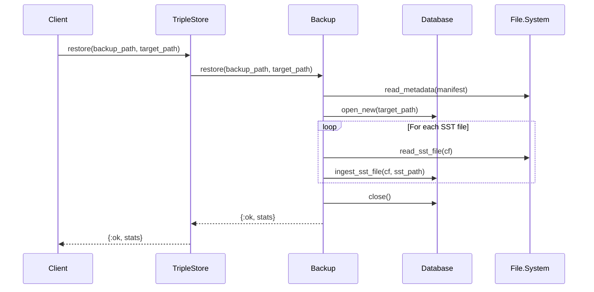

## Cache Invalidation Flow

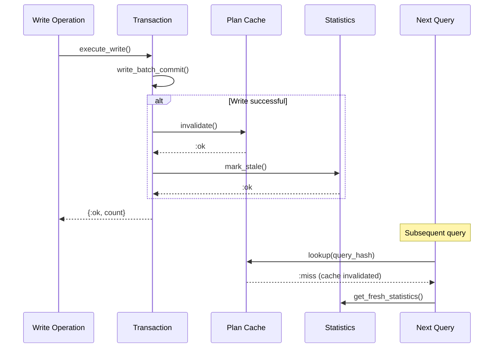

## Module Reference

| Module | Role in Data Flow |
|--------|-------------------|
| `TripleStore` | API entry point, routes to appropriate subsystem |
| `TripleStore.SPARQL.Parser` | Converts SPARQL strings to AST |
| `TripleStore.SPARQL.Algebra` | Converts AST to algebra representation |
| `TripleStore.SPARQL.Optimizer` | Transforms algebra to execution plan |
| `TripleStore.SPARQL.Executor` | Executes plan against indices |
| `TripleStore.Transaction` | Coordinates write operations |
| `TripleStore.Loader` | Handles bulk data loading |
| `TripleStore.Dictionary` | Encodes/decodes RDF terms |
| `TripleStore.Index` / `TripleStore.QuadIndex` | Pattern matching lookup |
| `TripleStore.Backend.RocksDB.ErlangAdapter` | RocksDB operations |
| `TripleStore.Reasoner` | OWL 2 RL materialization |

## Performance Considerations

### Query Flow Optimization

| Stage | Optimization Technique |
|-------|----------------------|
| Parsing | NIF-based (Rust) for speed |
| Plan caching | Normalize variable names for cache hits |
| Join ordering | Cost-based enumeration |
| Index selection | Pattern-based optimal index |
| Result streaming | Iterator-based, lazy evaluation |

### Load Flow Optimization

| Stage | Optimization Technique |
|-------|----------------------|
| File parsing | Streaming parsers |
| Term encoding | Batch allocation, sharded dictionary |
| Index writes | Write batching, atomic commits |
| Memtable tuning | Larger memtables for bulk load |

## Next Steps

- [Architecture Overview](00-architecture-overview.md) - For component interaction
- [Storage Layer](01-storage-layer.md) - For RocksDB operations
- [OTP & Concurrency](07-otp-concurrency.md) - For process architecture
