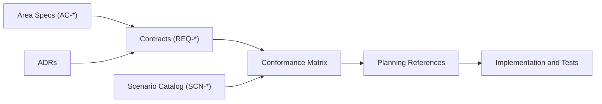

# TripleStore Architecture Overview

## Purpose

This document defines the architectural baseline for `TripleStore`.

If another architectural document conflicts with this overview, this overview wins until the conflict is resolved through a contract or ADR update.

## Design Goals

- Provide a persistent RDF triple store with a small Elixir-facing API.
- Keep SPARQL execution semantics in pure Elixir so query execution remains preemptible and inspectable.
- Use Rustler NIFs only for parser and RocksDB-adjacent work that benefits from native performance.
- Make dictionary encoding and triple-index fanout the canonical storage model.
- Keep reasoning explicit, materialized, and operationally observable.
- Preserve a clean boundary between explicit facts and derived facts.
- Expose operational surfaces for health, telemetry, backup, restore, and scheduled maintenance.

## Non-Goals

- Becoming a distributed cluster manager or multi-node consensus system.
- Replacing upstream RDF application semantics with a product-specific workflow layer.
- Moving query optimization or reasoning semantics into native code.
- Treating backup, health, and telemetry as optional concerns.

## Canonical Contract Layer

The documents in `specs/contracts` are normative. Area indexes and implementation notes MUST NOT redefine contract semantics.

- [contracts/control_plane_ownership_matrix.md](contracts/control_plane_ownership_matrix.md)
- [contracts/storage_runtime_contract.md](contracts/storage_runtime_contract.md)
- [contracts/query_execution_contract.md](contracts/query_execution_contract.md)
- [contracts/transaction_and_isolation_contract.md](contracts/transaction_and_isolation_contract.md)
- [contracts/reasoning_contract.md](contracts/reasoning_contract.md)
- [contracts/observability_contract.md](contracts/observability_contract.md)

## Specification Governance Flow

## Core Concepts

| Concept | Definition | Owns State? |
|---|---|---|
| Store handle | Public runtime reference returned by `TripleStore.open/2` containing database and manager references | No, it is a facade handle |
| Coordination services | OTP processes such as dictionary managers, snapshots, plan cache, statistics cache, and transaction coordinator | Yes, process-local coordination state |
| Dictionary layer | Maps RDF terms to tagged 64-bit IDs and back | Yes |
| Triple indices | `spo`, `pos`, `osp` keyspaces providing pattern-oriented lookup | Yes, persisted in RocksDB |
| Query engine | Parser, algebra, optimizer, executor, property paths, cost model, caches | Yes, semantic execution state and cached plans |
| Reasoner | Rule compiler, delta computation, semi-naive materialization, derived storage, incremental maintenance | Yes |
| Native adapters | Rustler NIFs for RocksDB and SPARQL parsing | No semantic authority; they implement bounded native capabilities |
| Data plane | RocksDB column families and backup/snapshot files on disk | Yes, persisted canonical bytes |

## Design Decisions

| Decision | Rationale | Tradeoff |
|---|---|---|
| Public API remains small and synchronous-looking | Keeps library use simple for callers | Requires careful internal coordination for writes and long-running operations |
| Query execution stays in Elixir | Preserves BEAM scheduling, debuggability, and optimizer flexibility | Native parser and storage speedups do not extend to the full query pipeline |
| Storage uses dictionary-encoded IDs and three primary indices | Enables compact keys and predictable pattern selection | All writes must fan out atomically across multiple keyspaces |
| Derived facts stay in a separate `derived` column family | Makes explicit versus inferred state operationally distinct | Reasoning paths must manage multiple persistence surfaces |
| Writes are serialized through a transaction coordinator | Preserves single-writer semantics and snapshot-friendly reads | Updates may bottleneck under heavy write concurrency |
| Operational surfaces are first-class | Health, telemetry, and backup are needed for production use | More modules and docs must stay aligned with core semantics |

## Runtime Lifecycle

1. `TripleStore.Application` boots process-global services such as the plan cache and snapshot manager.
2. `TripleStore.open/2` validates the path and opens RocksDB through the NIF.
3. `TripleStore.open/2` starts a dictionary manager or sharded dictionary manager for that store.
4. Read operations query the store directly against dictionary/index/query modules.
5. Update operations use `TripleStore.Transaction` to serialize writes and preserve atomic fanout.
6. Query operations route through parser, algebra, optimizer, and executor stages.
7. Reasoning operations route through rule compilation, delta computation, and materialization against explicit plus derived storage.
8. Backup, restore, health, and telemetry surfaces observe or operate on the same canonical runtime/data model.

## Canonical Storage Model

- RDF terms map to tagged 64-bit IDs.
- `spo`, `pos`, and `osp` are the canonical explicit-triple indices.
- `id2str` and `str2id` are the canonical dictionary surfaces.
- `derived` is the canonical inferred-triple persistence surface.
- Numeric and temporal literals MAY be inline-encoded when representable.

## Current Codebase Notes

- The default OTP application currently starts only `SPARQL.PlanCache` and `Snapshot`.
- `TripleStore.open/2` starts a dictionary manager and returns `transaction: nil` by default.
- `Statistics.Cache` is deprecated but still used by the application helper API; `Statistics.Server` exists as the newer alternative.
- `Query.Cache`, `Metrics`, and `Prometheus` are implemented and tested but remain opt-in runtime surfaces.
- RDF loaders for N-Quads and TriG currently keep only the default graph, and SPARQL graph update operations remain limited by the single-graph store model.
- The reasoning subsystem already includes status tracking, tracing, and schema/TBox support beyond the core materialization loop.

## Canonical References

- [topology.md](topology.md)
- [boundaries.md](boundaries.md)
- [control-planes.md](control-planes.md)
- [README.md](README.md)
- [runtime/public_api_and_store_lifecycle.md](runtime/public_api_and_store_lifecycle.md)
- [storage/dictionary_and_index_layer.md](storage/dictionary_and_index_layer.md)
- [query/sparql_execution_pipeline.md](query/sparql_execution_pipeline.md)
- [reasoning/materialization_and_maintenance.md](reasoning/materialization_and_maintenance.md)

## ADR References

- [adr/ADR-0001-control-plane-authority.md](adr/ADR-0001-control-plane-authority.md)
