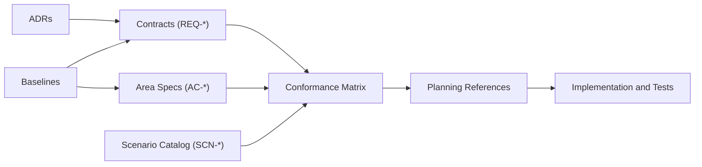

# TripleStore Architecture Overview

## Purpose

This document defines the architectural baseline for `TripleStore`.

If another architectural document conflicts with this overview, this overview wins until the conflict is resolved through a contract or ADR update.

## System Shape

`TripleStore` is a BEAM-owned RDF storage and query engine layered over RocksDB.

The codebase now implements two persistent store shapes:

- **Triple schema (`:triple`, v1)** for default-graph-only RDF triples backed by `spo`, `pos`, and `osp`
- **Quad schema (`:quad`, v2)** for named-graph RDF datasets backed by `gspo`, `gpos`, `spog`, and `posg`

The system is not a single monolithic API. It has:

- a primary facade in `TripleStore`
- expert entry points in modules such as `TripleStore.Update`, `TripleStore.GraphBackup`, `TripleStore.QuadOperations`, `TripleStore.Health`, and `TripleStore.SPARQL.Authorization`
- a small default OTP runtime
- a larger set of optional caches, metrics, statistics, and scheduling helpers

## Design Goals

- Provide a persistent RDF store with a stable Elixir API for lifecycle, loading, query, update, reasoning, export, and operations.
- Keep SPARQL semantics, update semantics, and reasoning semantics in Elixir so they remain inspectable, testable, and preemptible at the BEAM level.
- Support both triple-only and named-graph workloads through explicit schema selection at store-open time.
- Make dictionary encoding, explicit index fanout, and derived-fact storage the canonical persisted model.
- Keep graph-aware concerns explicit: named graphs, graph ACLs, graph-scoped reasoning, and graph backup should be visible architectural surfaces rather than hidden side effects.
- Preserve operational visibility through telemetry, health, snapshot, statistics, backup, graph backup, and scheduled backup surfaces.

## Non-Goals

- Acting as a distributed consensus system or cluster coordinator.
- Hiding the difference between triple and quad schemas behind a single ambiguous on-disk layout.
- Moving SPARQL execution or reasoning semantics into native code.
- Treating operational recovery, graph authorization, or reasoning provenance as purely external concerns.

## Canonical Contract Layer

The documents in `specs/contracts` are normative. Area indexes and implementation notes MUST NOT redefine contract semantics.

- [contracts/control_plane_ownership_matrix.md](contracts/control_plane_ownership_matrix.md)
- [contracts/storage_runtime_contract.md](contracts/storage_runtime_contract.md)
- [contracts/query_execution_contract.md](contracts/query_execution_contract.md)
- [contracts/transaction_and_isolation_contract.md](contracts/transaction_and_isolation_contract.md)
- [contracts/reasoning_contract.md](contracts/reasoning_contract.md)
- [contracts/observability_contract.md](contracts/observability_contract.md)

## Specification Governance Flow

## Core Concepts

| Concept | Definition | Owns State? |
|---|---|---|
| Store handle | Public runtime reference returned by `TripleStore.open/2`; at runtime it contains `db`, `dict_manager`, `transaction`, `path`, and `schema` | No, it is a caller-facing facade handle |
| Primary facade | `TripleStore`, which exposes the main lifecycle, load, query, update, reasoning, export, health, backup, and scheduling surface | No |
| Expert modules | Lower-level or specialized modules such as `TripleStore.Update`, `TripleStore.GraphBackup`, `TripleStore.QuadOperations`, `TripleStore.Health`, and `TripleStore.SPARQL.Authorization` | Varies by module |
| Coordination services | Long-lived or temporary processes such as dictionary managers, transaction coordinators, snapshots, plan cache, and statistics helpers | Yes, process-local runtime state |
| Storage semantics layer | Dictionary, triple indices, quad indices, loader, exporter, and graph-oriented storage helpers | Yes |
| Query stack | Parser facade, algebra, optimizer, executor, property paths, graph authorization, query caches, and cost model | Yes |
| Reasoning stack | Rule compiler, profiles, semi-naive evaluation, graph-scoped reasoner, derived store, status, provenance, and incremental maintenance | Yes |
| Native adapters | `TripleStore.Backend.RocksDB.ErlangAdapter` and `TripleStore.SPARQL.Parser.NIF` | No semantic authority; bounded capability surfaces only |
| Data plane | RocksDB column families, snapshots, backup directories, graph backup files, and persisted statistics metadata | Yes, canonical persisted bytes |

## Architectural Decisions

| Decision | Rationale | Current Tradeoff |
|---|---|---|
| Schema is chosen at `open/2` time | Triple and quad stores have incompatible key layouts and column-family sets | A store cannot be migrated in place; export and import is required |
| `TripleStore` remains the primary facade but not the only expert surface | Keeps common workflows simple while allowing narrower expert APIs for graph backup, authorization, and direct update contexts | Callers can bypass the facade, so specs must document those expert boundaries explicitly |
| Global OTP runtime stays minimal | Only plan-cache and snapshot services are reusable without a store-specific DB reference | Many helpers remain opt-in and are not guaranteed to exist unless callers wire them |
| Direct insert/delete/load paths use schema-aware batch writes, while SPARQL UPDATE uses `Transaction` | Matches the current implementation split between explicit batch storage helpers and parsed update coordination | Public mutation semantics are not uniform; transaction snapshot behavior applies to `Transaction` flows, not all public calls |
| Query and reasoning semantics stay in Elixir | Preserves control over graph semantics, authorization hooks, cost planning, and rule execution | Native speedups are bounded to parsing and storage adapters |
| Derived facts, provenance, numeric ranges, and ACLs are explicit persistence surfaces | Keeps graph-aware reasoning and authorization observable and debuggable | The on-disk layout is richer than the original triple-only design sketch |

## Runtime Lifecycle

1. The embedding application starts or depends on `TripleStore.Application`.
2. `TripleStore.Application` supervises `TripleStore.SPARQL.PlanCache` and `TripleStore.Snapshot`.
3. `TripleStore.open/2` validates the path, selects schema, opens RocksDB through `TripleStore.Backend.RocksDB.ErlangAdapter`, and starts either `Dictionary.Manager` or `Dictionary.ShardedManager`.
4. The returned store handle includes the DB reference, dictionary manager, `transaction: nil` by default, path, and schema.
5. `load`, `load_graph`, `load_string`, `insert`, and `delete` route through `TripleStore.Loader` and the storage layer, using direct atomic batch writes rather than a long-lived transaction server.
6. `query` routes through `TripleStore.SPARQL.Query` into parser, algebra, optimizer, and executor modules. Lower-level query contexts MAY include `:user` for graph ACL checks, but the `TripleStore.query/3` facade does not surface actor context today.
7. `update` routes through `TripleStore.Transaction`; `TripleStore.update/2` starts a temporary transaction coordinator when `store.transaction` is `nil`.
8. `materialize/2` remains a legacy triple-materialization entry point for its default local path, while graph-aware materialization is exposed through `materialize_graph/3`, `materialize_graphs/3`, `materialize_all/2`, and quad incremental reasoning APIs.
9. Backup, graph backup, restore, health, snapshot, statistics, metrics, and Prometheus all observe the same canonical runtime and data model.

## Canonical Storage Model

- RDF terms map to tagged 64-bit IDs through the dictionary layer.
- Inline encoding exists for supported numeric and temporal literals.
- **Triple schema (`:triple`, v1)** uses `id2str`, `str2id`, `spo`, `pos`, `osp`, `derived`, and `numeric_range`.
- **Quad schema (`:quad`, v2)** uses `id2str`, `str2id`, `gspo`, `gpos`, `spog`, `posg`, `derived`, `derivation_provenance`, `numeric_range`, and `acl`.
- In quad schema, graph ID `0` is the reserved default graph; named graphs use positive dictionary-backed IDs.
- `derived` is the canonical persisted surface for inferred facts in both schemas.
- `derivation_provenance` and `acl` are explicit quad-schema extensions; they are not hidden metadata.
- Statistics metadata is currently persisted via reserved-key usage in `id2str` rather than a dedicated statistics column family.
- Direct in-place migration between triple and quad schemas is not supported.

## Current Codebase Notes

- The `@type store()` and `@type open_opts()` declarations in `lib/triple_store.ex` lag the runtime shape; `schema` is supported and stored at runtime.
- `TripleStore.insert/2` and `TripleStore.delete/2` bypass `Transaction` and rely on schema-appropriate batch writes through `Loader`, `Index`, and `QuadOperations`.
- `Transaction.query/3` provides snapshot-aware reads when used directly, but the public `TripleStore.query/3` path does not route through that coordinator.
- `TripleStore.materialize/2` still defaults to the legacy triple-materialization code path for `scope: :local`; graph-local quad reasoning is exposed through explicit graph APIs instead.
- Two result-cache implementations exist. `TripleStore.Query.Cache` is the cache integrated into `SPARQL.Query`; `TripleStore.SPARQL.QueryCache` remains present and tested as a separate ETS-based cache.
- `Statistics.Cache` is deprecated but still application-integrated; `Statistics.Server` is the intended successor.

## Canonical References

- [topology.md](topology.md)
- [boundaries.md](boundaries.md)
- [control-planes.md](control-planes.md)
- [runtime/public_api_and_store_lifecycle.md](runtime/public_api_and_store_lifecycle.md)
- [storage/dictionary_and_index_layer.md](storage/dictionary_and_index_layer.md)
- [query/sparql_execution_pipeline.md](query/sparql_execution_pipeline.md)
- [reasoning/materialization_and_maintenance.md](reasoning/materialization_and_maintenance.md)
- [operations/observability_and_recovery.md](operations/observability_and_recovery.md)

## ADR References

- [adr/ADR-0001-control-plane-authority.md](adr/ADR-0001-control-plane-authority.md)
