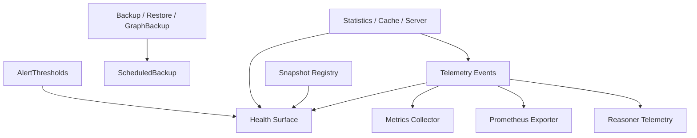

# Observability And Recovery

## Purpose

This document backfills the current operations-facing surfaces implemented by:

- `TripleStore.Telemetry`
- `TripleStore.Reasoner.Telemetry`
- `TripleStore.Metrics`
- `TripleStore.Prometheus`
- `TripleStore.Health`
- `TripleStore.Backup`
- `TripleStore.GraphBackup`
- `TripleStore.ScheduledBackup`
- `TripleStore.Snapshot`
- `TripleStore.Statistics`
- `TripleStore.Statistics.Cache`
- `TripleStore.Statistics.Server`
- `TripleStore.AlertThresholds`

## Control Plane

Primary ownership: **Operations Plane**.

## Dependency View

## Current Codebase Notes

- `Telemetry` is the central shared instrumentation surface; metrics and Prometheus both consume it.
- `Telemetry` sanitizes or reduces raw values such as queries and paths before they become operator-facing metadata.
- `Metrics` and `Prometheus` are real current modules, but they are opt-in and not part of the default application supervision tree.
- `Health` reports on both required and optional runtime surfaces, which means “degraded” states can reflect missing optional helpers rather than hard store failure.
- `TripleStore.health/1` is only a compact wrapper; `TripleStore.Health` is the richer health and readiness surface.
- `Snapshot` is a globally supervised support service and is already used by integration tests for read-consistency behavior.
- `Statistics.Cache` is deprecated but still runtime-integrated through `TripleStore.Application.start_stats_cache/2`; `Statistics.Server` is the intended successor.
- Backup and scheduled-backup support are current production-facing features, including incremental backup, verification, restore, and rotation behavior.
- `GraphBackup` is the current graph-scoped recovery surface and uses N-Quads export/import plus per-graph metadata.

## Acceptance Criteria

| Acceptance ID | Criterion | Related Tests |
|---|---|---|
| `AC-OPS-11` | Telemetry remains the shared source for metrics and Prometheus-style export rather than parallel ad hoc instrumentation stacks. | `test/triple_store/telemetry_test.exs`, `test/triple_store/metrics_test.exs`, `test/triple_store/prometheus_test.exs` |
| `AC-OPS-12` | Health distinguishes store liveness, readiness, and full-health status while reflecting optional support services accurately. | `test/triple_store/health_test.exs` |
| `AC-OPS-13` | Backup, restore, graph backup, incremental backup, and scheduled backup remain documented as current runtime features. | `test/triple_store/backup_test.exs`, `test/triple_store/graph_backup_test.exs`, `test/triple_store/scheduled_backup_test.exs` |
| `AC-OPS-14` | Snapshot lifecycle management remains an explicit operational support surface for read consistency and cleanup. | `test/triple_store/snapshot_test.exs`, `test/triple_store/integration/storage_layer_test.exs` |
| `AC-OPS-15` | The specs capture the current split between deprecated `Statistics.Cache` integration and the newer `Statistics.Server` implementation. | `test/triple_store/statistics/cache_test.exs`, `test/triple_store/statistics/server_test.exs`, `test/triple_store/statistics_quad_test.exs` |
