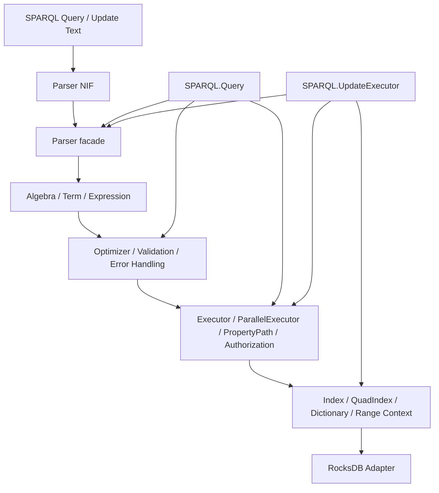

# SPARQL Execution Pipeline

## Purpose

This document backfills the current SPARQL execution stack implemented by:

- `TripleStore.SPARQL.Parser`
- `TripleStore.SPARQL.Parser.NIF`
- `TripleStore.SPARQL.Algebra`
- `TripleStore.SPARQL.Term`
- `TripleStore.SPARQL.Expression`
- `TripleStore.SPARQL.Optimizer`
- `TripleStore.SPARQL.Validation`
- `TripleStore.SPARQL.QueryLogger`
- `TripleStore.SPARQL.ErrorHandler`
- `TripleStore.SPARQL.Executor`
- `TripleStore.SPARQL.ParallelExecutor`
- `TripleStore.SPARQL.PropertyPath`
- `TripleStore.SPARQL.Authorization`
- `TripleStore.SPARQL.Query`
- `TripleStore.SPARQL.UpdateExecutor`
- `TripleStore.SPARQL.LimitExceededError`

## Control Plane

Primary ownership: **Query Plane**.

## Dependency View

## Current Codebase Notes

- `SPARQL.Query` is the main orchestration surface and uses `Task.async/1` for timeout isolation.
- Result caching is optional at query time and is not enabled by default.
- `SPARQL.Query` supports prepared queries, parameter binding, explain mode, streaming results, query logging, and timeout enforcement during setup or materialized execution.
- The executor stack supports triple patterns, quad patterns, graph clauses, property paths, and lower-level authorization checks when a `:user` exists in the execution context.
- `UpdateExecutor` handles SPARQL 1.1 update forms including graph management operations, invalidates query caches after successful writes, and can consult graph ACLs when invoked with a user-aware context.
- `TripleStore.query/3` and `TripleStore.update/2` do not currently expose actor context, so user-aware authorization is a lower-level expert capability rather than a facade feature.
- Streaming queries are lazy; the current timeout contract applies to setup and eager execution, not to the full duration of stream consumption.

## Acceptance Criteria

| Acceptance ID | Criterion | Related Tests |
|---|---|---|
| `AC-QRY-06` | The current query path routes through parse, compile, optimize, validation, and execute phases rather than skipping directly from parser output to low-level scans. | `test/triple_store/sparql/parser_test.exs`, `test/triple_store/sparql/algebra_test.exs`, `test/triple_store/sparql/optimizer_test.exs`, `test/triple_store/sparql/validation_test.exs`, `test/triple_store/sparql/executor_test.exs` |
| `AC-QRY-07` | `SPARQL.Query` supports the current public query features: timeout, explain, prepared queries, parameter binding, streaming, and optional result caching. | `test/triple_store/sparql/query_test.exs`, `test/triple_store/sparql/result_stream_test.exs`, `test/triple_store/sparql/enhanced_explain_test.exs`, `test/triple_store/sparql/telemetry_test.exs` |
| `AC-QRY-08` | `UpdateExecutor` preserves the current graph-aware update semantics, cache invalidation behavior, and lower-level authorization hooks. | `test/triple_store/sparql/update_executor_test.exs`, `test/triple_store/sparql/update_integration_test.exs`, `test/triple_store/sparql/graph_management_test.exs`, `test/triple_store/sparql/copy_move_add_test.exs`, `test/triple_store/sparql/update_authorization_test.exs` |
| `AC-QRY-09` | Property-path, validation, error handling, and other bounded query operations expose typed limit and failure behavior instead of silent truncation. | `test/triple_store/sparql/property_path_test.exs`, `test/triple_store/sparql/property_path_integration_test.exs`, `test/triple_store/sparql/error_handler_test.exs`, `test/triple_store/sparql/executor_error_test.exs` |
