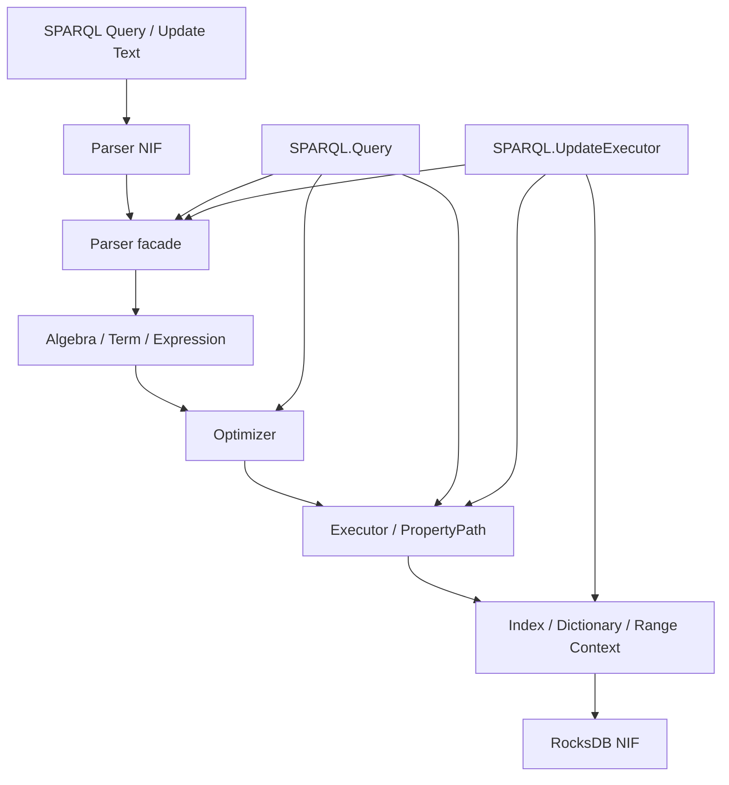

# SPARQL Execution Pipeline

## Purpose

This document backfills the current SPARQL execution stack implemented by:

- `TripleStore.SPARQL.Parser`
- `TripleStore.SPARQL.Parser.NIF`
- `TripleStore.SPARQL.Algebra`
- `TripleStore.SPARQL.Term`
- `TripleStore.SPARQL.Expression`
- `TripleStore.SPARQL.Optimizer`
- `TripleStore.SPARQL.Executor`
- `TripleStore.SPARQL.PropertyPath`
- `TripleStore.SPARQL.Query`
- `TripleStore.SPARQL.UpdateExecutor`
- `TripleStore.SPARQL.LimitExceededError`

## Control Plane

Primary ownership: **Query Plane**.

## Dependency View

## Current Codebase Notes

- `SPARQL.Query` is the main orchestration surface and uses `Task.async/1` for timeout isolation.
- Result caching is optional at query time and is not enabled by default.
- `UpdateExecutor` currently handles the core SPARQL 1.1 update forms, invalidates query cache after successful writes, and treats some graph operations as no-ops or unsupported under the single-graph model.
- Property-path execution, result limits, and error types are already first-class parts of the current query stack.
- The current implementation is richer than the original architecture sketch: it includes prepared queries, explain output, parameter binding, and cache hooks.

## Acceptance Criteria

| Acceptance ID | Criterion | Related Tests |
|---|---|---|
| `AC-QRY-06` | The current query path routes through parse, compile, optimize, and execute phases rather than skipping directly from parser output to low-level scans. | `test/triple_store/sparql/parser_test.exs`, `test/triple_store/sparql/algebra_test.exs`, `test/triple_store/sparql/optimizer_test.exs`, `test/triple_store/sparql/executor_test.exs` |
| `AC-QRY-07` | `SPARQL.Query` supports the current public query features: timeout, explain, prepared queries, and optional result caching. | `test/triple_store/sparql/query_test.exs`, `test/triple_store/sparql/telemetry_test.exs` |
| `AC-QRY-08` | `UpdateExecutor` preserves the current single-graph semantics, including explicit limitations around named-graph support. | `test/triple_store/sparql/update_executor_test.exs`, `test/triple_store/sparql/update_integration_test.exs` |
| `AC-QRY-09` | Property-path and other bounded query operations expose typed limit and failure behavior instead of silent truncation. | `test/triple_store/sparql/property_path_test.exs`, `test/triple_store/sparql/property_path_integration_test.exs` |
