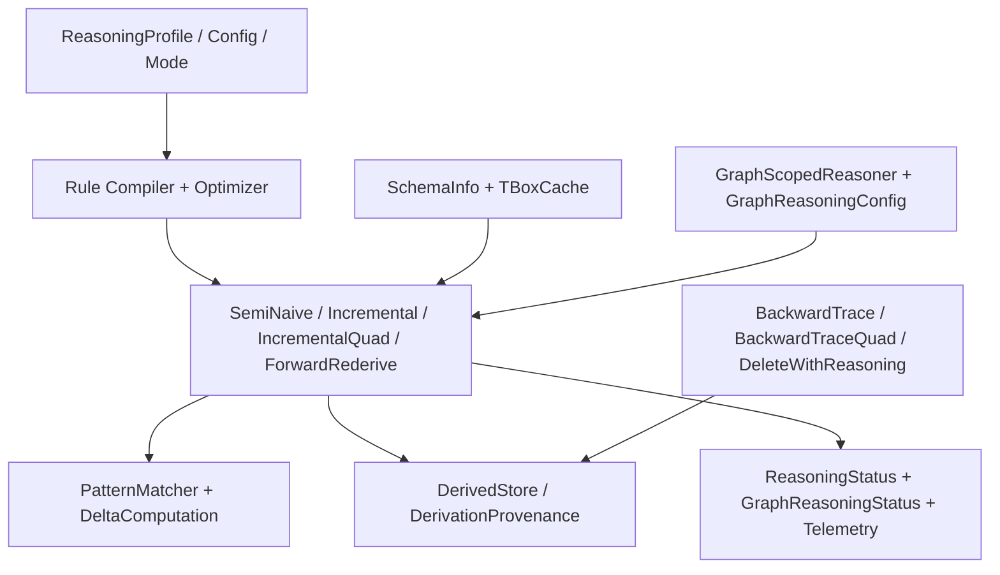

# Materialization And Maintenance

## Purpose

This document backfills the current reasoning subsystem implemented by:

- `TripleStore.Reasoner.Rule`
- `TripleStore.Reasoner.Rules`
- `TripleStore.Reasoner.RuleCompiler`
- `TripleStore.Reasoner.RuleOptimizer`
- `TripleStore.Reasoner.PatternMatcher`
- `TripleStore.Reasoner.DeltaComputation`
- `TripleStore.Reasoner.SemiNaive`
- `TripleStore.Reasoner.Incremental`
- `TripleStore.Reasoner.IncrementalQuad`
- `TripleStore.Reasoner.ForwardRederive`
- `TripleStore.Reasoner.ForwardRederiveQuad`
- `TripleStore.Reasoner.DeleteWithReasoning`
- `TripleStore.Reasoner.DeleteWithReasoningQuad`
- `TripleStore.Reasoner.DerivedStore`
- `TripleStore.Reasoner.TBoxCache`
- `TripleStore.Reasoner.SchemaInfo`
- `TripleStore.Reasoner.BackwardTrace`
- `TripleStore.Reasoner.BackwardTraceQuad`
- `TripleStore.Reasoner.GraphScopedReasoner`
- `TripleStore.Reasoner.GraphReasoningConfig`
- `TripleStore.Reasoner.GraphReasoningStatus`
- `TripleStore.Reasoner.DerivationProvenance`
- `TripleStore.Reasoner.GraphProvenance`
- `TripleStore.Reasoner.ReasoningConfig`
- `TripleStore.Reasoner.ReasoningMode`
- `TripleStore.Reasoner.ReasoningProfile`
- `TripleStore.Reasoner.ReasoningStatus`
- `TripleStore.Reasoner.Telemetry`

## Control Plane

Primary ownership: **Reasoning Plane**.

## Dependency View

## Current Codebase Notes

- The reasoning subsystem is broader than a single materializer: it includes configuration, graph-scoped status, provenance/backward tracing, incremental maintenance, and rederivation workflows.
- `TripleStore.materialize/2` routes `scope: :local` through a legacy triple-only path: it reads `Index.lookup_all/2`, calls `SemiNaive.materialize_in_memory`, and returns statistics while discarding the resulting fact set. This path does not write `derived`, does not reload previously persisted derived facts, and does not forward its `parallel` option to the evaluator.
- `materialize_graph/3`, `materialize_graphs/3`, and `materialize_all/2` route through `GraphScopedReasoner`, whose storage callbacks write inferred facts to `derived`. `DerivedStore` provides separate persistence and lookup APIs used by other reasoning workflows; the local facade path does not call it.
- Fully ground non-delta premises are verified through the configured lookup
  provider. A missing premise yields no binding, while a provider error aborts
  sequential or parallel evaluation with `{:error, {:lookup_failed, reason}}`.
- Global `:per_graph_cf` materialization stores canonical GSPO keys in `derived`
  under graph ID `0`. Global evaluation retains triple facts but not a unique
  source graph for each derivation, so this fixes the byte layout without
  assigning derived facts back to premise graphs.
- Existing malformed SPOG bytes cannot be distinguished from valid GSPO bytes
  by their 32-byte length. Follow the [derived-quad recovery runbook](../../docs/production/derived-quad-recovery.md)
  for an explicitly scoped, backup-first rebuild.
- `DerivationProvenance` and `GraphReasoningStatus` make graph-aware reasoning operationally inspectable rather than opaque. Persisted provenance uses the compatible unversioned derivation-map format. Reads safe-decode and completely validate the fact key, rule identifier, graph-first premises, bindings, timestamp, and optional metadata. Corrupt or unsupported records return `{:error, {:corrupt_provenance, reason}}`; explanation and delete-with-reasoning propagate that error before changing explicit or derived facts.
- `TBoxCache`, `SchemaInfo`, and graph helpers give the current reasoner a schema-aware support layer, not just a flat rule executor.

The dependency diagram above describes the subsystem, not a persistence guarantee for every entry point. See the [reasoning contract implementation status](../contracts/reasoning_contract.md#current-implementation-status) before treating a successful facade call as persisted materialization.

## Acceptance Criteria

| Acceptance ID | Criterion | Related Tests |
|---|---|---|
| `AC-RSN-06` | Full materialization remains anchored in compiled rules plus semi-naive delta evaluation. | `test/triple_store/reasoner/rule_compiler_test.exs`, `test/triple_store/reasoner/semi_naive_test.exs`, `test/triple_store/reasoner/materialization_integration_test.exs` |
| `AC-RSN-07` | Incremental, graph-scoped, delete-with-reasoning, and forward-rederivation flows preserve the explicit-versus-derived fact boundary and graph-local semantics. | `test/triple_store/reasoner/incremental_test.exs`, `test/triple_store/reasoner/incremental_quad_test.exs`, `test/triple_store/reasoner/delete_with_reasoning_test.exs`, `test/triple_store/reasoner/delete_with_reasoning_quad_test.exs`, `test/triple_store/reasoner/forward_rederive_test.exs`, `test/triple_store/reasoner/forward_rederive_quad_test.exs`, `test/triple_store/reasoner/graph_scoped_reasoning_integration_test.exs` |
| `AC-RSN-08` | Reasoning support modules such as `TBoxCache`, `SchemaInfo`, `GraphScopedReasoner`, and backward-trace or provenance helpers remain documented as part of the current subsystem rather than hidden internals. | `test/triple_store/reasoner/tbox_cache_test.exs`, `test/triple_store/reasoner/backward_trace_test.exs`, `test/triple_store/reasoner/backward_trace_quad_test.exs`, `test/triple_store/reasoner/graph_provenance_test.exs` |
| `AC-RSN-09` | Reasoning configuration and status remain first-class runtime artifacts for both global and per-graph workflows. | `test/triple_store/reasoner/reasoning_config_test.exs`, `test/triple_store/reasoner/reasoning_status_test.exs`, `test/triple_store/reasoner/reasoning_profile_test.exs`, `test/triple_store/reasoner/graph_reasoning_config_test.exs` |
| `AC-RSN-10` | Fully ground premises require an exact lookup match, and lookup failures cannot be reported as successful convergence. | `test/triple_store/reasoner/ground_premise_regression_test.exs`, `test/triple_store/reasoner/delta_computation_test.exs`, `test/triple_store/reasoner/semi_naive_test.exs` |
| `AC-RSN-11` | Derived quads use canonical GSPO bytes across batched writes, lookup, reopen, deletion, and recovery; global `:per_graph_cf` targets graph ID `0`. | `test/triple_store/reasoner/derived_quad_canonical_test.exs`, `test/triple_store/reasoner/section_7_8_5_derived_store_quad_test.exs` |
| `AC-RSN-12` | Persisted derivation records are safe-decoded and completely validated; corrupt lineage produces a tagged error before explanation or maintained deletion mutates facts, while valid legacy atom names and binary rule names remain compatible. | `test/triple_store/reasoner/derivation_provenance_test.exs`, `test/triple_store/phase_3_persisted_state_safety_integration_test.exs` |
