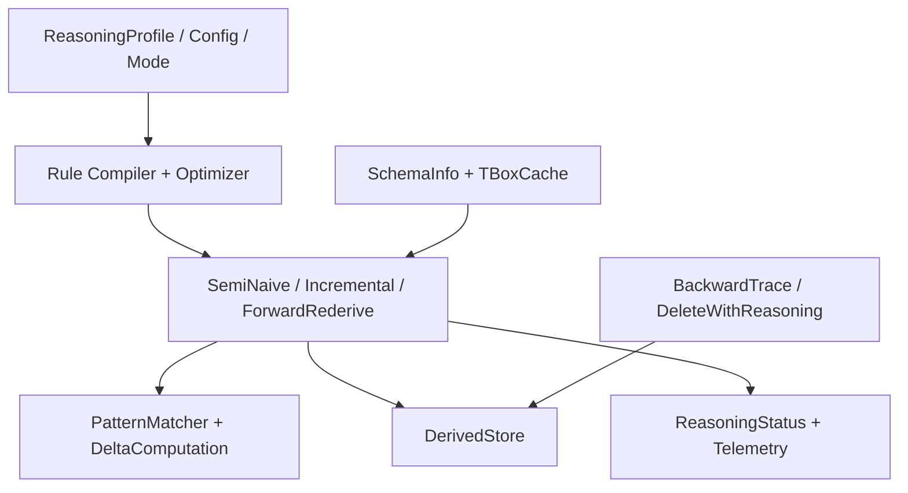

# Materialization And Maintenance

## Purpose

This document backfills the current reasoning subsystem implemented by:

- `TripleStore.Reasoner.Rule`
- `TripleStore.Reasoner.Rules`
- `TripleStore.Reasoner.RuleCompiler`
- `TripleStore.Reasoner.RuleOptimizer`
- `TripleStore.Reasoner.PatternMatcher`
- `TripleStore.Reasoner.DeltaComputation`
- `TripleStore.Reasoner.SemiNaive`
- `TripleStore.Reasoner.Incremental`
- `TripleStore.Reasoner.ForwardRederive`
- `TripleStore.Reasoner.DeleteWithReasoning`
- `TripleStore.Reasoner.DerivedStore`
- `TripleStore.Reasoner.TBoxCache`
- `TripleStore.Reasoner.SchemaInfo`
- `TripleStore.Reasoner.BackwardTrace`
- `TripleStore.Reasoner.ReasoningConfig`
- `TripleStore.Reasoner.ReasoningMode`
- `TripleStore.Reasoner.ReasoningProfile`
- `TripleStore.Reasoner.ReasoningStatus`
- `TripleStore.Reasoner.Telemetry`

## Control Plane

Primary ownership: **Reasoning Plane**.

## Dependency View

## Current Codebase Notes

- The reasoning subsystem is broader than a single materializer: it includes configuration, status tracking, provenance/backward tracing, incremental maintenance, and rederivation workflows.
- `DerivedStore` is the concrete persistence boundary for inferred facts and is already used to enforce explicit-versus-derived separation.
- `ReasoningStatus` can be stored and queried separately from the raw derivation pipeline, which makes the subsystem more operationally visible than the original high-level plan implied.
- `TBoxCache` and `SchemaInfo` give the current reasoner a schema-aware support layer, not just a flat rule executor.

## Acceptance Criteria

| Acceptance ID | Criterion | Related Tests |
|---|---|---|
| `AC-RSN-06` | Full materialization remains anchored in compiled rules plus semi-naive delta evaluation. | `test/triple_store/reasoner/rule_compiler_test.exs`, `test/triple_store/reasoner/semi_naive_test.exs`, `test/triple_store/reasoner/materialization_integration_test.exs` |
| `AC-RSN-07` | Incremental, delete-with-reasoning, and forward-rederivation flows preserve the explicit-versus-derived fact boundary. | `test/triple_store/reasoner/incremental_test.exs`, `test/triple_store/reasoner/delete_with_reasoning_test.exs`, `test/triple_store/reasoner/forward_rederive_test.exs` |
| `AC-RSN-08` | Reasoning support modules such as `TBoxCache`, `SchemaInfo`, and `BackwardTrace` remain documented as part of the current subsystem rather than hidden internals. | `test/triple_store/reasoner/tbox_cache_test.exs`, `test/triple_store/reasoner/backward_trace_test.exs` |
| `AC-RSN-09` | Reasoning configuration and status remain first-class runtime artifacts. | `test/triple_store/reasoner/reasoning_config_test.exs`, `test/triple_store/reasoner/reasoning_status_test.exs`, `test/triple_store/reasoner/reasoning_profile_test.exs` |
