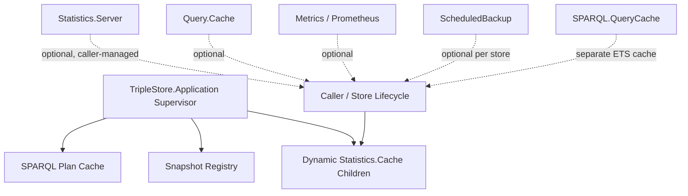

# Application And Support Services

## Purpose

This document backfills the current process-global and support-service runtime implemented by:

- `TripleStore.Application`
- `TripleStore.SPARQL.PlanCache`
- `TripleStore.Snapshot`
- `TripleStore.Statistics.Cache`
- `TripleStore.Statistics.Server`
- optional helper processes such as `TripleStore.Query.Cache`, `TripleStore.Metrics`, `TripleStore.Prometheus`, and `TripleStore.ScheduledBackup`

## Control Plane

Primary control-plane ownership: **Coordination Plane**.

## Current Codebase Scope

`TripleStore.Application` currently supervises:

- `TripleStore.SPARQL.PlanCache`
- `TripleStore.Snapshot`

It also exposes helper functions to dynamically start and stop `TripleStore.Statistics.Cache` children tied to a database reference.

## Dependency View

## Current Codebase Notes

- The application supervision tree is intentionally small today.
- `Statistics.Cache` is still the dynamically integrated statistics helper used by `TripleStore.Application.start_stats_cache/2`, even though it is deprecated in favor of `Statistics.Server`.
- `Statistics.Server` is richer and intended for new code, but it is not wired into the default application tree.
- `Query.Cache` is the result cache integrated into `SPARQL.Query`, but it remains opt-in and is not supervised by default.
- `SPARQL.QueryCache` is a separate ETS-backed query-cache implementation that remains present and tested.
- `Metrics`, `Prometheus`, and `ScheduledBackup` are real production-facing helpers, but they are started explicitly by callers rather than by the main application supervisor.

## Acceptance Criteria

| Acceptance ID | Criterion | Related Tests |
|---|---|---|
| `AC-RT-10` | The application supervisor starts only globally reusable support services that do not require a store-specific database reference. | `test/triple_store/integration/database_lifecycle_test.exs`, `test/triple_store/snapshot_test.exs`, `test/triple_store/sparql/plan_cache_test.exs` |
| `AC-RT-11` | Support services that require a store-specific database reference remain dynamic or caller-managed rather than prebooted globally. | `test/triple_store/statistics/cache_test.exs`, `test/triple_store/statistics/server_test.exs`, `test/triple_store/query/cache_test.exs` |
| `AC-RT-12` | The specs capture the transitional state where `Statistics.Cache` is integrated but deprecated in favor of `Statistics.Server`. | `test/triple_store/statistics/cache_test.exs`, `test/triple_store/statistics/server_test.exs` |
| `AC-RT-13` | Optional helper services remain explicitly opt-in rather than implicitly required by the default runtime. | `test/triple_store/query/cache_test.exs`, `test/triple_store/metrics_test.exs`, `test/triple_store/prometheus_test.exs`, `test/triple_store/scheduled_backup_test.exs` |
