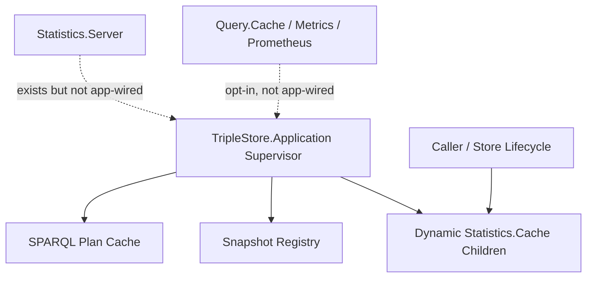

# Application And Support Services

## Purpose

This document backfills the current process-global and support-service runtime implemented by:

- `TripleStore.Application`
- `TripleStore.SPARQL.PlanCache`
- `TripleStore.Snapshot`
- `TripleStore.Statistics.Cache`
- `TripleStore.Statistics.Server`

## Control Plane

Primary control-plane ownership: **Coordination Plane**.

## Current Codebase Scope

`TripleStore.Application` currently supervises:

- `TripleStore.SPARQL.PlanCache`
- `TripleStore.Snapshot`

It also exposes helper functions to dynamically start and stop `TripleStore.Statistics.Cache` children tied to a database reference.

## Dependency View

## Current Codebase Notes

- The application supervision tree is intentionally small today.
- `Statistics.Cache` is still the dynamic child started by `TripleStore.Application.start_stats_cache/2`, even though the module is explicitly deprecated in favor of `Statistics.Server`.
- `Statistics.Server` exists and is richer than `Statistics.Cache`, but it is not yet the canonical runtime-integrated statistics surface.
- `Query.Cache`, `Metrics`, and `Prometheus` are real modules with tests, but they are not automatically started by the OTP application.
- Health checks know how to report on some optional support processes even when those processes are not part of the default supervision tree.

## Acceptance Criteria

| Acceptance ID | Criterion | Related Tests |
|---|---|---|
| `AC-RT-10` | The application supervisor starts only globally reusable support services that do not require a store-specific database reference. | `test/triple_store/integration/database_lifecycle_test.exs`, `test/triple_store/snapshot_test.exs` |
| `AC-RT-11` | Support services that require a store-specific database reference are started dynamically rather than prebooted globally. | `test/triple_store/statistics/cache_test.exs`, `test/triple_store/statistics/server_test.exs` |
| `AC-RT-12` | The specs capture the current transitional state where `Statistics.Cache` is still integrated but deprecated in favor of `Statistics.Server`. | code review plus statistics module docs |
| `AC-RT-13` | Optional support services remain explicitly opt-in rather than implicitly assumed to be present in the default application runtime. | `test/triple_store/query/cache_test.exs`, `test/triple_store/metrics_test.exs`, `test/triple_store/prometheus_test.exs` |
