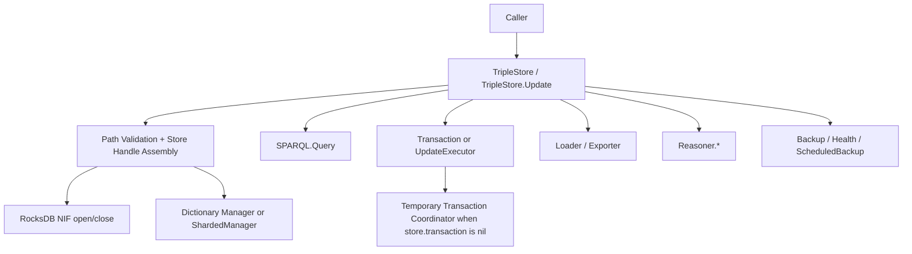

# Public API And Store Lifecycle

## Purpose

This document backfills the current public runtime surface implemented by:

- `TripleStore`
- `TripleStore.Update`

It describes how callers interact with a store today and how those entry points delegate into lower-level components.

## Control Plane

Primary control-plane ownership: **Public API Plane**.

## Current Codebase Scope

The public API currently exposes:

- store lifecycle: `open/2`, `close/1`
- load and export: `load/3`, `load_graph/3`, `load_string/4`, `export/2`
- mutation: `insert/2`, `delete/2`, `update/2`
- query: `query/3`
- reasoning: `materialize/2`, `reasoning_status/1`
- operations: `backup/3`, `restore/3`, `health/2`, `stats/1`, `start_scheduled_backup/2`

`TripleStore.Update` provides a parallel API surface for direct mutation against either:

- a transaction manager process, or
- a `%{db: ..., dict_manager: ...}` execution context

## Dependency View

## Runtime Workflow

1. `open/2` validates the target path, opens RocksDB through the NIF, and starts a dictionary manager.
2. The returned store handle currently contains `db`, `dict_manager`, `transaction`, and `path`.
3. `transaction` is `nil` by default; the public API does not start a long-lived coordinator automatically.
4. Query paths build a context map and route through `TripleStore.SPARQL.Query`.
5. Update paths use `TripleStore.Transaction` if a coordinator is already present; otherwise they start a temporary coordinator per update.
6. Reasoning routes through the `TripleStore.Reasoner.*` modules and derived-store surfaces.
7. Export, backup, restore, health, and scheduled-backup paths all operate against the same store handle contract.

## Current Codebase Notes

- `open/2` starts only the dictionary manager for the store; it does not auto-start statistics, metrics, query cache, or a transaction process.
- `close/1` currently stops the dictionary manager and closes the database reference; caller-managed helper processes should be stopped separately if they were started.
- `start_scheduled_backup/2` creates a dedicated scheduler process per store handle rather than wiring backup scheduling into the main application supervisor.
- Mutation paths are public-API stable, but the coordination model is mixed: some flows are ephemeral (`Transaction.start_link/1` inside `TripleStore.update/2`) and some are caller-managed.

## Acceptance Criteria

| Acceptance ID | Criterion | Related Tests |
|---|---|---|
| `AC-RT-06` | The public API exposes a coherent store-handle contract across lifecycle, query, update, reasoning, and operations calls. | `test/triple_store/api_test.exs`, `test/triple_store/full_system_integration_test.exs` |
| `AC-RT-07` | Default update behavior preserves coordination by creating a temporary transaction manager when needed. | `test/triple_store/transaction_test.exs`, `test/triple_store/update_test.exs` |
| `AC-RT-08` | Public lifecycle paths preserve validation and tagged-error semantics rather than leaking lower-level exceptions as the primary contract. | `test/triple_store/api_testing_test.exs`, `test/triple_store/integration/database_lifecycle_test.exs` |
| `AC-RT-09` | Public operations remain layered over lower-level modules rather than duplicating storage, query, or reasoning logic inline. | code review plus module-usage review in `lib/triple_store.ex` |
