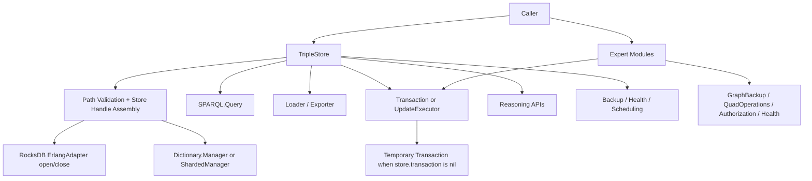

# Public API And Store Lifecycle

## Purpose

This document backfills the current public runtime surface implemented by:

- `TripleStore`
- `TripleStore.Update`

It describes how callers interact with a store today and how those entry points delegate into lower-level components.

## Control Plane

Primary control-plane ownership: **Public API Plane**.

## Current Codebase Scope

### Primary Facade

`TripleStore` currently exposes:

- store lifecycle: `open/2`, `close/1`
- load and export: `load/3`, `load_graph/3`, `load_string/4`, `export/3`
- mutation: `insert/2`, `delete/2`, `update/2`
- query: `query/3`
- reasoning: `materialize/2`, `materialize_graph/3`, `materialize_graphs/3`, `materialize_all/2`
- reasoning status and explanation: `reasoning_status/1`, `reasoning_status/2`, `explain_inference/4`
- graph-aware incremental maintenance: `add_quads_with_reasoning/4`, `delete_quads_with_reasoning/4`
- operations: `backup/3`, `restore/3`, `schedule_backup/3`, `health/1`, `stats/1`

### Expert Runtime Surfaces

The codebase also exposes narrower runtime modules that are not wrapped completely by `TripleStore`:

- `TripleStore.Update` for direct update contexts or explicit transaction-manager use
- `TripleStore.GraphBackup` for per-graph backup and restore
- `TripleStore.QuadOperations` for direct quad CRUD and graph transfer
- `TripleStore.Health` for liveness, readiness, and richer health status
- `TripleStore.SPARQL.Authorization` for named-graph ACL management
- `TripleStore.Exporter` for dataset, named-graph, and quad-oriented export surfaces not exposed through the generic `TripleStore.export/3` facade

## Dependency View

## Runtime Workflow

1. `open/2` validates the path, chooses schema, opens RocksDB through the adapter, and starts a dictionary manager.
2. The runtime store handle contains `db`, `dict_manager`, `transaction`, `path`, and `schema`, although some typedocs still describe an older subset.
3. `transaction` is `nil` by default; the public facade does not auto-start a long-lived transaction coordinator.
4. `query/3` builds a `%{db: db, dict_manager: dict_manager}` context and routes through `TripleStore.SPARQL.Query`.
5. `load/3`, `load_graph/3`, `load_string/4`, `insert/2`, and `delete/2` route through `TripleStore.Loader` and use direct schema-aware batch writes.
6. `update/2` uses `TripleStore.Transaction`; if no coordinator exists in the handle, a temporary one is started just for the update.
7. `materialize/2` is still the legacy triple-centric entry point for its default local mode; graph-aware reasoning is exposed through `materialize_graph/3`, `materialize_graphs/3`, `materialize_all/2`, and quad incremental reasoning APIs.
8. `export/3` remains a graph-oriented facade (`:graph`, `{:file, ...}`, `{:string, ...}`) even though expert export APIs support datasets and named-graph exports.
9. `backup`, `restore`, `schedule_backup`, `health`, and `stats` are facade wrappers over specialized runtime modules.

## Current Codebase Notes

- `open/2` supports `schema: :triple | :quad` and `dictionary_shards`, even though some declared types lag this runtime shape.
- `close/1` stops the dictionary manager and closes the DB reference; separately started helpers such as statistics servers, caches, or scheduled backup processes remain caller-managed.
- `insert/2` and `delete/2` do not use `Transaction`; they normalize RDF input and write through storage-layer batch functions.
- `query/3` does not currently accept a user or actor option, so graph ACL enforcement is available only through lower-level SPARQL execution contexts.
- `load_graph/3` effectively supports both `RDF.Graph` and `RDF.Dataset` because it delegates to `Loader.load_graph/4`, but the public spec and examples are still graph-focused.
- `export/3` does not currently expose dataset export, named-graph export, or graph-scoped N-Quads/TriG export even though `Exporter` and `GraphBackup` implement those capabilities.
- `health/1` is a compact facade summary; richer liveness, readiness, and optional-helper reporting lives in `TripleStore.Health`.

## Acceptance Criteria

| Acceptance ID | Criterion | Related Tests |
|---|---|---|
| `AC-RT-06` | The store handle contract is coherent across lifecycle, query, update, reasoning, and operations paths, including runtime `schema`. | `test/triple_store/api_test.exs`, `test/triple_store/integration/database_lifecycle_test.exs`, `test/triple_store/full_system_integration_test.exs` |
| `AC-RT-07` | Public SPARQL update behavior preserves coordination by creating a temporary transaction manager when needed. | `test/triple_store/transaction_test.exs`, `test/triple_store/update_test.exs`, `test/triple_store/sparql/update_integration_test.exs` |
| `AC-RT-08` | Public insert, delete, and load flows remain direct storage-layer paths and preserve tagged-result behavior, including schema-aware graph loading behavior. | `test/triple_store/api_testing_test.exs`, `test/triple_store/loader_test.exs`, `test/triple_store/graph_scoped_loading_test.exs`, `test/triple_store/integration/full_stack_test.exs` |
| `AC-RT-09` | Graph-aware expert capabilities such as dataset export, per-graph backup, ACL management, and direct quad operations remain documented as expert surfaces rather than hidden implementation details. | `test/triple_store/graph_backup_test.exs`, `test/triple_store/quad_operations_test.exs`, `test/triple_store/dataset_operations_test.exs`, `test/triple_store/sparql/authorization_test.exs` |
