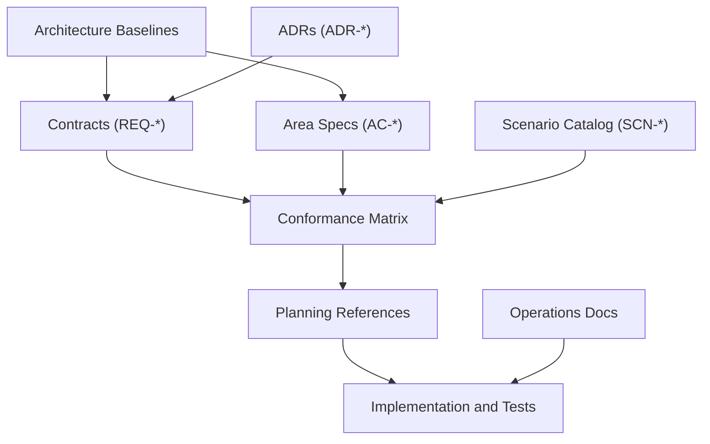

# TripleStore Specs Governance And Compliance Guide

## Purpose

This guide explains how the `specs/` system works in this repository:

- what each file type is for
- how file types relate to one another
- how architectural drift should be reviewed
- how the specs system connects to the existing `notes/` and `guides/` material

## System Model

## File Types And Roles

| File Type | Location | Identifier Pattern | Primary Purpose | Required Relationship |
|---|---|---|---|---|
| Architecture baselines | `specs/architecture-overview.md`, `specs/topology.md`, `specs/boundaries.md`, `specs/control-planes.md` | n/a | Define canonical system shape and authority boundaries | Must align with contracts and ADRs |
| Contracts | `specs/contracts/*.md` | `REQ-*` families | Normative behavior requirements for storage, query, reasoning, coordination, and operations | Area `AC-*` and conformance `SCN-*` map back to these families |
| Area specs | `specs/runtime`, `specs/storage`, `specs/query`, `specs/reasoning` | `AC-*` | Area-level scope, responsibilities, and acceptance criteria | Each `AC-*` should map to at least one `REQ-*` family and one `SCN-*` scenario |
| ADRs | `specs/adr/ADR-*.md` | `ADR-*` | Explain why a durable architectural decision exists | Baseline or contract changes should update ADRs when precedence changes |
| Conformance catalog | `specs/conformance/scenario_catalog.md` | `SCN-*` | Canonical scenario definitions for review and testing | Referenced by the matrix |
| Conformance matrix | `specs/conformance/spec_conformance_matrix.md` | `REQ-*`, `SCN-*`, spec paths | Traceability between requirements, specs, and validation scenarios | Must stay synchronized with contracts and area specs |
| Planning index | `specs/planning/README.md` | phase references | Links specs to the existing implementation roadmap in `notes/planning/` | Should reference affected baselines and contracts |
| Operations index | `specs/operations/README.md` | optional `REQ-*`/`SCN-*` references | Operational concerns such as backup, recovery, health, and telemetry | Must stay consistent with runtime and observability contracts |

## Traceability Chain

Canonical compliance chain:

`ADR decision -> REQ contract family -> AC area criteria -> SCN conformance scenario -> planning reference -> implementation/tests`

In practice:

1. ADRs define why a rule or boundary exists.
2. Contracts express that rule as `REQ-*`.
3. Area specs define expected behavior and acceptance criteria as `AC-*`.
4. Conformance docs define how behavior is validated as `SCN-*`.
5. Planning references show where delivery work is sequenced.

## Governance Status

The repository does not yet ship automated docs governance tooling comparable to the `jido_os` validators.

Current expectations are therefore manual:

1. Baseline changes SHOULD be paired with contract and area-spec updates.
2. Contract changes SHOULD update the conformance matrix in the same change set.
3. Control-plane ownership changes MUST update the ownership matrix and ADR-0001.
4. New runtime areas SHOULD add or extend `SCN-*` coverage in the scenario catalog and matrix.

## Relationship To Existing Notes And Guides

- `notes/planning/` remains the primary delivery plan source.
- `notes/research/` remains exploratory and explanatory background, not normative architecture authority.
- `guides/` remains the user/developer documentation layer; it should consume, not redefine, canonical behavior from `specs/`.

## Suggested Change Workflow

1. Update baseline docs when the system shape or ownership changes.
2. Update one or more `REQ-*` contracts to express the normative behavior.
3. Update the affected area spec and its `AC-*` criteria.
4. Update the conformance matrix and scenario catalog if validation expectations changed.
5. Update planning references or implementation notes when delivery sequencing changes.
6. Update guides when public behavior or operator workflows change.
