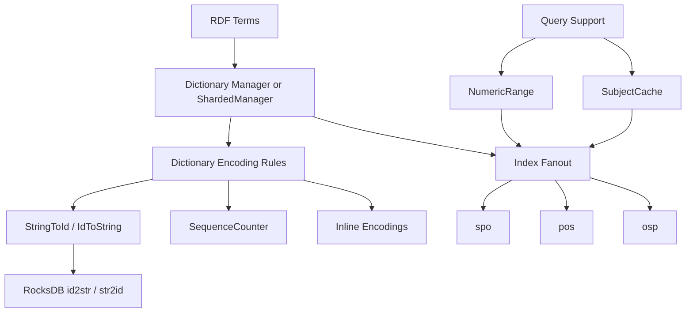

# Dictionary And Index Layer

## Purpose

This document backfills the current storage-core implementation built around:

- `TripleStore.Dictionary`
- `TripleStore.Dictionary.Manager`
- `TripleStore.Dictionary.ShardedManager`
- `TripleStore.Dictionary.SequenceCounter`
- `TripleStore.Dictionary.Batch`
- `TripleStore.Dictionary.StringToId`
- `TripleStore.Dictionary.IdToString`
- `TripleStore.Index`
- `TripleStore.Index.NumericRange`
- `TripleStore.Index.SubjectCache`

## Control Plane

Primary ownership: **Coordination Plane** for encoding policy and **Data Plane** for persisted key structure.

## Dependency View

## Current Codebase Notes

- The dictionary layer is richer than the original high-level plan: it includes batching, read caching, sharded parallelization, input validation, and persisted sequence recovery.
- Inline encodings currently cover integers, decimals, and datetimes when representable.
- `ShardedManager` is the current scaling path for bulk loads and is selected through `TripleStore.open/2` options.
- `NumericRange` and `SubjectCache` are query-support storage accelerators that sit on top of the core dictionary/index model.
- Statistics are persisted into `id2str` using a reserved key prefix rather than a dedicated statistics column family.

## Acceptance Criteria

| Acceptance ID | Criterion | Related Tests |
|---|---|---|
| `AC-STO-06` | Dictionary-allocated and inline-encoded term IDs remain type-safe and collision-free. | `test/triple_store/dictionary/term_id_encoding_test.exs`, `test/triple_store/dictionary/inline_numeric_test.exs` |
| `AC-STO-07` | Manager and sharded-manager paths preserve atomic create-or-get semantics for term IDs. | `test/triple_store/dictionary/concurrent_access_test.exs`, `test/triple_store/dictionary/sharded_manager_test.exs` |
| `AC-STO-08` | Index key encoding and pattern selection remain consistent across insert, delete, lookup, and export paths. | `test/triple_store/index/key_encoding_test.exs`, `test/triple_store/index/pattern_matching_test.exs`, `test/triple_store/index/index_lookup_test.exs` |
| `AC-STO-09` | Query-support accelerators (`NumericRange`, `SubjectCache`) remain subordinate to the canonical dictionary/index model rather than redefining it. | `test/triple_store/index/numeric_range_test.exs`, `test/triple_store/index/subject_cache_test.exs` |
| `AC-STO-10` | Statistics persistence remains an explicit extension of the storage model and not an undocumented side channel. | `test/triple_store/statistics_test.exs`, `test/triple_store/statistics/cache_test.exs`, `test/triple_store/statistics/server_test.exs` |
