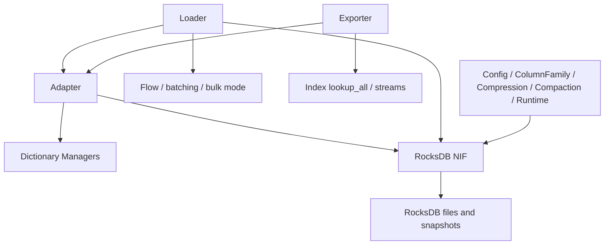

# Native Backend And RDF I/O

## Purpose

This document backfills the storage-adjacent execution surfaces implemented by:

- `TripleStore.Backend`
- `TripleStore.Backend.RocksDB`
- `TripleStore.Backend.RocksDB.NIF`
- `TripleStore.Config` and `TripleStore.Config.*`
- `TripleStore.Adapter`
- `TripleStore.Loader`
- `TripleStore.Exporter`

## Control Plane

Mixed ownership:

- **Native Adapter Plane** for RocksDB and parser-adjacent native execution
- **Coordination Plane** for Elixir-owned validation, batching, and conversion policy

## Dependency View

## Current Codebase Notes

- The storage backend is not just a thin wrapper; the Elixir side still owns path validation, option handling, batch shaping, telemetry, and security constraints.
- The loader currently supports Flow-based parallel ingestion, dynamic batch sizing, progress callbacks, and a bulk-mode durability tradeoff.
- N-Quads and TriG inputs are parsed, but only the default graph is loaded; named graphs are explicitly discarded in the current implementation.
- The exporter supports graph, string, file, and streaming paths over the canonical triple store rather than a quad store.
- The config surface is split across general config plus RocksDB-specific modules (`column_family`, `compression`, `compaction`, `runtime`).

## Acceptance Criteria

| Acceptance ID | Criterion | Related Tests |
|---|---|---|
| `AC-STO-11` | The Elixir backend layer keeps validation, option shaping, and telemetry outside the NIF boundary. | `test/triple_store/backend/rocksdb_test.exs`, `test/triple_store/config/rocksdb_test.exs` |
| `AC-STO-12` | Loader batching, parallelization, and bulk-mode behavior remain explicit and testable runtime choices. | `test/triple_store/loader/batch_size_test.exs`, `test/triple_store/loader/parallel_loading_test.exs`, `test/triple_store/loader/pipeline_integration_test.exs` |
| `AC-STO-13` | RDF adaptation remains the canonical bridge between RDF.ex terms and internal IDs. | `test/triple_store/adapter/term_conversion_test.exs`, `test/triple_store/adapter/triple_graph_conversion_test.exs` |
| `AC-STO-14` | Export paths preserve the canonical triple-only storage model rather than implying full named-graph support. | `test/triple_store/exporter_test.exs`, `test/triple_store/integration/rdf_roundtrip_test.exs` |
| `AC-STO-15` | The specs explicitly document the current default-graph-only limitation for N-Quads, TriG, and SPARQL graph operations. | `lib/triple_store/loader.ex`, `lib/triple_store/sparql/update_executor.ex` |
