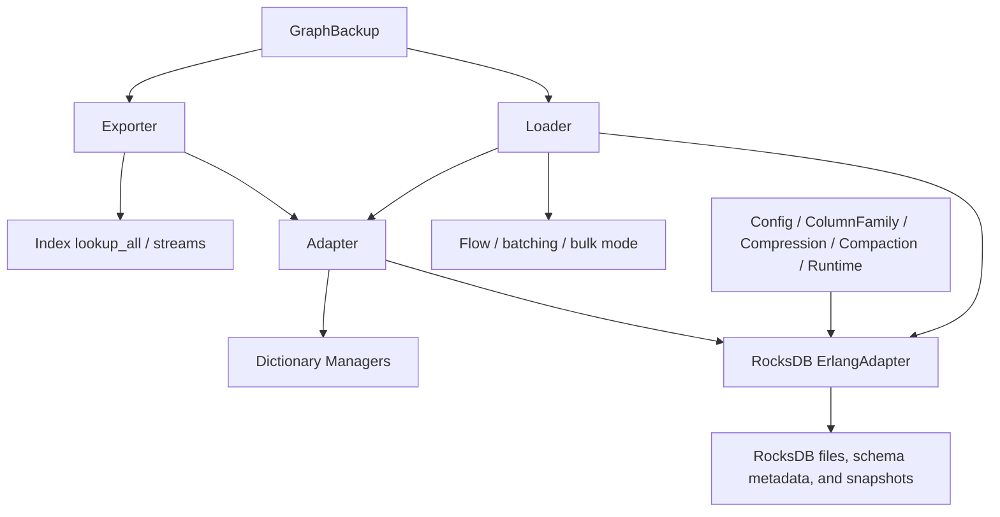

# Native Backend And RDF I/O

## Purpose

This document backfills the storage-adjacent execution surfaces implemented by:

- `TripleStore.Backend`
- `TripleStore.Backend.RocksDB`
- `TripleStore.Backend.RocksDB.ErlangAdapter`
- `TripleStore.Config` and `TripleStore.Config.*`
- `TripleStore.Adapter`
- `TripleStore.Loader`
- `TripleStore.Exporter`
- `TripleStore.GraphBackup`

## Control Plane

Mixed ownership:

- **Storage Plane** for Elixir-owned validation, batching, graph handling, and conversion policy
- **Native Adapter Plane** for RocksDB execution
- **Data Plane** for persisted bytes and export artifacts

## Dependency View

## Current Codebase Notes

- The storage backend is not just a thin wrapper; the Elixir side still owns path validation, schema selection, option handling, batch shaping, telemetry, and security constraints.
- The loader currently supports Flow-based parallel ingestion, dynamic batch sizing, progress callbacks, and a bulk-mode durability tradeoff.
- Generic `load_file/4` and `load_string/5` remain graph-oriented and therefore parse N-Quads/TriG through default-graph extraction, even when the target store is quad schema.
- Dedicated quad-aware loader surfaces such as `load_graph/4` with `RDF.Dataset`, `load_nquads_*`, `load_trig_*`, `load_to_graph/5`, and `load_files_to_graphs/4` preserve named graphs.
- The generic `TripleStore.export/3` facade remains graph-oriented, but `Exporter` supports `RDF.Dataset`, N-Quads, TriG, default-graph export, and named-graph export for quad stores.
- `GraphBackup` is the graph-scoped recovery surface; it exports and imports per-graph N-Quads plus metadata.
- The config surface is split across general config plus RocksDB-specific modules (`column_family`, `compression`, `compaction`, `runtime`).

## Acceptance Criteria

| Acceptance ID | Criterion | Related Tests |
|---|---|---|
| `AC-STO-11` | The Elixir backend layer keeps validation, option shaping, and telemetry outside the native-adapter boundary. | `test/triple_store/backend/rocksdb_test.exs`, `test/triple_store/config/rocksdb_test.exs` |
| `AC-STO-12` | Loader batching, parallelization, bulk-mode behavior, and graph-preservation behavior remain explicit and testable runtime choices. | `test/triple_store/loader/batch_size_test.exs`, `test/triple_store/loader/parallel_loading_test.exs`, `test/triple_store/loader/pipeline_integration_test.exs`, `test/triple_store/integration/nquads_loading_test.exs`, `test/triple_store/integration/trig_loading_test.exs`, `test/triple_store/graph_scoped_loading_test.exs` |
| `AC-STO-13` | RDF adaptation remains the canonical bridge between RDF.ex terms and internal IDs for both triples and quads. | `test/triple_store/adapter/term_conversion_test.exs`, `test/triple_store/adapter/triple_graph_conversion_test.exs`, `test/triple_store/adapter/quad_conversion_test.exs` |
| `AC-STO-14` | Export paths preserve the current split between graph-oriented facade exports and quad-aware dataset or named-graph export surfaces. | `test/triple_store/exporter_test.exs`, `test/triple_store/exporter_refactoring_test.exs`, `test/triple_store/integration/rdf_roundtrip_test.exs`, `test/triple_store/dataset_operations_test.exs` |
| `AC-STO-15` | Graph backup, restore, and schema-aware RDF I/O remain documented as explicit expert workflows rather than being implied by the generic facade alone. | `test/triple_store/graph_backup_test.exs`, `test/triple_store/nquads_test.exs`, `test/triple_store/trig_test.exs` |
