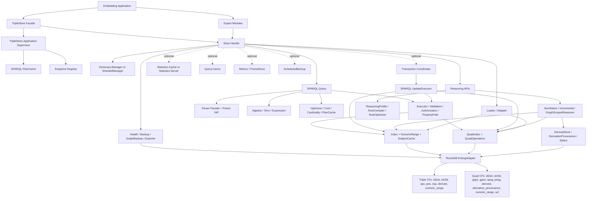
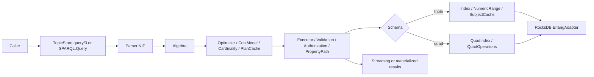
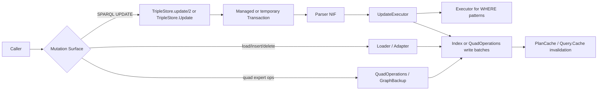
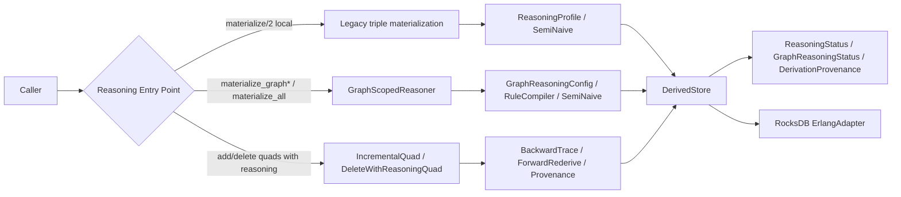

# TripleStore Topology

## Purpose

This document defines the canonical topology for `TripleStore`.

It covers:

- caller entry points
- the small default OTP supervision tree
- store-local managers and optional helpers
- query, update, reasoning, and operations flow
- persisted schema topology for triple and quad stores

## Core Topology Decisions

- `TripleStore` is the primary caller-facing entry point, but expert modules are legitimate topology nodes rather than hidden internals.
- `TripleStore.Application` supervises only process-global helpers that do not require a store-specific DB reference.
- Store-local managers are created at `open/2` time, not pre-created globally.
- SPARQL query, update, graph-management, and reasoning meaning remain Elixir-owned even when parser or storage work crosses a native boundary.
- Triple and quad stores are different persisted topologies, not cosmetic variations over the same column-family layout.
- Named graphs, ACLs, and provenance are topology nodes in quad schema.
- Optional runtime helpers such as `Query.Cache`, `Metrics`, `Prometheus`, `Statistics.Server`, and `ScheduledBackup` are opt-in topology additions, not guaranteed baseline children.

## Runtime Topology

## Component Classes

| Class | Primary Modules | Responsibility |
|---|---|---|
| Primary facade | `TripleStore` | Main lifecycle, query, update, reasoning, export, health, backup, and scheduling API |
| Expert modules | `TripleStore.Update`, `TripleStore.GraphBackup`, `TripleStore.QuadOperations`, `TripleStore.Health`, `TripleStore.SPARQL.Authorization` | Narrower APIs for direct update contexts, graph backup, quad storage, rich health, and graph ACLs |
| Global runtime services | `TripleStore.Application`, `TripleStore.SPARQL.PlanCache`, `TripleStore.Snapshot` | Process-global support services |
| Store-local coordination | `TripleStore.Dictionary.Manager`, `TripleStore.Dictionary.ShardedManager`, `TripleStore.Transaction`, `TripleStore.Statistics.Cache`, `TripleStore.Statistics.Server` | ID allocation, optional serialized SPARQL update coordination, statistics support |
| Storage semantics | `TripleStore.Adapter`, `TripleStore.Dictionary.*`, `TripleStore.Index`, `TripleStore.QuadIndex`, `TripleStore.QuadOperations`, `TripleStore.Loader`, `TripleStore.Exporter` | RDF conversion, dictionary encoding, index fanout, loading, export |
| Query execution | `TripleStore.SPARQL.*`, `TripleStore.Query.Cache`, `TripleStore.SPARQL.QueryCache` | Parse, compile, optimize, execute, authorize, validate, and optionally cache query work |
| Reasoning execution | `TripleStore.Reasoner.*` | Compile rules, materialize, maintain derived facts, track graph reasoning status and provenance |
| Native boundaries | `TripleStore.Backend.RocksDB.ErlangAdapter`, `TripleStore.SPARQL.Parser.NIF` | Bounded storage and parser capability |
| Operations | `TripleStore.Telemetry`, `TripleStore.Health`, `TripleStore.Backup`, `TripleStore.GraphBackup`, `TripleStore.ScheduledBackup`, `TripleStore.Metrics`, `TripleStore.Prometheus` | Observability, recovery, backup, and scheduling |

## Query Flow Topology

## Update And Mutation Flow Topology

## Reasoning Flow Topology

## Topology Constraints

- The default application runtime MUST remain smaller than the full set of optional helper modules.
- Schema choice at `open/2` time MUST determine the active persisted topology for that store.
- Public mutation semantics MUST distinguish between direct batch-mutation helpers and SPARQL update coordination through `Transaction`.
- Public `TripleStore.query/3` MUST NOT be described as implicitly using transaction-query snapshots, because the current code does not route it that way.
- Graph clauses, graph management, ACL checks, and graph-scoped reasoning MUST be documented as quad-schema behavior.
- `TripleStore.materialize/2` local mode MUST be treated as the legacy triple-materialization path; graph-aware reasoning lives in the explicit graph APIs.
- Operational modules MUST observe the same canonical runtime and data topology used by query, update, and reasoning code.

## Current Codebase Notes

- The default topology includes only global plan-cache and snapshot services.
- `Query.Cache`, `SPARQL.QueryCache`, `Metrics`, `Prometheus`, `Statistics.Server`, and `ScheduledBackup` are opt-in additions.
- `TripleStore.Health` provides richer health topology than the compact `TripleStore.health/1` facade.
- `GraphBackup` and dataset export make named-graph topology a current operational concern, not a future design placeholder.
