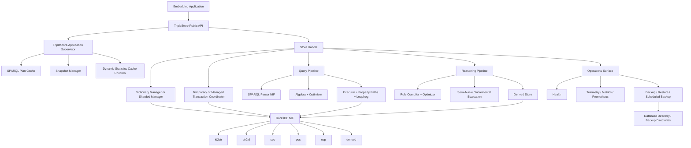
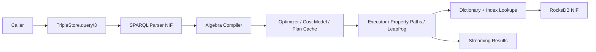
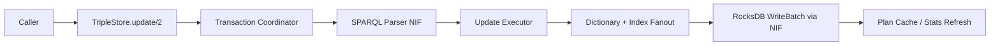
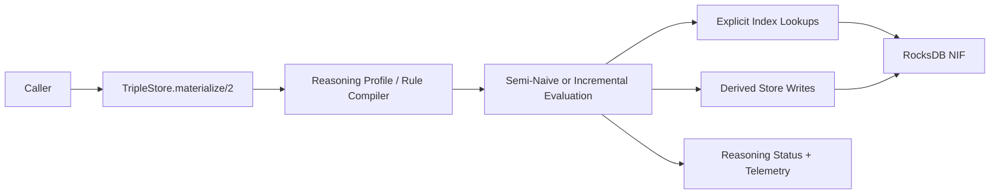

# TripleStore Topology

## Purpose

This document defines the canonical topology for `TripleStore`.

It covers:

- public entry points
- OTP supervision surfaces
- store-local coordination components
- query, reasoning, and native execution flow
- persisted storage surfaces

## Core Topology Decisions

- `TripleStore` is the only public API authority for caller-facing store lifecycle and high-level operations.
- Process-global services started by `TripleStore.Application` remain intentionally small and reusable across stores.
- Store-local managers are created during `TripleStore.open/2`, not pre-created globally.
- Query execution, update orchestration, and reasoning semantics remain Elixir-owned even when parser/storage work crosses the NIF boundary.
- RocksDB column families are implementation-critical topology nodes, not hidden incidental storage.
- Derived facts remain topologically separate from explicit triple indices.

## Runtime Topology

## Component Classes

| Class | Primary Modules | Responsibility |
|---|---|---|
| Public API | `TripleStore` | Store lifecycle, load/query/update/materialize/export/operations facade |
| Global runtime services | `TripleStore.Application`, `TripleStore.SPARQL.PlanCache`, `TripleStore.Snapshot` | Process-global support services |
| Store-local coordination | `TripleStore.Dictionary.Manager`, `TripleStore.Dictionary.ShardedManager`, `TripleStore.Transaction`, `TripleStore.Statistics.Cache` | Serialization, ID allocation, statistics refresh, per-store coordination |
| Query execution | `TripleStore.SPARQL.*`, `TripleStore.Query.Cache`, `TripleStore.Index.NumericRange`, `TripleStore.Index.SubjectCache` | Parse, compile, optimize, execute, and cache query work |
| Reasoning execution | `TripleStore.Reasoner.*` | Compile rules, derive facts, maintain `derived` state, expose reasoning status |
| Native boundary | `TripleStore.Backend.RocksDB.NIF`, `TripleStore.SPARQL.Parser.NIF` | RocksDB I/O and SPARQL parsing |
| Data surfaces | RocksDB column families and filesystem backup paths | Canonical persisted state |

## Query Flow Topology

## Update Flow Topology

## Reasoning Flow Topology

## Topology Constraints

- The public API MUST remain the only caller-facing topology entry point.
- Query semantics MUST NOT bypass Elixir execution and move directly into native code.
- Writes MUST preserve coordinated fanout across index surfaces.
- Reasoning MUST preserve a topological distinction between explicit and derived facts.
- Operational modules MUST observe the same store and data topology as query and update paths.

## Current Codebase Notes

- The default topology includes global plan-cache and snapshot services, but not result cache, metrics, or Prometheus processes.
- Query result caching, metrics aggregation, and Prometheus export are optional runtime additions rather than baseline topology nodes.
- Statistics support is transitional: `Statistics.Cache` is dynamically integrated while `Statistics.Server` exists as a newer standalone surface.
